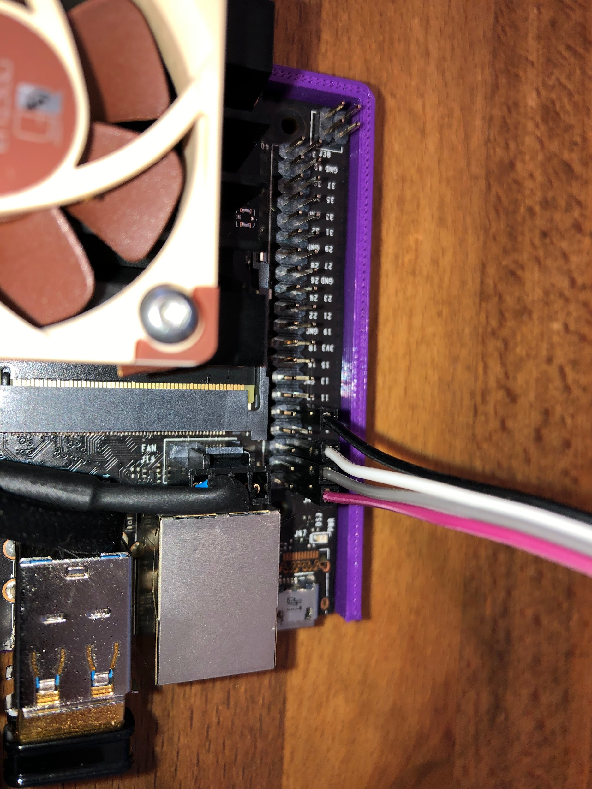

**UCSD RoboCar ECE & MAE 148**

Version 20.7 - 23Oct2022

Prepared by

Dr. Jack Silberman

Department of Electrical and Computer Engineering

and

Dominic Nightingale

Department of Mechanical and Aerospace Engineering

University of California, San Diego

9500 Gilman Dr, La Jolla, CA 92093

{width="3.3984372265966756in"
height="0.8055555555555556in"}

{width="1.4427088801399826in"
height="1.4427088801399826in"}

# Table of Contents

**[Table of Contents](#table-of-contents) 2**

**[Introduction](#introduction) 4**

**[Single Board Computer (SBC) Basic
Setup](#single-board-computer-sbc-basic-setup) 5**

> [Jetson Nano (JTN) Configuration](#jetson-nano-jtn-configuration) 5
>
> [Jetson Xavier NX Configuration](#jetson-xavier-nx-jnx-configuration)
> 5

**[Hardware Setup](#hardware-setup) 6**

> [Jetson Nano GPIO Header PINOUT](#jetson-nano-gpio-header-pinout) 6
>
> [VESC](#vesc) 7
>
> [VESC Hardware V6.x](#_s281f6m5z2vd) 8
>
> [Motor Detection](#_fh8ltsnwmmrd) 10
>
> [Sensor Detection](#_2d2r0k5t70f4) 14
>
> [Enable Servo Control For Steering](#_9ymkdmchduhq) 16
>
> [VESC Hardware V4.12 (if you have V6, skip this)](#_ohr8s4phbsb0) 17
>
> [PWM Controller](#pwm-controller) 18
>
> [Wiring adafruit board](#wiring-adafruit-board) 19
>
> [Detecting the PWM controller](#detecting-the-pwm-controller) 20
>
> [Emergency stop - Relay](#emergency-stop---relay) 21
>
> [Logitech F710 controller](#logitech-f710-controller) 23
>
> [Other JoyStick Controllers](#other-joystick-controllers) 23
>
> [LD06 Lidar](#ld06-lidar) 25
>
> [Laser Map](#laser-map) 25
>
> [Mechanical drawing](#mechanical-drawing) 25

**[Install OpenCV from Source](#_8sb9o86fl4d1) 26**

**[DonkeyCar AI Framework](#donkeycar-ai-framework) 26**

> [Setting up the DonkeyCar AI
> Framework](#setting-up-the-donkeycar-ai-framework) 26
>
> [Create a virtual environment for the DonkeyCar AI
> Framework.](#create-a-virtual-environment-for-the-donkeycar-ai-framework.)
> 27
>
> [Confirm openCV build from previous steps](#_vgqx7t3x8yes) 28
>
> [Tensorflow](#tensorflow) 29
>
> [PyTorch](#_k329co33iptx) 32
>
> [Installing Donkeycar AI Framework](#section-9) 35
>
> [Create a Car](#create-a-car) 36
>
> [Donkeycar manage.py](#_jok809vjuom8) 37
>
> [Modifying PWM board configuration](#_nkz3143022ot) 37
>
> [Modifying Camera](#modifying-camera) 37
>
> [Quick Test](#quick-test) 38
>
> [Modifying Joystick](#modifying-joystick) 39
>
> [Calibration of the Throttle and
> Steering](#calibration-of-the-throttle-and-steering) 41
>
> [Begin Calibration](#begin-calibration) 42
>
> [Saving car configuration file](#saving-car-configuration-file) 44
>
> [Driving the Robot to Collect
> data](#driving-the-robot-to-collect-data) 46

**[Backup of the uSD Card](#backup-of-the-usd-card) 50**

> [If needed, we have an uSD Card Image Ready for Plug and
> Play](#if-needed-we-have-an-jtn-usd-card-image-ready-for-plug-and-play)
> 52

**[ROS with Docker](#ros-with-docker) 53**

**[Supporting material](#supporting-material) 54**

#  

# Introduction 

This document was derived from the DIY RoboCar - Donkey Car Framework

Reference information can be found at
[[http://docs.donkeycar.com]{.underline}](http://docs.donkeycar.com)

At UC San Diego's Introduction to Autonomous Vehicles class (ECE
MAE148), we use an AI Framework called Donkey Car which is based on Deep
Learning / Human behavior cloning as well as we do traditional
programming using Robot Operating System (ROS2).

DonkeyCar can be seen as the "hello world" of affordable scaled
autonomous cars

We have added other features into our UCSD scale robot cars that are not
found

at the Default Donkey car build such as a wireless emergency off switch.
Therefore, please follow

the instructions found in this document vs. the default Donkey built.

Another framework we use called UCSD Robocar is primarily maintained and
developed by Dominic Nightingale right here at UC San Diego. UCSD
Robocar uses ROS and ROS2 for controlling our scaled robot cars which
can vary from traditional programming or machine learning to achieve an
objective. The framework works with a vast selection of sensors and
actuation methods in our inventory making it a robust framework to use
across various platforms. Has been tested on 1/16, 1/10, 1/5 scaled
robot cars and soon our go-karts.

As August 2019 we transitioned from the single board computer (SBC)
called Raspberry PI to the

Nvidia Jetson Nano. If you are using a Raspberry PI, then search in this
document for

Raspberry PI (RPI or PI) Configuration.

On 28Aug19, we updated the instructions to include Raspberry PI 4B

Depending on your Single Board Computer, Jetson Xavier NX, Jetson Nano,

then follow the related instructions.

#  

# Single Board Computer (SBC) Basic Setup

We will be using the Ubuntu Linux distribution. In the class you have
access to a virtual

machine image file with Ubuntu.

We won't install ROS2 directly into the SBC, we will be using Docker
images and containers.

You will install OpenCV from source as part of your learning on
compiling and building

software from source.

## Jetson Nano (JTN) Configuration

[[Instructions to configure the Jetson
Nano]{.underline}](https://docs.google.com/document/d/1TF1uGAFeDARNwbPkgg9xg4NvWPJvrsHW2I_IN9dWQH0/edit?usp=sharing)

## Jetson Xavier NX (JNX) Configuration

[[Instructions to Configure the Jetson Xaviver
NX]{.underline}](https://docs.google.com/document/d/1mXgN9DcAj30HAsbfrHNCP-YEYqKWPTbcUssRI1Xab1A/edit?usp=sharing)

[[Archive location to previous JetPack
versions]{.underline}](https://developer.nvidia.com/embedded/jetpack-archive)

## Editing Remotely with Jupyter Notebooks

Install Jupyter notebook on your Jetson:

  -----------------------------------------------------------------------
  sudo apt install jupyter-notebook
  -----------------------------------------------------------------------

  -----------------------------------------------------------------------

[[https://ljvmiranda921.github.io/notebook/2018/01/31/running-a-jupyter-notebook/]{.underline}](https://ljvmiranda921.github.io/notebook/2018/01/31/running-a-jupyter-notebook/)

Help document for editing using Jupyter notebook:

[[Conifguring Jupyter Notebook on
SSH]{.underline}](https://docs.google.com/document/d/1ZNACJvKmQNnN7QNMwgqnzjrs9JDdFbiqVFHAuhgillQ/edit?usp=sharing)

# Hardware Setup 

You should consider breaking the work on building the robots per team
member:

a)  Someone could start to build OpenCV GPU accelerated in parallel
    while you build the robot. [[It will take several hours building
    OpenCV from
    source]{.underline}](https://docs.google.com/document/d/1HX2zmjbVsyLnliEQ8wp97Y453g5qNAYHWtFQiKQ0elA/edit?usp=sharing).
    Try to divide the work by team members ...

b)  Start designing, 3D Printing, Laser Cutting the parts

As of Spring 2022, we upgraded all the ECE MAE 148 robots to use VESCs.

## VESC

VESC is a super cool Electronic Speed Controller (ESC) that runs open
source code with

significantly more capabilities than a regular RC Car ESC.

VESCs are very popular for electrical skateboards, DIY electrical
scooters, and robotics.

For robotics, one of the capabilities we will use the most is Odometry
(speed and position)

based on the sensors on brushless motors (sensored) or to some extent,
specially using the latest VESCs and firmware, it is also available with
brushless motors without sensors (sensorless).

[[https://vesc-project.com/]{.underline}](https://vesc-project.com/)

[[VESC Setup
Instructions]{.underline}](https://docs.google.com/document/d/1Y5DdvWdtFjbeyGIVJyWAb8Wrq6M1MkCkMPiDgT4LoQY/edit?usp=sharing)

## Logitech F710 controller 

Place your Logitech F710 controller on the [x mode]{.mark}

(look for small switch in one of the controller face)

Connect the USB JoyStick Dongle into the JTN and then list the input
devices again

ls /dev/input

> (env) jetson@ucsdrobocar00:\~/projects/d3\$ ls /dev/input
>
> by-id event0 event2 event4 mice mouse1
>
> by-path event1 event3 [js0]{.mark} mouse0

We are looking for a js0

### Other JoyStick Controllers

JoyStick Controllers - either the Logitech F-10 or PS4

Make sure your myconfig.py on your car directory reflects your
controller

**At the SBC**

Connecting the LogiTech Controller is as easy as plugging in the USB
dongle at the SBC.

Or if you have a PS4 controller

Connecting a PS4 Controller - Bluetooth

Deactivate the virtual environment if you are using one

deactivate

sudo apt-get install bluetooth libbluetooth3 libusb-dev

sudo systemctl enable bluetooth.service

> [Need these for XBox Controller, skip for PS4]{.mark}
>
> [sudo apt install sysfsutils]{.mark}
>
> [sudo nano /etc/sysfs.conf]{.mark}
>
> [add this line at the end of the file:]{.mark}
>
> [/module/bluetooth/parameters/disable_ertm=1]{.mark}
>
> [Reboot your SBC and see if ertm was disabled.]{.mark}
>
> [cat /sys/module/bluetooth/parameters/disable_ertm]{.mark}
>
> [The result should print Y]{.mark}

**[At the PS4 controller]{.mark}**

[Press the Share and PS buttons at the same time.]{.mark}

[The controller light will flash like a strobe light. That means it is
in the pairing mode]{.mark}

[If the SBC is not seeing the PS4, you should try a mUSB cable between
the SBC and the]{.mark}

[PS4 controller.]{.mark}

**[At the SBC]{.mark}**

sudo bluetoothctl

agent on

default-agent

scan on

[If your controller is off, Press Share/PlayStation]{.mark}

[example of a PS4 controller mac address]{.mark}

> [Device A6:15:66:D1:46:1B Alias: Wireless Controller]{.mark}

connect YOUR_MAC_ADDRESS

trust YOUR_MAC_ADDRESS

quit

[If your ps4 turns off, turn it on again by pressing PS]{.mark}

[If you want to check controller was connected]{.mark}

ls /dev/input

[and see if js0 is listed.]{.mark}

[Lets test the joystick in a linux machine]{.mark}

sudo apt-get update

sudo apt-get install -y jstest-gtk

jstest /dev/input/js0

[Turn off your PS4 controller by pressing and holding PS]{.mark}

To remove a device, let\'s say another JoyStick that you don't use
anymore

bluetoothctl

paired-devices

remove THE_CONTROLLER_MAC_ADDRESS

I had to try the method above twice, I rebooted the SBC in between

##  

## LD06 Lidar

Datasheet for LD06 lidar:
[[datasheet]{.underline}](https://drive.google.com/file/d/1t0CkEEd9fYG_eIq_DL8eqy4NywQQDrjg/view?usp=sharing)

### Laser Map

{width="3.4479166666666665in"
height="2.9040201224846895in"}

### Mechanical drawing

{width="4.705857392825897in"
height="3.932292213473316in"}

# Previous Versions of Hardware

Skip the PWM Controller and EMO starting in 2022 Summer II. Left here
for people using these as low cost alternative robot.

## PWM Controller

> *If you are using a VESC, we don't use the PWM board, you can skip
> this part.*
>
> *These PWM controllers are used only if one has a regular ESC (not the
> cool VESC).*
>
> *[We are following the standard from RC CAR world, Channel 1 for
> Steering, Channel 2 for Throttle]{.mark}*
>
> *Note:The default DonkeyCar build uses Channels 0 and 1*
>
> *The UCSDRoboCar has at least two actuators. A steering servo and the
> DC motor connected to an Electronics Speed Controller (ESC). These are
> controlled by PWM (Pulse Width Modulation).*
>
> *We use PWM Controller to generate the PWM signals, a device similar
> to the one in the picture below*
>
> {width="3.0268350831146105in"
> height="2.1093755468066493in"}
>
> Shutdown the JTN if it is on by typing this command
>
> sudo shutdown -h now
>
> Connect the Steering Servo to the Channel 1
>
> Connect the Throttle (Electronic Speed Controller ESC) to Channel 2
>
> Observe the orientation of the 3 wires connector coming from the
> Steering Servo and ESC. Look for a the black or brown wire, that is
> the GND (-).
>
> Lets install the PWM Controller
>
> [[https://www.jetsonhacks.com/nvidia-jetson-nano-j41-header-pinout/]{.underline}](https://www.jetsonhacks.com/nvidia-jetson-nano-j41-header-pinout/)

### Wiring adafruit board

> *You need to connect the following pins between the JTN and the PWM
> board:*
>
> *Disconnect the power to the JTN*
>
> *+3.3v, the two I2C pins (SDA and SCL) and ground*
>
> ***The 3.3V from the JTN goes to the VCC at the PWM board***
>
> *Note: for the ground connection you need to skip one pin (skip pin
> 7)*

-   *3.3V - pin 1*

-   *SDA - pin 3*

-   *SCL- pin 5*

-   *No_Connect (Skip) - pin 7*

-   *Ground - pin 9*

> {width="2.115685695538058in"
> height="2.8177088801399823in"}{width="2.021828521434821in"
> height="2.6927088801399823in"}{width="2.2616382327209097in"
> height="3.0364588801399823in"}

###  

### Detecting the PWM controller

> Lets detect the PWM controller
>
> sudo i2cdetect -r -y 1
>
> *0 1 2 3 4 5 6 7 8 9 a b c d e f*
>
> *00: \-- \-- \-- \-- \-- \-- \-- \-- \-- \-- \-- \-- \--*
>
> *10: \-- \-- \-- \-- \-- \-- \-- \-- \-- \-- \-- \-- \-- \-- \-- \--*
>
> *20: \-- \-- \-- \-- \-- \-- \-- \-- \-- \-- \-- \-- \-- \-- \-- \--*
>
> *30: \-- \-- \-- \-- \-- \-- \-- \-- \-- \-- \-- \-- \-- \-- \-- \--*
>
> *40: [40]{.mark} \-- \-- \-- \-- \-- \-- \-- \-- \-- \-- \-- \-- \--
> \-- \--*
>
> *50: \-- \-- \-- \-- \-- \-- \-- \-- \-- \-- \-- \-- \-- \-- \-- \--*
>
> *60: \-- \-- \-- \-- \-- \-- \-- \-- \-- \-- \-- \-- \-- \-- \-- \--*
>
> *70: [70]{.mark} \-- \-- \-- \-- \-- \-- \--*
>
> If you see the 40 and 70 above, the JTN is communicating with the PWM
> board
>
> If you want to save some typing everytime you log into the JTN, add it
> to the end of .bashrc
>
> nano \~/.bashrc
>
> source /projects/envs/donkey/bin/activate
>
> cd \~/projects/d3
>
> Test is with a reboot
>
> sudo reboot now

##  

## Emergency stop - Relay

> If using an ESC vs. VESC follow this, with VESC skip
>
> Connecting the Emergency Stop Circuit and Batteries into the Robot
>
> For this part of your robot, you will have to do some hacking. That is
> part of the class.
>
> The instructor will discuss the principle of the circuit and how to
> implement it with the component in your robot kit.
>
> Long story short, the PWM Controller we use has a disable pin. If the
> correct logic is applied to it for example Logic 1 or 0 (3.3V or 0V)
> it will disable the PWM signals and the UCSDRoboCar will stop.
>
> Think why one needs a separate EMO circuit vs. relying on the
> software, operating system and computer communicating with the PWM
> controller that then send PWM pulses to the actuators (steering servo
> and driving DC motor by the electronics speed controller)
>
> First search on the web and read the datasheet of the emergency stop
> switch (EMO) components provided with the robot kit and discuss with
> your teammates how the EMO will work. You got two main components to
> build the WireLess EMO switch:

a)  A Wireless Relay with wireless remote controls

b)  A Red/Blue high power LED. This is to help the user know if the car
    is disable (Red) or Enabled (Blue).

> Do some discussion with your Team and pay attention to the Lecture
> explanations:

-   What is the disable pin of the PWM controller?

-   Does it disable logic 1 or 0?

-   How to wire the wireless relay to provide the logic you need to
    disable the PWM controller? (1 or 0)

-   What pin at the Single Board Computer (SBC) can provide the logic
    you need to disable the PWM controller

-   How to connect the LEDs (Blue and Red) to indicate (BLUE - enabled),
    (RED - power is on / robot is disabled).

-   What is the fail safe situation, using the normally closed or
    normally open pins of the wireless relay to disable the PWM
    controller?

-   Note: The power to the PWM controller, that powers the LEDs, comes
    from ESC (Electronics Speed Controller). Therefore, you have to
    connect the robot batteries to the ESC and the ESC to the PWM
    controller. **We are using channel 2 for the ESC**. **Channel 1 for
    the Steering. Then you need to power the ESC for the circuit to work
    \...**

> After you see that the EMO is working, i.e. wireless remote control
> disables the PWM, and the LEDs light up as planned, then you need to
> document your work. Please use a schematic software such as Fritzing
> ([[http://fritzing.org/home/]{.underline}](http://fritzing.org/home/))
> to document your electrical schematic.
>
> It may seem we did the opposite way; document after your build. In our
> case, you learned by looking at components information, thinking about
> the logic, and experimenting. Since you are an engineer you need to
> document even if it was a hack / test try first...
>
> Working in a company you may do fast prototyping first then document
> your work when the risk is low. On larger projects you design, make
> schematics, diagrams, drawings, work instructions, then build it. Keep
> that in mind!
>
> Now you can go drive your robot to collect data. Make sure to keep the
>
> EMO handy and used when needed!
>
> Also keep in mind that \<X\> on your controller is like an emergency
> break.
>
> When you run Donkey it will display the functions associated with the
> joystick buttons.
>
> Read and remember them

# 

#  

# Install OpenCV from Source

> \# Installing an Open Source Computer Vision (OpenCV) package with
> CUDA Support
>
> \# As of Jan 2020, NVIDIA is not providing OpenCV optimized to use
> CUDA (GPU acceleration).
>
> \# Search the web if you are curious why.
>
> \#
> [[https://forums.developer.nvidia.com/t/opencv-cuda-python-with-jetson-nano/72902]{.underline}](https://forums.developer.nvidia.com/t/opencv-cuda-python-with-jetson-nano/72902)

\#[[Here are the instructions to build OpenCV from
source]{.underline}](https://docs.google.com/document/d/1HX2zmjbVsyLnliEQ8wp97Y453g5qNAYHWtFQiKQ0elA/edit?usp=sharing)

It will take an approximate 4 hrs to install opencv

1\. jtop

2\. 4

3\. Add 6 GB of swap space and enable

4\. cd \~

5\. nano install_opencv.sh

6\. Copy the entire contents of the attached
[[file]{.underline}](https://drive.google.com/file/d/1jhsqzTNFHFMHxnDKIspjKlVHD1rL0izi/view?usp=share_link)

7\. bash install_opencv.sh

# DonkeyCar AI Framework

## Setting up the DonkeyCar AI Framework

Reference
[[http://docs.donkeycar.com]{.underline}](http://docs.donkeycar.com)

Make sure that the OpenCV you want to use supporting CUDA is already
available as a system

wide package.

Remember that when you are compiling and building software from source,
it may take a few

hours \...

SSH into the Single Board Computer (SBC) e.g., RPI, JTN, JNX, etc.

\# Install some packaged, some may be already installed

sudo apt update -y

sudo apt upgrade -y

sudo usermod -aG dialout jetson

> #If packages are being held back
>
> sudo apt-get \--with-new-pkgs upgrade

sudo apt-get install -y build-essential python3 python3-dev python3-pip
libhdf5-serial-dev hdf5-tools libhdf5-dev zlib1g-dev zip libjpeg8-dev
liblapack-dev libblas-dev gfortran libxslt1-dev libxml2-dev libffi-dev
libcurl4-openssl-dev libssl-dev libpng-dev libopenblas-dev openmpi-doc
openmpi-bin libopenmpi-dev libopenblas-dev git nano

Install RPi.GPIO clone for Jetson Nano

[[https://github.com/NVIDIA/jetson-gpio]{.underline}](https://github.com/NVIDIA/jetson-gpio)

pip3 install Jetson.GPIO

> If the pip install complains about ownership of the directory\*
>
> then execute the following command
>
> sudo chown -R jetson:jetson /home/jetson/.cache/pip
>
> ex:
>
> WARNING: The directory \'/home/jetson/.cache/pip/http\' or its parent
> directory is not owned by the current user and the cache has been
> disabled. Please check the permissions and owner of that directory. If
> executing pip with sudo, you may want sudo\'s -H flag.
>
> WARNING: The directory \'/home/jetson/.cache/pip\' or its parent
> directory is not owned by the current user and caching wheels has been
> disabled. check the permissions and owner of
>
> that directory. If executing pip with sudo, you may want sudo\'s -H
> flag.
>
> If pip breaks for some reason, you can reinstall it with the following
> lines
>
> python3 -m pip uninstall pip
>
> sudo apt install python3-pip \--reinstall
>
> If the install request elevated privileges, execute the following
> command
>
> sudo pip3 install Jetson.GPIO
>
> if pip has a new version
>
> pip3 install \--upgrade pip

Let's make sure the user jetson can use gpio

sudo groupadd -f -r gpio

sudo usermod -a -G gpio jetson

> sudo cp /opt/nvidia/jetson-gpio/etc/99-gpio.rules /etc/udev/rules.d/
>
> 28Jan20 - did not work with JetPack3.4
>
> 15May21- did not work with JetPack4.5
>
> 19Oct21 - did not work with JetPack4.6
>
> 18Sep22 - did not work with JetPack4.6.2
>
> Will get back to it later if the jetson user can not access GPIO

sudo udevadm control \--reload-rules && sudo udevadm trigger

We want to have control over the versions of each software library to
minimize the framework from

breaking after system-wide upgrades. Therefore, lets create a virtual
environment for the

DonkeyCar.

### Create a virtual environment for the DonkeyCar AI Framework. 

If you want the virtual environment to be under the user's home
directory, make sure to be on the

home directory for user jetson

If you have not done so, lets create a directory to store our projects
and one subdirectory

to store virtual environments

cd \~

mkdir projects

cd projects

mkdir envs

cd envs

pip3 install virtualenv

> if complains about user permission
>
> pip3 install virtualenv \--user

We will create a virtual environment called donkey since our AI
framework is

based on the Donkey Car project

Since your SBC will be initially dedicated to the class AI framework
(Donkey), at least until

your custom project starts, let's activate the donkey virtual env
automatically every time the user

Jetson logs into the SBC. We can remove this settings later if needed
when using ROS2

echo \"source \~/projects/envs/donkey/bin/activate\" \>\> \~/.bashrc

source \~/.bashrc

When a virtual environment is active, you should see
(name_of_virtual_enviroment) in front of the terminal prompt.

ex:

[(donkey)]{.mark} jetson@ucsdrobocar-xxx-yy:\~\$

At this point, using pip and pip3 should be the same as using pip3 by
default in this virtual environment.

https://docs.donkeycar.com/guide/robot_sbc/setup_jetson_nano/ 46

> #it is necessary to create a link to it
>
> \# Go to the folder where OpenCV\'s native library is built
>
> #cd /usr/local/lib/python3.6/site-packages/cv2/python-3.6
>
> \# Rename
>
> #mv cv2.cpython-36m-xxx-linux-gnu.so cv2.so
>
> \# Go to your virtual environments site-packages folder if previously
> set
>
> #cd \~/env/lib/python3.6/site-packages/
>
> \# Or just go to your home folder if not set a venv site-packages
> folder
>
> #cd \~
>
> \# Symlink the native library
>
> #ln -s /usr/local/lib/python3.6/site-packages/cv2/python-3.6/cv2.so
> cv2.so
>
> #NOTE that it is almost mandatory to create a virtual environment in
> order to properly install
>
> \# tensorflow, scipy and keras, and always a best practice.

cd \~/projects/envs/donkey/lib/python3.6/site-packages/

ln -s /usr/local/lib/python3.6/site-packages/cv2/python-3.6/cv2.so
cv2.so

### 

### Confirm that OpenCV built from previous steps is working on the virtual environment Donkey

\# Testing to see if OpenCV is installed in the virtual env.

python3 -c \'import cv2 as cv; print(cv.\_\_version\_\_)\'

> (donkey) **jetson@ucsdrobocar-xxx-yy**:**\~/projects/envs/donkey**\$
> python3 -c \'import cv2 as cv; print(cv.\_\_version\_\_)\'
>
> 4.6.0

\# We won\'t use Python2, but just in case one will need it for some
reason

python2 -c \'import cv2 as cv; print(cv.\_\_version\_\_)\'

We are not done installing software yet. We need to install more
dependencies..

**Make sure you have the donkey virtual environment activated**

Remember some of these installs may take a while. It does not mean that
the SBC is frozen, you

can see that the CPU is busy with top, htop, or jtop

source \~/projects/envs/donkey/bin/activate

pip3 install -U pip testresources setuptools

pip3 install -U futures==3.1.1 protobuf==3.12.2 pybind11==2.5.0

pip3 install -U cython==0.29.21 pyserial

pip3 install -U future==0.18.2 mock==4.0.2 h5py==2.10.0
keras_preprocessing==1.1.2 keras_applications==1.0.8 gast==0.3.3

pip3 install -U absl-py==0.9.0 py-cpuinfo==7.0.0 psutil==5.7.2
portpicker==1.3.1 six requests==2.24.0 astor==0.8.1 termcolor==1.1.0
wrapt==1.12.1 google-pasta==0.2.0

pip3 install -U gdown

### Tensorflow

Now let\'s install
[[Tensorflow]{.underline}](https://www.tensorflow.org/) (Artificial
Neural Network software).

> "TensorFlow is an end-to-end open source platform for machine
> learning. It has a comprehensive, flexible ecosystem of tools,
> libraries and community resources that lets researchers push the
> state-of-the-art in ML and developers easily build and deploy ML
> powered applications."

Lets install Tensorflow enabled for GPU acceleration

Another chance for you to study while software is being installed...

Background information here

[[https://docs.nvidia.com/deeplearning/frameworks/install-tf-jetson-platform/index.html]{.underline}](https://docs.nvidia.com/deeplearning/frameworks/install-tf-jetson-platform/index.html)

Remember you are using a low power SBC, depending on the size of the
software it takes a while

We are installing Tensorflow outside the virtual environment so it is
available for other uses

Here is another chance for you to study while software is being
installed...

[[Background information
here]{.underline}](https://docs.nvidia.com/deeplearning/frameworks/install-tf-jetson-platform/index.html)

We are using JetPack 4.5 because the new DonkeyCar release was breaking
the install with JetPack4.6.2. It requires Python 7 and newer.

Let\'s stick with JetPack4.5 for now

[[https://developer.download.nvidia.com/compute/redist/jp/v45/tensorflow/]{.underline}](https://developer.download.nvidia.com/compute/redist/jp/v45/tensorflow/)

As of 18Sep22

> tensorflow-1.15.4+nv20.12-cp36-cp36m-linux_aarch64.whl 218MB
> 2020-12-18 14:54:04
>
> tensorflow-2.3.1+nv20.12-cp36-cp36m-linux_aarch64.whl 264MB 2020-12-18
> 14:54:06
>
> tensorflow-1.15.5+nv21.2-cp36-cp36m-linux_aarch64.whl 218MB 2021-02-26
> 16:10:00
>
> tensorflow-2.4.0+nv21.2-cp36-cp36m-linux_aarch64.whl 273MB 2021-02-26
> 16:10:14
>
> tensorflow-1.15.5+nv21.3-cp36-cp36m-linux_aarch64.whl 218MB 2021-03-25
> 18:14:17
>
> tensorflow-2.4.0+nv21.3-cp36-cp36m-linux_aarch64.whl 273MB 2021-03-25
> 18:14:48
>
> tensorflow-1.15.5+nv21.4-cp36-cp36m-linux_aarch64.whl 218MB 2021-04-26
> 20:36:59
>
> tensorflow-2.4.0+nv21.4-cp36-cp36m-linux_aarch64.whl 273MB 2021-04-26
> 20:38:13
>
> tensorflow-1.15.5+nv21.5-cp36-cp36m-linux_aarch64.whl 218MB 2021-05-20
> 20:19:08
>
> tensorflow-2.4.0+nv21.5-cp36-cp36m-linux_aarch64.whl 274MB 2021-05-20
> 20:19:20
>
> tensorflow-1.15.5+nv21.6-cp36-cp36m-linux_aarch64.whl 220MB 2021-06-29
> 18:18:14
>
> **tensorflow-2.5.0**+nv21.6-cp36-cp36m-linux_aarch64.whl 293MB
> 2021-06-29 18:18:43

\# This will install the latest tensorflow compatible with the Jet Pack
as a system package

Alternatively if you want to chose a particular version:

#pip3 install \--pre \--extra-index-url
https://developer.download.nvidia.com/compute/redist/jp/v45
tensorflow==**2.3.1**

> Previous versions install
>
> pip3 install \--pre \--extra-index-url
> https://developer.download.nvidia.com/compute/redist/jp/v45
> tensorflow==2.3.1
>
> pip3 install \--pre \--extra-index-url
> https://developer.download.nvidia.com/compute/redist/jp/v45
> tensorflow==2.4.0

Remember you are using a low power SBC, depending on the size of the
software it takes a while

Lets verify that Tensorflow installed correctly

python3

import tensorflow

exit()

> No errors should be reported
>
> **If you get errors importing Tensorflow 2.5.0, try these**
>
> **pip install numpy==1.19.2**

ex:

If you see info with **libcuda** it means, Tensorflow will be
accelerated using the CUDA

cores of the SBC's GPU

(donkey) jetson@ucsdrobocar-xxx-yy:\~/projects\$ python3

Python 3.6.9 (default, Jun 29 2022, 11:45:57)

\[GCC 8.4.0\] on linux

Type \"help\", \"copyright\", \"credits\" or \"license\" for more
information.

\>\>\> import tensorflow

2022-08-09 12:19:25.285765: I
tensorflow/stream_executor/platform/default/dso_loader.cc:53\]
Successfully opened dynamic library [libcudart.]{.mark}so.10.2

\>\>\> exit()

Verifying that TensorRT was installed

sudo apt-get update

(donkey) jetson@ucsdrobocar-xxx-yy:\~\$ sudo apt-get install tensorrt

Reading package lists\... Done

Building dependency tree

Reading state information\... Done

tensorrt is already the newest version (7.1.3.0-1+cuda10.2).

0 upgraded, 0 newly installed, 0 to remove and 0 not upgraded.

dpkg -l \| grep TensorRT

> arm64 Meta package of TensorRT
>
> ii uff-converter-tf 7.1.3-1+cuda10.2 arm64 UFF converter for TensorRT
> package

\# Periodically the versions of tensorflow, cuDNN / CUDA give us
conflict. Here is a list of compatibility

[[https://www.tensorflow.org/install/sourcegpu]{.underline}](https://www.tensorflow.org/install/source#gpu)

Installing pycuda - it will take a while again...

pip3 install pycuda

If you are having errors installing pycuda use the following command:

pip3 install pycuda==2020.1

### PyTorch

Lets install [[PyTorch]{.underline}](https://pytorch.org/) too

"An open source machine learning framework that accelerates the path
from research prototyping to production deployment"

Again, these steps will take some time. Use your time wisely

cd \~/projects

wget
https://nvidia.box.com/shared/static/p57jwntv436lfrd78inwl7iml6p13fzh.whl

cp p57jwntv436lfrd78inwl7iml6p13fzh.whl
torch-1.8.0-cp36-cp36m-linux_aarch64.whl

pip3 install torch-1.8.0-cp36-cp36m-linux_aarch64.whl

sudo apt-get install libjpeg-dev zlib1g-dev libpython3-dev
libavcodec-dev libavformat-dev libswscale-dev

git clone -b v0.9.0 https://github.com/pytorch/vision torchvision

cd torchvision

python setup.py install

cd ../

\# it will take a good while again. Keep studying other things...

Testing Pythorch install

python

> import torch
>
> print(torch.\_\_version\_\_)

exit()

ex:

> (donkey) jetson@ucsdrobocar-xxx-yy:\~/projects\$ python
>
> Python 3.6.9 (default, Jan 26 2021, 15:33:00)
>
> \[GCC 8.4.0\] on linux
>
> Type \"help\", \"copyright\", \"credits\" or \"license\" for more
> information.
>
> \>\>\> import torch
>
> \>\>\> print(torch.\_\_version\_\_)
>
> 1.8.0
>
> \>\>\> exit()
>
> (donkey) jetson@ucsdrobocar-xxx-yy:\~/projects\$

One more test

pip3 show torch

ex:

> Name: torch
>
> Version: 1.8.0
>
> Summary: Tensors and Dynamic neural networks in Python with strong GPU
> acceleration
>
> Home-page: https://pytorch.org/
>
> Author: PyTorch Team
>
> Author-email: packages@pytorch.org
>
> License: BSD-3
>
> Location:
> /home/jetson/projects/envs/donkey/lib/python3.6/site-packages
>
> Requires: dataclasses, typing-extensions, numpy
>
> Required-by: torchvision

###  

## As of Summer II 2022, we are using a new Stereo Camera from Luxonis 

## Configuring OAKD Lite

Open a terminal window and run the following commands:

sudo apt update && sudo apt upgrade

\# after upgrades

sudo reboot now

If you have not added the extra swap space while building OpenCV, please
add it

You can use jtop to add more swap space using the left and right keys
and clicking the plus button

jtop

4

{width="4.005208880139983in"
height="1.776890857392826in"}

Add 4G of swap and press \<S\> to enable it.

{width="3.0156255468066493in"
height="2.161738845144357in"}

> Alternatively you can use the command line
>
> \# Disable ZRAM:
>
> sudo systemctl disable nvzramconfig
>
> \# Create 4GB swap file
>
> sudo fallocate -l 4G /mnt/4GB.swap
>
> sudo chmod 600 /mnt/4GB.swap
>
> sudo mkswap /mnt/4GB.swap
>
> If you have an issue with the final command, you can try the
> following:
>
> sudo nano /etc/fstab
>
> \# Add this line at the bottom of the file
>
> /mnt/4GB.swap swap swap defaults 0 0
>
> \# Reboot
>
> sudo reboot now

#Installing dependencies

Navigate to the directory where you will be installing the luxonis
libraries using cd \~/projects

sudo nano install_dependencies.sh

Copy the entire contents of the file:
[[install_dependencies.sh]{.underline}](https://drive.google.com/file/d/1dA_MAeJbzDbkNlWzFMTlBraCIS2v965S/view?usp=share_link)

bash install_dependencies.sh

echo \"export OPENBLAS_CORETYPE=ARMV8\" \>\> \~/.bashrc

echo \'SUBSYSTEM==\"usb\", ATTRS{idVendor}==\"03e7\", MODE=\"0666\"\' \|
sudo tee /etc/udev/rules.d/80-movidius.rules

sudo udevadm control \--reload-rules && sudo udevadm trigger

#Navigate using cd to the folder where you would like to install the
camera example files and requirements

cd \~/projects

git clone
[[https://github.com/luxonis/depthai-python.git]{.underline}](https://github.com/luxonis/depthai-python.git)

cd depthai-python/examples

python3 install_requirements.py

#If you want to test the camera and you have remote desktop
[[NoMachine]{.underline}](https://www.nomachine.com/download) already
installed and the OAKD Lite is connected to JTN , run the following in
the terminal on a NoMachine session

#Navigate to the examples folder in depthai-python first and then

cd ColorCamera

python3 rgb_preview.py

You should be able to see preview video on the No machine desktop

###  

### Installing Donkeycar AI Framework

Lets Install the Donkeycar AI Framework

If you are upgrading from Donkey3 then save the values from your
calibration that

you had on

myconfig.py

Then let\'s remove the old donkeycar and d3 directories

> cd \~/projects
>
> rm -rf donkeycar
>
> rm -rf d3
>
> If the projects directory was not created yet, mkdir projects
>
> #cd \~/projects
>
> Get donkeycar from Github
>
> git clone https://github.com/autorope/donkeycar
>
> cd donkeycar
>
> cd \~/projects
>
> git clone https://github.com/autorope/donkeycar
>
> cd donkeycar
>
> git fetch \--all \--tags -f
>
> git checkout 4.5.1
>
> pip install -e .\[[nano]{.mark}\]

Install more dependencies

sudo apt-get install python3-dev python3-numpy python-dev libsdl-dev
libsdl1.2-dev libsdl-image1.2-dev libsdl-mixer1.2-dev libsdl-ttf2.0-dev
libsdl1.2-dev libsmpeg-dev python-numpy subversion libportmidi-dev
ffmpeg libswscale-dev libavformat-dev libavcodec-dev libfreetype6-dev
libswscale-dev libjpeg-dev libfreetype6-dev

pip install pygame

Lets enable the use of synchronization of files with remote computers
using rsync

sudo apt-get install rsync

This part will take a bit of time. Be patient, please keep in mind that
you are using a low power

single board computer (SBC).

If you are curious if your SBC is really working, you can open another
tab in the terminal window

or a complete new terminal window, ssh to the JTN then execute the
command top or htop

look at the CPU utilization...

> Note I had problems installing Donkey with the latest version of pip
> (20.0.2). I had to revert
>
> to an earlier version of pip. See versions of pip here
> [[https://pip.pypa.io/en/stable/news/]{.underline}](https://pip.pypa.io/en/stable/news/)
>
> On 28 May20, it worked. Keeping the line below for reference in case
> the problem happens again
>
> \# pip install \--upgrade pip==18.1

Install Donkey with

#pip3 install -e .\[nano\]

Proceed to [[Create a Car]{.underline}](#create-a-car)

> \# 1/30/24
>
> \# [[mlopezme@ucsd.edu]{.underline}](mailto:mlopezme@ucsd.edu)
> []{.mark}
>
> \# Moises, did you change the instructions to have nano45? It was
> giving problems in WI24. Does it install Donkey 4.5.1? That is what we
> need
>
> \# For ECE MAE 148 when we are ready for the latest version of Donkey,
> let\'s say using a docker container
>
> cd \~/projects
>
> git clone https://github.com/autorope/donkeycar
>
> cd donkeycar
>
> git fetch \--all \--tags -f
>
> latestTag=\$(git describe \--tags \`git rev-list \--tags
> \--max-count=1\`)
>
> git checkout \$latestTag
>
> pip install -e .\[[nano45]{.mark}\]

It may take a while. You may not see progress on the terminal. You can
ssh to the SBC

and run the command top or htop or jtop from another terminal/tab

Grab a coffee, go study something \...

### 

### Create a Car

Let's create a car on the path \~/project/d4

cd \~/projects/donkeycar

donkey createcar \--path \~/projects/d4

If complains about old version of numpy and the install fails

pip install numpy \--upgrade

\_\_\_\_\_\_\_\_ \_\_\_\_\_\_ \_\_\_\_\_\_\_\_\_

\_\_\_ \_\_ \\\_\_\_\_\_\_\_\_\_\_\_\_\_\_\_ /\_\_\_\_\_\_\_\_\_\_\_
\_\_ \_\_ \_\_\_\_/\_\_\_\_\_ \_\_\_\_\_\_\_\_

\_\_ / / / \_\_ \\\_ \_\_ \\\_ //\_/ \_ \\\_ / / / \_ / \_ \_\_ \`/\_
\_\_\_/

\_ /\_/ // /\_/ / / / / ,\< / \_\_/ /\_/ / / /\_\_\_ / /\_/ /\_ /

/\_\_\_\_\_/ \\\_\_\_\_//\_/ /\_//\_/\|\_\| \\\_\_\_/\_\\\_\_, /
\\\_\_\_\_/ \\\_\_,\_/ /\_/

/\_\_\_\_/

using donkey v4.3.22 \...

Creating car folder: /home/jetson/projects/d4

making dir /home/jetson/projects/d4

The version of the Donkey car may be newer than the one above...

\# For Winter 2024

Make sure the DonkeyCar is version 4.5.1. The latest version of the
DonkeyCar (5.x) does not work at the Jetson Nano yet.

You spent several hours on this configuration right?! Please make a
backup of your uSD card - "[[Backup of the uSD
Card]{.underline}](https://docs.google.com/document/d/1TF1uGAFeDARNwbPkgg9xg4NvWPJvrsHW2I_IN9dWQH0/edit#heading=h.mwv009fkh5ax)"

#  

# If you are using a PWM board with a ESC vs. a VESC

### **Starting on FALL'22, we use a VESC for controlling the BLDC motor. Skip setting the PWM board. We left here for people that may want to use it on their own robot**

### Again, if you using an ESC skip the PWM board setup

### #Modifying PWM board configuration

> #Now we need to edit the myconfig.py to change the default bus number
> for the PWM board
>
> #(PCA9685)
>
> #nano myconfig.py
>
> #Jetson Nano: set PCA9685_I2C_BUSNUM = 1
>
> #Remove the comment from the line; "" and add "1" to the BUSNUM
>
> #PCA9685_I2C_BUSNUM = 1 None ...

### Modifying Camera 

Change the camera type to MOCK to enable us to test the system without a
camera

nano myconfig.py

#CAMERA

CAMERA_TYPE = \"MOCK\" (PICAM\|WEBCAM\|CVCAM\|CSIC\|V4L\|MOCK)

\# if you have USB camera connected to the JTN , use WEBCAM

\# And change this line so the Donkey can run using the web interface

USE_JOYSTICK_AS_DEFAULT = False

In summary you change these 3 lines in the myconfig.py to be able to
test your Donkey installation

\# if using the PWM board the PWM board and ESC vs. VESC

> PCA9685_I2C_BUSNUM = 1

CAMERA_TYPE = \"MOCK\"

USE_JOYSTICK_AS_DEFAULT = False

###  

### Quick Test

Lets test the Donkey AI framework install

python manage.py drive

> Adding part PWMSteering.
>
> Adding part PWMThrottle.
>
> Tub does NOT exist. Creating a new tub\...
>
> New tub created at: /home/jetson/projects/d3/data/tub_1_19-08-05
>
> Adding part TubWriter.
>
> You can now go to \<your pi ip address\>:8887 to drive your car.
>
> Starting vehicle\...
>
> 8887

Lets connect to the JTN by using a web browser from your PC

[[http://ucsdrobocar-xxx-yy:8887]{.underline}](http://ucsdrobocar01.local:8887)

You should see a screen like this

{width="4.6631517935258096in"
height="3.119792213473316in"}

#We stop the Donkey with Ctrl-C

Ctrl-C

### Modifying Joystick 

Now let\'s change the type of joystick we use with Donkey

nano myconfig.py

> JOYSTICK
>
> [USE_JOYSTICK_AS_DEFAULT = True]{.mark} when starting the manage.py,
> when True, wil\$
>
> JOYSTICK_MAX_THROTTLE = 0.5 this scalar is multiplied with the -1 to\$
>
> JOYSTICK_STEERING_SCALE = 1.0 some people want a steering that is
> less\$
>
> AUTO_RECORD_ON_THROTTLE = True if true, we will record whenever
> throttle\$
>
> [CONTROLLER_TYPE=\'F710\']{.mark} (ps3\|ps4\|xbox\|nimbus\|wiiu\|F710)

python manage.py drive

ex

> Starting vehicle\...
>
> Opening /dev/input/js0\...
>
> Device name: Logitech Gamepad F710
>
> recorded 10 records
>
> recorded 20 records
>
> recorded 30 records
>
> recorded 40 records
>
> erased last 100 records.
>
> E-Stop!!!
>
> recorded 10 records
>
> recorded 20 records
>
> recorded 30 records
>
> recorded 40 records
>
> recorded 50 records

The Right Joystick is the Throttle, the Left Joystick is the Steering

The Y Button deletes 5s of driving at the default configuration =100
records at 20 Hz

The A Button is the emergency break

Joystick Controls:

> +\-\-\-\-\-\-\-\-\-\-\-\-\-\-\-\-\--+\-\-\-\-\-\-\-\-\-\-\-\-\-\-\-\-\-\-\-\-\-\-\-\-\-\--+
>
> \| control \| action \|
>
> +\-\-\-\-\-\-\-\-\-\-\-\-\-\-\-\-\--+\-\-\-\-\-\-\-\-\-\-\-\-\-\-\-\-\-\-\-\-\-\-\-\-\-\--+
>
> \| start \| toggle_mode \|
>
> \| B \| toggle_manual_recording \|
>
> \| Y \| erase_last_N_records \|
>
> \| A \| emergency_stop \|
>
> \| back \| toggle_constant_throttle \|
>
> \| R1 \| chaos_monkey_on_right \|
>
> \| L1 \| chaos_monkey_on_left \|
>
> \| circle \| show_record_acount_status \|
>
> \| R2 \| enable_ai_launch \|
>
> \| left_stick_horz \| set_steering \|
>
> \| right_stick_vert \| set_throttle \|
>
> +\-\-\-\-\-\-\-\-\-\-\-\-\-\-\-\-\--+\-\-\-\-\-\-\-\-\-\-\-\-\-\-\-\-\-\-\-\-\-\-\-\-\-\--+

If your joystick is not returning to neutral

You can add a deadzone value

on myconfig.py

ex:

> NETWORK_JS_SERVER_IP = \"192.168.0.1\"when listening for network
> joystick cont\$
>
> JOYSTICK_DEADZONE = 0.01 when non zero, this is the smallest throt\$
>
> JOYSTICK_THROTTLE_DIR = -1.0 use -1.0 to flip forward/backward, use \$

Lets Integrate the JTN and PWM Controller into the RC Chassis

Charge your LiPo Battery

After you charge your Lithium Polymer (LiPo) battery(ries) - [[some info
here]{.underline}](https://rogershobbycenter.com/lipoguide/)

Connect the battery(ries) **and batteries monitor/alarm**

Please do not use the batteries without the batteries monitor/alarms

**If you discharge a LiPO batteries below a threshold lets say 3.0**

#  

## Calibration of the Throttle and Steering

Before you develop code or you can use someone\'s code to control a
robot, we need to calibrate the actuator/mechanism to find out its range
of motion compared to the control / command a computer will send to the
controller of the actuator/mechanism.

The calibration is car specific. If you use the same platform, the
numbers should be really close. Otherwise, you will need to calibrate
your car.

[MAKE SURE THE ROBOT IS ON THE RC CAR STAND]{.mark}

[MAKE SURE THE ROBOT IS ON THE RC CAR STAND]{.mark}

[MAKE SURE THE ROBOT IS ON THE RC CAR STAND]{.mark}

[MAKE SURE THE ROBOT IS ON THE RC CAR STAND]{.mark}

[MAKE SURE THE ROBOT IS ON THE RC CAR STAND]{.mark}

Follow the safety guidelines provided in person in the class.

If something does not sound right, don't do it. Safety first.

Power the JTN

Power the Electronic Speed Controller (ESC)

Lets run a Python command to calibrate Steering and Throttle

The donkey commands need to be run from the directory you created for
your car, i.e., \~/projects/[d4]{.mark}

If you have not done so, SSH into the JTN

If needed, change directory to d4

cd \~/projects/d4

##  

### Begin Calibration

donkey calibrate [\--channel 1]{.mark} \--bus 1

**Please make sure that when you are trying the steering values you do
not keep the steering**

**servo max out**.

Please reduce go back 10 or 15 values when you notice the servo motor is
not moving or making a

constant noise. If you leave the servo motor max-out you will most
likely burn it.

**If by any chance your software locks-up, please turn off the ESC
immediately.**

Then once you run the calibrate again, issue the center value before
turning in the ESC again

Note that after 10 values or so the calibration may time out. Just run
it again.

Try some values around 390 to center the steering

> Enter a PWM setting to test(100-600)370
>
> Enter a PWM setting to test(100-600)380
>
> Enter a PWM setting to test(100-600)390
>
> Enter a PWM setting to test(100-600)400

[In my case]{.mark}, 390 seems to center the steering

Take note of the left max and right max value. We will be able to adjust
these after we try driving the

car so it goes straight.

ex:

390 - Center

[290]{.mark} - Steering left max

[490]{.mark} - Steering right max

Note: If the donkey calibration times-out, just run it again.

You can end the calibration by typing CTRL-C

[MAKE SURE THE ROBOT IS ON THE RC CAR STAND]{.mark}

[MAKE SURE THE ROBOT IS ON THE RC CAR STAND]{.mark}

[MAKE SURE THE ROBOT IS ON THE RC CAR STAND]{.mark}

[MAKE SURE THE ROBOT IS ON THE RC CAR STAND]{.mark}

[MAKE SURE THE ROBOT IS ON THE RC CAR STAND]{.mark}

Now to calibrate the Throttle Electronic Speed Controller ESC (THROTTLE)

Following the standard for R/C cars. Throttle goes on channel [2]{.mark}

donkey calibrate [\--channel 2 \--bus 1]{.mark}

> Enter a PWM setting to test(100-600)370
>
> Enter a PWM setting to test(100-600)[380]{.mark} (neutral)
>
> Enter a PWM setting to test(100-600)390

On my case, 380 when I power up the ESC seems to be the middle point
(neutral),

I will use 380. Your case may vaires. 370 seems a common value

Neutral when power the ESC - [380]{.mark}

[Make sure the car is balanced over the car stand]{.mark}

Then go in increments of 10 until you can no longer hear an increase on
the speed

of the car. Don't worry much about the max speed since we won't drive
that fast autonomously

and during training the speed will be limited.

Max speed forward - [490]{.mark}

Reverse on RC cars is a little tricky because the ESC needs to receive

a reverse pulse, zero pulse, and again reverse pulse to start to go
backwards.

Use the same technique as above set the PWM setting to your zero
throttle

(lets say 380 or 370).

> [Enter the reverse value]{.mark}, then the [zero throttle (e.g.,
> 370)]{.mark} value, then a [reverse value again]{.mark}.
>
> Enter values +/- 10 of the reverse value to find a reasonable reverse
> speed. Remember this reverse PWM value.
>
> (dk)**pi@jackrpi02**:**\~/projects/d3 \$**
>
> donkey calibrate [\--channel 2 \--bus 1]{.mark}
>
> Enter a PWM setting to test(100-600)360
>
> Enter a PWM setting to test(100-600)[370]{.mark}
>
> Enter a PWM setting to test(100-600)360
>
> Enter a PWM setting to test(100-600)350
>
> Enter a PWM setting to test(100-600)340
>
> Enter a PWM setting to test(100-600)330
>
> Enter a PWM setting to test(100-600)320

I got for Throttle

[490]{.mark} - Max speed forward

[380]{.mark} - Neutral

[300]{.mark} - Max speed backwards

\-\--

For my robocar I have:

Steering

[290]{.mark} - Steering left max

[490]{.mark} - Steering right max

Throttle

[490]{.mark} - Max speed forward

[380]{.mark} - Neutral

[300]{.mark} - Max speed backwards

### Saving car configuration file

Now let\'s write these values into the car configuration file

Edit the file my config.py

nano myconfig.py

Change these values according to YOUR [calibration values]{.mark} and
[where you have the Steering Servo and ESC]{.mark} connected

\...

STEERING

STEERING_CHANNEL = 1 channel on the 9685 pwm board 0-15

STEERING_LEFT_PWM = 290 pwm value for full left steering

STEERING_RIGHT_PWM = 490 pwm value for full right steering

THROTTLE

THROTTLE_CHANNEL = 2 channel on the 9685 pwm board 0-15

THROTTLE_FORWARD_PWM = 490 pwm value for max forward throttle

THROTTLE_STOPPED_PWM = 380 pwm value for no movement

THROTTLE_REVERSE_PWM = 300 pwm value for max reverse throttle

Also, change these

CAMERA

CAMERA_TYPE = \"WEBCAM\" (PICAM\|WEBCAM\|CVCAM\|CSIC\|V4L\|MOCK)

9865, overrides only if needed, ie. TX2..

PCA9685_I2C_ADDR = 0x40 I2C address, use i2cdetect to validate this
numb\$

PCA9685_I2C_BUSNUM = 1 None will auto detect, which is fine on the pi.
\$

JOYSTICK

USE_JOYSTICK_AS_DEFAULT = True when starting the manage.py, when True,
wil\$

and if needed to zero the joystick

JOYSTICK_DEADZONE = 0.01 when non zero, this is the smallest thro\$

Note: When driving the robot, if you robot has too much power or not
enough power

you can adjust the max_throttle

JOYSTICK_MAX_THROTTLE = 0.5

This also will be your starting power setting when using the constant
throttle autopilot.

You can test driving your robot by issuing

python manage.py drive

# If you are using the VESC and OAKD camera on the physical car

## VESC

Ensure that you have already configured the VESC device using the VESC
Tool Software

Edit the myconfig.py to have these values

DRIVE_TRAIN_TYPE = \"VESC\"

VESC_MAX_SPEED_PERCENT =.2 \## Max speed as a percent of actual max
speed

VESC_SERIAL_PORT= \"/dev/ttyACM0\" \## check this val with ls /dev/tty\*

VESC_HAS_SENSOR= True

VESC_START_HEARTBEAT= True

VESC_BAUDRATE= 115200

VESC_TIMEOUT= 0.05

VESC_STEERING_SCALE = .5

VESC_STEERING_OFFSET = .5

DONKEY_GYM = False

(we will leave the CAMERA_TYPE = "MOCK" for now to make sure we can
drive the car with the VESC)

Download the following files

[~~[https://drive.google.com/drive/folders/1SBzChXK2ebzPHgZBP_AIhVXJOekVc0r3?usp=sharing]{.underline}~~](https://drive.google.com/drive/folders/1SBzChXK2ebzPHgZBP_AIhVXJOekVc0r3?usp=sharing)

[[https://drive.google.com/drive/folders/19TS3VyNXQPBSr41yiPaxpI1lnxClI2c8?usp=sharing]{.underline}](https://drive.google.com/drive/folders/19TS3VyNXQPBSr41yiPaxpI1lnxClI2c8?usp=sharing)

And replace them on the Jetson in the locations shown in the images
below. Note - to get the files on the jetson you can use SFTP (secure
file transfer protocol):

Examples on how to use SFTP:\
sftp jetson@ucsdrobocar-148-xx.local

cd To the directory you want to go to

put /File/Path/On/Your/Computer

alternatively

get filename /File/Location/You/Want/Them/Go/On/Your/Computer

To get a directory

get -rf filename /File/Location/You/Want/Them/Go/On/Your/Computer

type \"exit\" to disconnect

## {width="4.351609798775153in" height="3.276042213473316in"}{width="4.307292213473316in" height="3.131517935258093in"}

Once these have been replaced, you should run

python manage.py drive

It should first throw a pyvesc import error. Follow the description in
the terminal to install the needed libraries

Then run it again. It should throw a permissions error. Follow the
advice on how to fix the error with chmod

Int(10) error bug fix (Credit Saimai Lau and Albert Chang):\
When running python manage.py drive, the intermittent \"invalid literal
for int() with base 10: \'None\' error is from the VESC package checking
whether the version of the VESC is below 3.0, so we can comment out that
part since we\'re using 6.0 just do

nano
/home/jetson/projects/envs/donkey/lib/python3.6/site-packages/pyvesc/VESC/VESC.py

and put \# at the beginning of lines 38-40 Then \^S to save and \^X to
exit

{width="7.5in"
height="2.0833333333333335in"}

Error explanation: The self.get_firmware_version() get thes version by
requesting it from the VESC and reading the replied bytes, but sometimes
the data is lost or incomplete so the function returns \'None\' as the
version. We already know the version is 6.0 so we don't need this
function.

## OAKD 

Once you have the VESC driving the car, you will need to make sure you
have set up the document by following the instructions labeled
Configuring OAKD Lite found [[earlier in this
document]{.underline}](#configuring-oakd-lite)

Edit the myconfig.py camera type to OAKD

CAMERA_TYPE = \"OAKD\"

Make sure the camera is working by checking the images that are being
saved to the /data/images directory.

The easiest way to do this is to go to

[[http://localhost:8887]{.underline}](http://localhost:8887) while
running donkeysim, and you should be able to see a livestream from the
camera. Note - if several people are running donkeysim at the same time
on the same wifi this interface may get buggy

You can also do this by either:

transferring the files to you laptop or virtual machine

with scp, rsync, winscp (windows) or filezilla (mac)

Or

Using NoMachine by following the instructions found
[[here]{.underline}](#remote-desktop-installation) in this document
