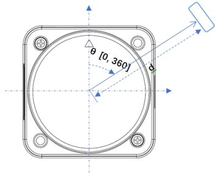
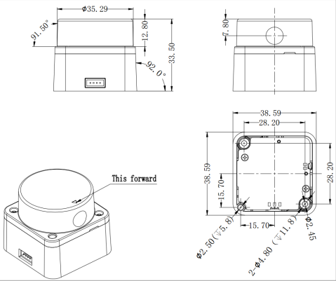
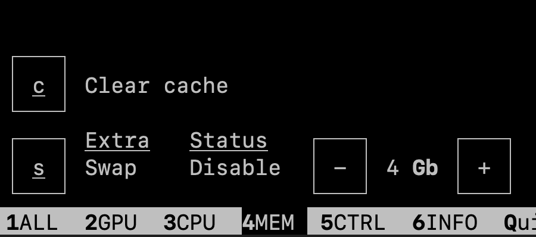
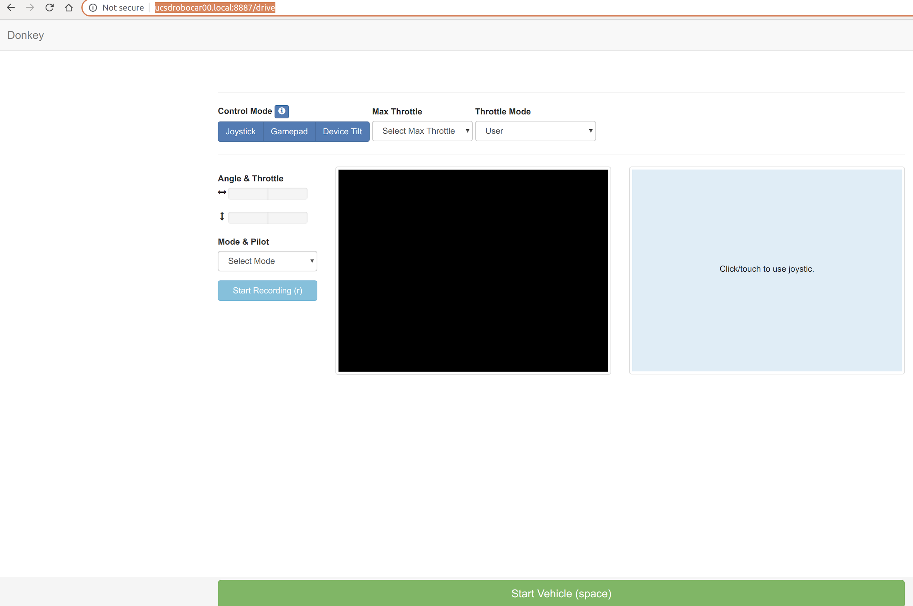
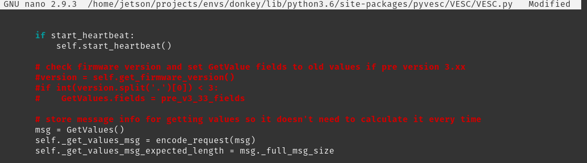

# Note, you can go to [https://docs.google.com/document/d/1Gy4CEKjqXZub0rz-YmxFOakj9O_ZjMmlUYe7NLdM4FY/edit](https://docs.google.com/document/d/1Gy4CEKjqXZub0rz-YmxFOakj9O_ZjMmlUYe7NLdM4FY/edit) instead for a more comprehensive guide.


**UCSD RoboCar ECE & MAE 148**

Version 20.7 - 23Oct2022

Prepared by

Dr. Jack Silberman

Department of Electrical and Computer Engineering

and

Dominic Nightingale

Department of Mechanical and Aerospace Engineering

University of California, San Diego

9500 Gilman Dr, La Jolla, CA 92093


# Table of Contents

**[Table of Contents](#table-of-contents) 2**

**[Introduction](#introduction) 4**

**[Single Board Computer (SBC) Basic
Setup](#single-board-computer-sbc-basic-setup) 5**

> [Jetson Nano (JTN) Configuration](#jetson-nano-jtn-configuration) 5

> [Jetson Xavier NX Configuration](#jetson-xavier-nx-jnx-configuration)
> 5

**[Hardware Setup](#hardware-setup) 6**

> [Jetson Nano GPIO Header PINOUT](#jetson-nano-gpio-header-pinout) 6

> [VESC](#vesc) 7
>
> [VESC Hardware V6.x](#_s281f6m5z2vd) 8
>
> [Motor Detection](#_fh8ltsnwmmrd) 10
>
> [Sensor Detection](#_2d2r0k5t70f4) 14
>
> [Enable Servo Control For Steering](#_9ymkdmchduhq) 16
>
> [VESC Hardware V4.12 (if you have V6, skip this)](#_ohr8s4phbsb0) 17
>
> [PWM Controller](#pwm-controller) 18
>
> [Wiring adafruit board](#wiring-adafruit-board) 19
>
> [Detecting the PWM controller](#detecting-the-pwm-controller) 20
>
> [Emergency stop - Relay](#emergency-stop---relay) 21
>
> [Logitech F710 controller](#logitech-f710-controller) 23
>
> [Other JoyStick Controllers](#other-joystick-controllers) 23
>
> [LD06 Lidar](#ld06-lidar) 25
>
> [Laser Map](#laser-map) 25
>
> [Mechanical drawing](#mechanical-drawing) 25

**[Install OpenCV from Source](#_8sb9o86fl4d1) 26**

**[DonkeyCar AI Framework](#donkeycar-ai-framework) 26**

> [Setting up the DonkeyCar AI
> Framework](#setting-up-the-donkeycar-ai-framework) 26
>
> [Create a virtual environment for the DonkeyCar AI
> Framework.](#create-a-virtual-environment-for-the-donkeycar-ai-framework.)
> 27
>
> [Confirm openCV build from previous steps](#_vgqx7t3x8yes) 28
>
> [Tensorflow](#tensorflow) 29
>
> [PyTorch](#_k329co33iptx) 32
>
> [Installing Donkeycar AI Framework](#section-9) 35
>
> [Create a Car](#create-a-car) 36
>
> [Donkeycar manage.py](#_jok809vjuom8) 37
>
> [Modifying PWM board configuration](#_nkz3143022ot) 37
>
> [Modifying Camera](#modifying-camera) 37
>
> [Quick Test](#quick-test) 38
>
> [Modifying Joystick](#modifying-joystick) 39
>
> [Calibration of the Throttle and
> Steering](#calibration-of-the-throttle-and-steering) 41
>
> [Begin Calibration](#begin-calibration) 42
>
> [Saving car configuration file](#saving-car-configuration-file) 44
>
> [Driving the Robot to Collect
> data](#driving-the-robot-to-collect-data) 46

**[Backup of the uSD Card](#backup-of-the-usd-card) 50**

> [If needed, we have an uSD Card Image Ready for Plug and
> Play](#if-needed-we-have-an-jtn-usd-card-image-ready-for-plug-and-play)
> 52

**[ROS with Docker](#ros-with-docker) 53**

**[Supporting material](#supporting-material) 54**

#  

# Introduction 

This document was derived from the DIY RoboCar - Donkey Car Framework

Reference information can be found at
[http://docs.donkeycar.com](http://docs.donkeycar.com)

At UC San Diego's Introduction to Autonomous Vehicles class (ECE
MAE148), we use an AI Framework called Donkey Car which is based on Deep
Learning / Human behavior cloning as well as we do traditional
programming using Robot Operating System (ROS2).

DonkeyCar can be seen as the "hello world" of affordable scaled
autonomous cars

We have added other features into our UCSD scale robot cars that are not
found at the Default Donkey car build such as a wireless emergency off switch.
Therefore, please follow the instructions found in this document vs. the default Donkey built.

Another framework we use called UCSD Robocar is primarily maintained and
developed by Dominic Nightingale right here at UC San Diego. UCSD
Robocar uses ROS and ROS2 for controlling our scaled robot cars which
can vary from traditional programming or machine learning to achieve an
objective. The framework works with a vast selection of sensors and
actuation methods in our inventory making it a robust framework to use
across various platforms. Has been tested on 1/16, 1/10, 1/5 scaled
robot cars and soon our go-karts.

As August 2019 we transitioned from the single board computer (SBC)
called Raspberry PI to the Nvidia Jetson Nano. If you are using a Raspberry PI, then search in this
document for Raspberry PI (RPI or PI) Configuration.

On 28Aug19, we updated the instructions to include Raspberry PI 4B Depending on your Single Board Computer, Jetson Xavier NX, Jetson Nano, then follow the related instructions.

#  

# Single Board Computer (SBC) Basic Setup

We will be using the Ubuntu Linux distribution. In the class you have
access to a virtual machine image file with Ubuntu.

We won't install ROS2 directly into the SBC, we will be using Docker
images and containers.

You will install OpenCV from source as part of your learning on
compiling and building software from source.

## Jetson Nano (JTN) Configuration

[Instructions to configure the Jetson
Nano](https://docs.google.com/document/d/1TF1uGAFeDARNwbPkgg9xg4NvWPJvrsHW2I_IN9dWQH0/edit?usp=sharing)

## Jetson Xavier NX (JNX) Configuration

[Instructions to Configure the Jetson Xaviver
NX](https://docs.google.com/document/d/1mXgN9DcAj30HAsbfrHNCP-YEYqKWPTbcUssRI1Xab1A/edit?usp=sharing)

[Archive location to previous JetPack
versions](https://developer.nvidia.com/embedded/jetpack-archive)

## Editing Remotely with Jupyter Notebooks

Install Jupyter notebook on your Jetson:

  -----------------------------------------------------------------------
  sudo apt install jupyter-notebook
  -----------------------------------------------------------------------

  -----------------------------------------------------------------------

[https://ljvmiranda921.github.io/notebook/2018/01/31/running-a-jupyter-notebook/](https://ljvmiranda921.github.io/notebook/2018/01/31/running-a-jupyter-notebook/)

Help document for editing using Jupyter notebook:

[Conifguring Jupyter Notebook on
SSH](https://docs.google.com/document/d/1ZNACJvKmQNnN7QNMwgqnzjrs9JDdFbiqVFHAuhgillQ/edit?usp=sharing)

# Hardware Setup 

You should consider breaking the work on building the robots per team
member:

a)  Someone could start to build OpenCV GPU accelerated in parallel
    while you build the robot. [It will take several hours building
    OpenCV from
    source](https://docs.google.com/document/d/1HX2zmjbVsyLnliEQ8wp97Y453g5qNAYHWtFQiKQ0elA/edit?usp=sharing).
    Try to divide the work by team members ...

b)  Start designing, 3D Printing, Laser Cutting the parts

As of Spring 2022, we upgraded all the ECE MAE 148 robots to use VESCs.

## VESC

VESC is a super cool Electronic Speed Controller (ESC) that runs open
source code with significantly more capabilities than a regular RC Car ESC.

VESCs are very popular for electrical skateboards, DIY electrical
scooters, and robotics.

For robotics, one of the capabilities we will use the most is Odometry
(speed and position)

based on the sensors on brushless motors (sensored) or to some extent,
specially using the latest VESCs and firmware, it is also available with
brushless motors without sensors (sensorless).

[https://vesc-project.com/](https://vesc-project.com/)

[VESC Setup
Instructions](https://docs.google.com/document/d/1Y5DdvWdtFjbeyGIVJyWAb8Wrq6M1MkCkMPiDgT4LoQY/edit?usp=sharing)

## Logitech F710 controller 

Place your Logitech F710 controller on the [x mode]

(look for small switch in one of the controller face)

Connect the USB JoyStick Dongle into the JTN and then list the input
devices again

ls /dev/input

(env) jetson@ucsdrobocar00:~/projects/d3$ ls /dev/input

by-id event0 event2 event4 mice mouse1

by-path event1 event3 [js0] mouse0

We are looking for a js0

### Other JoyStick Controllers

JoyStick Controllers - either the Logitech F-10 or PS4

Make sure your myconfig.py on your car directory reflects your
controller

Connecting the LogiTech Controller is as easy as plugging in the USB
dongle at the SBC.

[If you want to check controller was connected]

ls /dev/input

[and see if js0 is listed.]

[Lets test the joystick in a linux machine]

sudo apt-get update

sudo apt-get install -y jstest-gtk

jstest /dev/input/js0

To remove a device, let's say another JoyStick that you don't use
anymore

bluetoothctl

paired-devices

remove THE_CONTROLLER_MAC_ADDRESS


## LD06 Lidar

Datasheet for LD06 lidar:
[datasheet](https://drive.google.com/file/d/1t0CkEEd9fYG_eIq_DL8eqy4NywQQDrjg/view?usp=sharing)

### Laser Map



### Mechanical drawing




# DonkeyCar AI Framework

## Setting up the DonkeyCar AI Framework

Reference
[http://docs.donkeycar.com](http://docs.donkeycar.com)

Make sure that the OpenCV you want to use supporting CUDA is already
available as a systemwide package.

Remember that when you are compiling and building software from source,
it may take a few hours ...

SSH into the Single Board Computer (SBC) e.g., RPI, JTN, JNX, etc.

 Install some packaged, some may be already installed
```
sudo apt update -y
```
```
sudo apt upgrade -y
```
```
sudo usermod -aG dialout jetson
```

 #If packages are being held back
```
 sudo apt-get --with-new-pkgs upgrade
```
```
sudo apt-get install -y build-essential python3 python3-dev python3-pip
libhdf5-serial-dev hdf5-tools libhdf5-dev zlib1g-dev zip libjpeg8-dev
liblapack-dev libblas-dev gfortran libxslt1-dev libxml2-dev libffi-dev
libcurl4-openssl-dev libssl-dev libpng-dev libopenblas-dev openmpi-doc
openmpi-bin libopenmpi-dev libopenblas-dev git nano
```
Install RPi.GPIO clone for Jetson Nano

[https://github.com/NVIDIA/jetson-gpio](https://github.com/NVIDIA/jetson-gpio)
```
pip3 install Jetson.GPIO
```
 If the pip install complains about ownership of the directory*

 then execute the following command

 sudo chown -R jetson:jetson /home/jetson/.cache/pip

 ex:

 WARNING: The directory '/home/jetson/.cache/pip/http' or its parent
 directory is not owned by the current user and the cache has been
 disabled. Please check the permissions and owner of that directory. If
 executing pip with sudo, you may want sudo's -H flag.

 WARNING: The directory '/home/jetson/.cache/pip' or its parent
 directory is not owned by the current user and caching wheels has been
 disabled. check the permissions and owner of

 that directory. If executing pip with sudo, you may want sudo's -H
 flag.

 If pip breaks for some reason, you can reinstall it with the following
 lines

 python3 -m pip uninstall pip

 sudo apt install python3-pip --reinstall

 If the install request elevated privileges, execute the following
 command

 sudo pip3 install Jetson.GPIO

 if pip has a new version

 pip3 install --upgrade pip

Let's make sure the user jetson can use gpio

sudo groupadd -f -r gpio

sudo usermod -a -G gpio jetson

 sudo cp /opt/nvidia/jetson-gpio/etc/99-gpio.rules /etc/udev/rules.d/

 28Jan20 - did not work with JetPack3.4

 15May21- did not work with JetPack4.5

 19Oct21 - did not work with JetPack4.6

 18Sep22 - did not work with JetPack4.6.2

 Will get back to it later if the jetson user can not access GPIO

sudo udevadm control --reload-rules && sudo udevadm trigger

We want to have control over the versions of each software library to
minimize the framework from

breaking after system-wide upgrades. Therefore, lets create a virtual
environment for the DonkeyCar.

### Create a virtual environment for the DonkeyCar AI Framework. 

If you want the virtual environment to be under the user's home
directory, make sure to be on the

home directory for user jetson

If you have not done so, lets create a directory to store our projects
and one subdirectory

to store virtual environments
```
cd ~
```
```
mkdir projects
```
```
cd projects
```
```
mkdir envs
```
```
cd envs
```
```
pip3 install virtualenv
```
 if complains about user permission

 pip3 install virtualenv --user

We will create a virtual environment called donkey since our AI
framework is based on the Donkey Car project
```
python3 -m virtualenv -p python3 donkey --system-site-packages
```

Since your SBC will be initially dedicated to the class AI framework
(Donkey), at least until your custom project starts, let's activate the donkey virtual env
automatically every time the user Jetson logs into the SBC. We can remove this settings later if needed
when using ROS2
```
echo "source ~/projects/envs/donkey/bin/activate" >> ~/.bashrc
```
```
source ~/.bashrc
```
When a virtual environment is active, you should see
(name_of_virtual_enviroment) in front of the terminal prompt.

ex:
```
(donkey)jetson@ucsdrobocar-xxx-yy:
```
At this point, using pip and pip3 should be the same as using pip3 by
default in this virtual environment.

https://docs.donkeycar.com/guide/robot_sbc/setup_jetson_nano/ 46

 it is necessary to create a link to it

  Go to the folder where OpenCV's native library is built
```
 cd /usr/local/lib/python3.6/site-packages/cv2/python-3.6
```
  Rename
```
 mv cv2.cpython-36m-xxx-linux-gnu.so cv2.so
```
  Go to your virtual environments site-packages folder if previously
 set
```
 cd ~/env/lib/python3.6/site-packages/
```
 #Or just go to your home folder if not set a venv site-packages
 folder

 cd ~

  Symlink the native library

 ln -s /usr/local/lib/python3.6/site-packages/cv2/python-3.6/cv2.so
 cv2.so

 NOTE that it is almost mandatory to create a virtual environment in
 order to properly install tensorflow, scipy and keras, and always a best practice.
```
cd ~/projects/envs/donkey/lib/python3.6/site-packages/
```
```
ln -s /usr/local/lib/python3.6/site-packages/cv2/python-3.6/cv2.so
```
```
cv2.so
```
### 

### Confirm that OpenCV built from previous steps is working on the virtual environment Donkey

# Testing to see if OpenCV is installed in the virtual env.
```
python3 -c 'import cv2 as cv; print(cv.__version__)'
```
 (donkey) **jetson@ucsdrobocar-xxx-yy**:**~/projects/envs/donkey**$
 python3 -c 'import cv2 as cv; print(cv.__version__)'

 4.6.0

# We won't use Python2, but just in case one will need it for some
reason
```
python2 -c 'import cv2 as cv; print(cv.__version__)'
```
We are not done installing software yet. We need to install more
dependencies..

**Make sure you have the donkey virtual environment activated**
### Step 3a: Install System-Wide Dependencies

First install some packages with `apt-get`.

```bash
sudo apt-get update -y
sudo apt-get upgrade -y
sudo apt-get install -y libhdf5-serial-dev hdf5-tools libhdf5-dev zlib1g-dev zip libjpeg8-dev liblapack-dev libblas-dev gfortran
sudo apt-get install -y python3-dev python3-pip
sudo apt-get install -y libxslt1-dev libxml2-dev libffi-dev libcurl4-openssl-dev libssl-dev libpng-dev libopenblas-dev
sudo apt-get install -y git nano
sudo apt-get install -y openmpi-doc openmpi-bin libopenmpi-dev libopenblas-dev
```

#### Setup Python Dependencies

Next, you will need to install packages with `pip`:

```bash
pip3 install -U pip testresources setuptools
pip3 install -U futures==3.1.1 protobuf==3.12.2 pybind11==2.5.0
pip3 install -U cython==0.29.21 pyserial
pip3 install -U future==0.18.2 mock==4.0.2 h5py==2.10.0 keras_preprocessing==1.1.2 keras_applications==1.0.8 gast==0.3.3
pip3 install -U absl-py==0.9.0 py-cpuinfo==7.0.0 psutil==5.7.2 portpicker==1.3.1 six requests==2.24.0 astor==0.8.1 termcolor==1.1.0 wrapt==1.12.1 google-pasta==0.2.0
pip3 install -U gdown

# This will install tensorflow as a system package
pip3 install --pre --extra-index-url https://developer.download.nvidia.com/compute/redist/jp/v45 tensorflow==2.3.1
```

## As of Summer II 2022, we are using a new Stereo Camera from Luxonis 

## Configuring OAKD Lite

Open a terminal window and run the following commands:

sudo apt update && sudo apt upgrade

# after upgrades

sudo reboot now

If you have not added the extra swap space while building OpenCV, please
add it

You can use jtop to add more swap space using the left and right keys
and clicking the plus button

jtop

4



Add 4G of swap and press S to enable it.


 Alternatively you can use the command line

 #Disable ZRAM:

 sudo systemctl disable nvzramconfig

#Create 4GB swap file

 sudo fallocate -l 4G /mnt/4GB.swap

 sudo chmod 600 /mnt/4GB.swap

 sudo mkswap /mnt/4GB.swap

 If you have an issue with the final command, you can try the
 following:

 sudo nano /etc/fstab

 #Add this line at the bottom of the file

 /mnt/4GB.swap swap swap defaults 0 0

 #Reboot

sudo reboot now

#Installing dependencies

Navigate to the directory where you will be installing the luxonis
libraries using cd ~/projects
```
sudo nano install_dependencies.sh
```
Copy the entire contents of the file:
[install_dependencies.sh](https://drive.google.com/file/d/1dA_MAeJbzDbkNlWzFMTlBraCIS2v965S/view?usp=share_link)
```
bash install_dependencies.sh
```
```
echo "export OPENBLAS_CORETYPE=ARMV8" >> ~/.bashrc
```
```
echo 'SUBSYSTEM=="usb", ATTRS{idVendor}=="03e7", MODE="0666"' |
```
```
sudo tee /etc/udev/rules.d/80-movidius.rules
```
```
sudo udevadm control --reload-rules && sudo udevadm trigger
```
#Navigate using cd to the folder where you would like to install the
camera example files and requirements
```
cd ~/projects
```
```
git clone
[https://github.com/luxonis/depthai-python.git](https://github.com/luxonis/depthai-python.git)
```
```
cd depthai-python/examples
```
```
python3 install_requirements.py
```
#If you want to test the camera and you have remote desktop
[NoMachine](https://www.nomachine.com/download) already
installed and the OAKD Lite is connected to JTN , run the following in
the terminal on a NoMachine session

#Navigate to the examples folder in depthai-python first and then
```
cd ColorCamera
```
```
python3 rgb_preview.py
```
You should be able to see preview video on the No machine desktop

###  

### Installing Donkeycar AI Framework


#### Install Donkeycar Python Code

Change to a dir you would like to use as the head of your projects. Assuming
you've already made the `projects` directory above, you can use that. Get
the latest 4.5.X release and install that into the venv.

```bash
mkdir projects
cd ~/projects
git clone https://github.com/autorope/donkeycar
cd donkeycar
git fetch --all --tags -f
git checkout 4.5.1
pip install -e .[nano]

```

Lets enable the use of synchronization of files with remote computers
using rsync
```
sudo apt-get install rsync
```
This part will take a bit of time. Be patient, please keep in mind that
you are using a low power single board computer (SBC).

If you are curious if your SBC is really working, you can open another
tab in the terminal window or a complete new terminal window, ssh to the JTN then execute the
command top or htop

look at the CPU utilization...


### Create a Car

Let's create a car on the path ~/projects/d4

cd ~/projects/donkeycar

donkey createcar --path ~/projects/d4


Make sure the DonkeyCar is version 4.5.1. The latest version of the
DonkeyCar (5.x) does not work at the Jetson Nano yet.

You spent several hours on this configuration right?! Please make a
backup of your uSD card - "[Backup of the uSD
Card](https://docs.google.com/document/d/1TF1uGAFeDARNwbPkgg9xg4NvWPJvrsHW2I_IN9dWQH0/edit#heading=h.mwv009fkh5ax)"

### Modifying Camera 

Change the camera type to MOCK to enable us to test the system without a
camera

nano myconfig.py

#CAMERA

CAMERA_TYPE = "MOCK" (PICAM|WEBCAM|CVCAM|CSIC|V4L|MOCK)

# if you have USB camera connected to the JTN , use WEBCAM

# And change this line so the Donkey can run using the web interface

USE_JOYSTICK_AS_DEFAULT = False

###  

### Quick Test

Lets test the Donkey AI framework install

python manage.py drive

Lets connect to the JTN by using a web browser from your PC

[http://ucsdrobocar-xxx-yy:8887](http://ucsdrobocar01.local:8887)

You should see a screen like this



#We stop the Donkey with Ctrl-C

Ctrl-C

### Modifying Joystick 

Now let's change the type of joystick we use with Donkey

nano myconfig.py

 JOYSTICK

 USE_JOYSTICK_AS_DEFAULT = True when starting the manage.py,
 when True, wil$

 JOYSTICK_MAX_THROTTLE = 0.5 this scalar is multiplied with the -1 to$

 JOYSTICK_STEERING_SCALE = 1.0 some people want a steering that is
 less$

 AUTO_RECORD_ON_THROTTLE = True if true, we will record whenever
 throttle$

 CONTROLLER_TYPE='F710'(ps3|ps4|xbox|nimbus|wiiu|F710)

python manage.py drive

ex

 Starting vehicle...

 Opening /dev/input/js0...

 Device name: Logitech Gamepad F710

 recorded 10 records

 recorded 20 records

 recorded 30 records

 recorded 40 records

 erased last 100 records.

 E-Stop!!!

 recorded 10 records

 recorded 20 records

 recorded 30 records

 recorded 40 records

 recorded 50 records

The Right Joystick is the Throttle, the Left Joystick is the Steering

The Y Button deletes 5s of driving at the default configuration =100
records at 20 Hz

The A Button is the emergency break

Joystick Controls:

 +------------------+---------------------------+

 | control | action |

 +------------------+---------------------------+

 | start | toggle_mode |

 | B | toggle_manual_recording |

 | Y | erase_last_N_records |

 | A | emergency_stop |

 | back | toggle_constant_throttle |

 | R1 | chaos_monkey_on_right |

 | L1 | chaos_monkey_on_left |

 | circle | show_record_acount_status |

 | R2 | enable_ai_launch |

 | left_stick_horz | set_steering |

 | right_stick_vert | set_throttle |

 +------------------+---------------------------+

If your joystick is not returning to neutral

You can add a deadzone value

on myconfig.py

ex:

 NETWORK_JS_SERVER_IP = "192.168.0.1"when listening for network
 joystick cont$

 JOYSTICK_DEADZONE = 0.01 when non zero, this is the smallest throt$

 JOYSTICK_THROTTLE_DIR = -1.0 use -1.0 to flip forward/backward, use $

Lets Integrate the JTN and PWM Controller into the RC Chassis

Charge your LiPo Battery

After you charge your Lithium Polymer (LiPo) battery(ries) - [some info
here](https://rogershobbycenter.com/lipoguide/)

Connect the battery(ries) **and batteries monitor/alarm**

Please do not use the batteries without the batteries monitor/alarms

**If you discharge a LiPO batteries below a threshold lets say 3.0**

#  


## VESC

Ensure that you have already configured the VESC device using the VESC
Tool Software

Edit the myconfig.py to have these values

DRIVE_TRAIN_TYPE = "VESC"

VESC_MAX_SPEED_PERCENT =.2 ## Max speed as a percent of actual max
speed

VESC_SERIAL_PORT= "/dev/ttyACM0" ## check this val with ls /dev/tty*

VESC_HAS_SENSOR= True

VESC_START_HEARTBEAT= True

VESC_BAUDRATE= 115200

VESC_TIMEOUT= 0.05

VESC_STEERING_SCALE = .5

VESC_STEERING_OFFSET = .5

DONKEY_GYM = False

(we will leave the CAMERA_TYPE = "MOCK" for now to make sure we can
drive the car with the VESC)

Download the following files

[https://drive.google.com/drive/folders/19TS3VyNXQPBSr41yiPaxpI1lnxClI2c8?usp=sharing](https://drive.google.com/drive/folders/19TS3VyNXQPBSr41yiPaxpI1lnxClI2c8?usp=sharing)

And replace them on the Jetson in the locations shown in the images
below. Note - to get the files on the jetson you can use SFTP (secure
file transfer protocol):

Examples on how to use SFTP:
```
sftp jetson@ucsdrobocar-148-xx.local
```
```
cd To the directory you want to go to
```
```
put /File/Path/On/Your/Computer
```
alternatively
```
get filename /File/Location/You/Want/Them/Go/On/Your/Computer
```
To get a directory
```
get -rf filename /File/Location/You/Want/Them/Go/On/Your/Computer
```
type "exit" to disconnect

## 

Once these have been replaced, you should run
```
python manage.py drive
```
It should first throw a pyvesc import error. Follow the description in
the terminal to install the needed libraries

Then run it again. It should throw a permissions error. Follow the
advice on how to fix the error with chmod

Int(10) error bug fix (Credit Saimai Lau and Albert Chang):
When running python manage.py drive, the intermittent "invalid literal
for int() with base 10: 'None' error is from the VESC package checking
whether the version of the VESC is below 3.0, so we can comment out that
part since we're using 6.0 just do
```
nano
/home/jetson/projects/envs/donkey/lib/python3.6/site-packages/pyvesc/VESC/VESC.py
```
and put # at the beginning of lines 38-40 Then ^S to save and ^X to
exit



Error explanation: The self.get_firmware_version() get thes version by
requesting it from the VESC and reading the replied bytes, but sometimes
the data is lost or incomplete so the function returns 'None' as the
version. We already know the version is 6.0 so we don't need this
function.

## OAKD 

Once you have the VESC driving the car, you will need to make sure you
have set up the document by following the instructions labeled
Configuring OAKD Lite found [earlier in this
document](#configuring-oakd-lite)

Edit the myconfig.py camera type to OAKD

CAMERA_TYPE = "OAKD"
CAMERA_INDEX = 0

Make sure the camera is working by checking the images that are being
saved to the /data/images directory.

The easiest way to do this is to go to

[http://ucsdrobocar-xxx-yy:8887](http://ucsdrobocar01.local:8887) while
running donkeysim, and you should be able to see a livestream from the
camera. Note - if several people are running donkeysim at the same time
on the same wifi this interface may get buggy

You can also do this by either:
Transferring the files to you laptop or virtual machine

with scp, sftp, rsync, winscp (windows) or filezilla (mac)

or

Using NoMachine by following the instructions found
[here](#remote-desktop-installation) in this document
