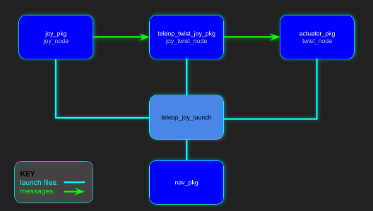

# UCSD Robocar Framework

## 1. Introduction
The UCSD Robocar framework is primarily maintained and developed by Dominic Nightingale right here at UC San Diego.  

UCSD Robocar uses ROS and ROS2 for controlling our scaled robot cars which can vary from traditional programming or machine learning to achieve an objective. The framework works with a vast selection of sensors and actuation methods in our inventory making it a robust framework to use across various platforms. Has been tested on 1/16, 1/10, 1/5 scaled robot cars and soon our go-karts.  

### 1.1 About
This framework was originally developed as one of Dominic’s senior capstone projects as an undergraduate and has been under constant development throughout his graduate program. The framework provides the ability to easily control a car-like robot as well as performing autonomous tasks. It is currently being used to support his thesis in learning-model predictive control (LMPC).  

The framework is also being used to teach undergraduates the fundamentals of using gitlab, docker, python, openCV and ROS. The students are given the task to use the framework with their robots to perform autonomous laps on a track by first going through a calibration process that's embedded into the framework. The students then have to come up with their own final projects for the class that can be supported by the framework, which can vary from car following, SLAM applications, path planning, city driving behaviors, Human-machine-interfacing and so much more.  

### 1.2 What's Being Used
#### 1.2.1 Embedded Computers
There are 3 main computers that have been used to develop and test this framework which belong to the NVIDIA Jetson family.  
Jetson Nano  
Jetson Xavier Nx  
Jetson AGX Xavier  
#### 1.2.2 Ubuntu
The host OS on all the Jetson computers use Ubuntu18 which is flashed through NVIDIA's Jetpack image. However, the docker image uses Ubuntu20 in order to use ROS2 without worrying about package installation issues  
#### 1.2.3 Gitlab
This is where all the code for the entire framework is managed and developed. Gitlab provides a service similar to google drive but for programs! It's especially convenient in terms of deploying code into embedded computers.  
#### 1.2.4 Docker
This tool is being used to expedite the setup process on the computers. To get the docker image working, the Jetson just needs to be flashed with the Jetpack 4.6 image provided by NVIDIA and then simply pull the UCSD Robocar docker image from docker hub onto the Jetson. This allows for plug-n-play capabilities as long as all the hardware is connected to the Jetson properly.  
#### 1.2.5 ROS
The framework allows for both ROS-Noetic and ROS2-Foxy to work together through the ROS bridge or independently depending on the application.  

### 1.3 Recommendations
#### 1.3.1 VS Code IDE
Microsoft Visual Studio IDE is an excellent development tool for coding especially because of all the free plug-ins that can be added.  
Plug-ins recommended:  
Python  
Docker  
Remote - SSH  
#### 1.3.2 Virtual Machines
If having software related issues, a virtual machine can possibly solve the issues and also provide a linux based interface to use with the jetson which is usually much smoother than with windows or mac.  
Below are some links to install Virtual machine software and a virtual machine image that runs Ubuntu20.04, has VS code (with all plug-ins mentioned above), docker and the UCSDrobocar docker image installed already.  
VMware Software  
UCSD Robocar VM image for VMware  
Hostname: ucsdrobocar-vm  
Username: robocar  
Password: ucsdrobocar  


## 2. UCSD Robocar Framework Breakdown

The UCSD Robocar Framework is a collection of ROS 2 packages for each of the hardware components used on the robocar (e.g. the camera, VESC, LiDAR, etc.). The Nav package acts as the "brain" of the collection since it interacts with each of the other independent packages.

Having standalone packages instead of one major package makes deployment more robust. Additionally, as the robot becomes more sophisticated, the number of associated packages would likely increase to achieve many different types of tasks depending on the application.

So the idea is to develop a package that could in general be used on any car-like robot as well as being able to choose what packages your robot really needs without having to use the entire framework.

For example, lets say another company developed their own similar sensor, actuator and nav packages but they have not researched into lane detection. Instead of using the entire UCSD Robocar framework, they could easily just deploy the lane detection package and have some interpreter in their framework read the messages from the lane detection package to suit their needs.

Link to the official git repo: [**ROS 2**](https://gitlab.com/ucsd_robocar2/ucsd_robocar_hub2)

Note: The hub2 package is a *metapackage*. For specific details about any individual package, click on any of the packages in either hub to be taken to that packages' main repository.

### 2.1 Packages

Each UCSD ROS package has a README.md that explains in detail what config, nodes, launch files it has as well as topic/message information. When troubleshooting, consider outlining what problem you are having and what package that most likely the cause of such an error. Then reference the README for that package.

#### 2.1.1 Nav

The navigation package (nav_pkg) is the "brain" of the UCSD Robocar framework because it keeps all the launch files in its package to launch any node/launch file from the other packages used in the framework. This makes using the framework easier because you only really have to remember the name of the nav_pkg and what launch file you want to use rather than having to remember all the other package names and their own unique launch files.

[NAV2 README](https://gitlab.com/ucsd_robocar2/ucsd_robocar_nav2_pkg/-/blob/master/README.md)

#### 2.1.2 Lane Detection

The lane detection package is one method of navigating by identifying and tracking road markers. The basic principle behind this package is to detect road markers using openCV and then compute whats called the “cross-track-error” which is the difference between the center axis of the car and the centroid (center of “mass”) of the road mark which is then fed into a PID controller for tracking.

[Lane Detection2 README](https://gitlab.com/ucsd_robocar2/ucsd_robocar_lane_detection2_pkg/-/blob/master/README.md)

#### 2.1.3 Sensor

The sensor package contains all the required nodes/launch files needed to use the sensors that are equipped to the car.

[Sensor2 README](https://gitlab.com/ucsd_robocar2/ucsd_robocar_sensor2_pkg/-/blob/master/README.md)

#### 2.1.4 Actuator

The actuator package contains all the required nodes/launch files needed to use the actuators that are equipped to the car.

[Actuator2 README](https://gitlab.com/ucsd_robocar2/ucsd_robocar_actuator2_pkg/-/blob/master/README.md)

#### 2.1.7 Basics

The path package contains all the required nodes/launch files needed to subscribe/publish to the sensor/actuator messages within the framework for fast algorithm prototyping

[Basics2 README](https://gitlab.com/ucsd_robocar2/ucsd_robocar_basics2_pkg/-/blob/master/README.md)

### 2.2 Updating All Packages

A utility function was added to the ```~/.bashrc``` script that will automatically update all the packages in the framework and then rebuild and source it so it will be ready to start using ROS2!

To do so, in your terminal:
```
upd_ucsd_robocar
```
### 2.3 Launch Files

The launch file diagrams below show the very general approach of how the packages communicate with one another. With ROS, it just comes down to a combination of starting launch files and sending messages (through topics) to nodes. For specific details about messages types, topics, services and launch files used, please go to the readme for the specific package of interest!

The nav_pkg is at the base of each of the diagrams and rooting from it are the launch files it calls that will launch other nodes/launch files from all the other packages in the framework.

In ROS2, a dynamically built launch file (at run-time) is used to launch all the different nodes/launch files for various purposes such as data collection, navigation algorithms and controllers. This new way of creating launch files has now been simplified by just adding an entry to a yaml file of where the launch file is and a separate yaml file to indicate to use that launch file or not. There is only one file to modify and all that needs to be changed is either putting a “0” or a “1” next to the list of nodes/launch files. To select the nodes that you want to use, put a “1” next to it otherwise put a “0” which means it will not activate. In the figures below, instead of including the entire ros2 launch command, you will only see the names of the launch files that need to be turned on in the node config file explained more in detail [here](https://docs.google.com/document/d/1ygzU4uE3p38XZT8Rey_QmykXRS-VA-rtt_XBkC3gpCE/edit#heading=h.3ucils4zejvp)


ROS2-FOXY: ```all_components.launch.py, sensor_vizualization.launch.py```




ROS2-FOXY: ```all_components.launch.py, teleop_joy_vesc_launch.launch.py```


ROS2-FOXY: ```all_components.launch.py, camera_nav_calibration.launch.py```


## 3. Developer Tools

### 3.1 ROS Guidebooks

Links provided below are guides for ROS and ROS2 which include many examples, terminal commands and general concept explanations of the various features in ROS and ROS2.

* [UCSD ROS Guidebook](https://docs.google.com/document/d/1u7XS7B-Rl_emK3kVKEfc0MxHtwXGYHf5HfLlnX8Ydiw/edit)
* [UCSD ROS2 Guidebook](https://docs.google.com/document/d/1DJgVLnu_vN-IXKD3QrQVF3W-JC6RiQPVugHeFAioB58/edit?usp=sharing)

### 3.2 Gitlab

Since the framework uses a meta package (a package that contains multiple packages) we refer to individual packages as submodules.

#### 3.2.1 Adding New Submodules

1. ```git submodule add <remote_url>```
2. ```git commit -m "message"```
3. ```git push```

#### 3.2.2 Updating local submodules with remote submodules

#### 3.2.3 Updating remote submodules with local submodules

#### 3.2.4 Removing submodules

#### 3.2.5 Adding an existing package to git

### 3.3 Docker

Below is a go-to list of docker commands that can be used with the framework:

Some new lingo:
* Container name: **NAMES**

* Image name: **REPOSITORY**

* Image tag ID (comparable to branches in git): **TAG**

#### 3.3.1 Pulling/Running

* pulling image from docker hub: ```docker pull REPOSITORY:TAG```

* starting a stopped container: ```docker start NAMES```

* stopping a container: docker stop NAMES

* Using multiple terminals for a single docker container: ```docker exec -it NAMES bash```

* build docker image and git it a new name and tag: ```docker build -t REPOSITORY:TAG .```

#### 3.3.2 Updating/Creating/Sharing

* Saving changes made while in a container to the original image (change tag to create a new image): ```docker commit name_of_container REPOSITORY:TAG```

* Create a new image from a container: ```docker tag NAMES REPOSITORY:TAG```

* Pushing an image to Dockerhub: ```docker push REPOSITORY:TAG```

* Share files between host and Docker container:
  * From **host** to docker container: ```docker cp foo.txt container_id:/foo.txt```
  * From **docker container** to host: ```docker cp container_id:/foo.txt foo.txt```

#### 3.3.3 Listing

* list all images: ```docker images```

* list all running containers: ```docker ps```

* list all containers (including stopped): ```docker ps -a```

#### 3.3.4 Deleting

* delete specific container: ```docker rm NAMES```

* delete specific image: ```docker rmi REPOSITORY:TAG```

* delete ALL containers: ```docker rm -f $(docker ps -a -q)```

* delete ALL images: ```docker rmi -f $(docker images -q)```


## 4. Accessing Docker Images

### 4.1 UCSD Robocar Image

Link to image on Docker Hub: [Docker Image](https://hub.docker.com/r/djnighti/ucsd_robocar)

**Computer Architecture: ARM (Jetson)**

To pull the image from a terminal:
```
docker pull djnighti/ucsd_robocar:devel
```

### 4.2 Docker Setup

The exact "recipe" to build this image can be found [here](https://gitlab.com/ucsd_robocar2/ucsd_robocar_hub2/-/blob/master/docker_setup/docker_files/Dockerfile)

If using the virtual machine, this has already been done for you.

#### 4.2.1 Enable X_11 Port Forwarding

1. On your HOST machine (not the Jetson) enter these commands (Will have to enter every time)
```
xhost +
ssh -X jetson@ip_address
```

2. Now on the Jetson, run the following commands to obtain sudo access for docker commands (only needs to be ran once)
```
sudo usermod -aG docker ${USER}
su ${USER}
```

3. Now check that if X_11 forwarding is working:

```
xeyes
```

If some googly eyes pop up, X_11 is ready to go. IF X_11 PORT FORWARDING IS NOT SETUP, follow steps [here](https://gitlab.com/djnighti/ucsd_robo_car_simple_ros/-/blob/master/x11_forwarding_steps.txt) to get it set up. Then come back here to continue the steps below.

#### X-Forwarding Without the Virtual Machine
On windows, I recommend downloading moba xterm, which should have x11-forwarding set up by default https://mobaxterm.mobatek.net/  
On mac, you can download xquartz from xquartz.org. Here is a link describing how to set it up: https://drive.google.com/file/d/1ozFIgeIVAWg04S_bMru95JwThPDrq6Fk/view?usp=sharing  

#### 4.2.2 Update Docker Daemon

1. Now modify the Docker ```daemon.json``` file (just delete the previous version, then create a new one)
```
sudo rm /etc/docker/daemon.json 
sudo nano /etc/docker/daemon.json
```
2. Within the empty ```daemon.json``` file, add:
```
{
    "runtimes": {
        "nvidia": {
            "path": "nvidia-container-runtime",
            "runtimeArgs": []
        }
    },
    "default-runtime": "nvidia"
}

```

3. Save changes to the file and reboot the Jetson:
```
sudo reboot now
```

#### 4.2.3 Running a Container

1. SSH back into the Jetson with the -X flag which enables X_11 Forwarding
```
ssh -X jetson@ip_address
```

2. Create a new function in the ~/.bashrc file with command line arguments to easily run a container
```
gedit ~/.bashrc
```
or 
```
nano ~/.bashrc
```

3. Copy this into the bottom of the .bashrc:
```
robocar_docker ()
{
    docker run \
    --name ${1}\
    -it \
    --privileged \
    --net=host \
    -e DISPLAY=$DISPLAY \
    -v /dev/bus/usb:/dev/bus/usb \
    --device-cgroup-rule='c 189:* rmw' \
    --device /dev/video0 \
    --volume="$HOME/.Xauthority:/root/.Xauthority:rw" \
    djnighti/ucsd_robocar:${2:-devel}
}

```

**Notice the two arguments we have made for the bash command:**

\${1}: This will be the name of the container, ex. Name_this_container

\${2:devel}: This is the tag id of the image you want to launch a container from. If nothing is specified when calling at the command line (example shown below), the “devel” tag will be run. 

Don't modify the bash function &mdash; the arguments are intentional and are not meant to be hard-coded.

4. Source the ~/.bashrc script so the current terminal can see the new function we just added
```
source ~/.bashrc
```

5. Run the following command to enter the docker container
```
robocar_docker <CONTAINER_NAME>
```
6. To access the **same** docker container from another terminal (do this for as many terminals you want)
```
docker exec -it <CONTAINER_NAME> bash
```

At this point the docker setup is complete but don't forget to refer to the useful docker commands sections which includes deleting, creating and updating images locally and remotely.

### 4.3 Workspaces in Docker Container

#### 4.3.2 ros2_ws

ROS version: ROS2-FOXY

This workspace contains source compiled packages from [ucsd_robocar_hub2](https://gitlab.com/ucsd_robocar2/ucsd_robocar_hub2)

#### 4.3.3 sensor2_ws

ROS version: ROS2-FOXY

This workspace contains source compiled packages for various sensors in our inventory.

### 4.4 ROS Bridge

### 4.5 Utility functions in ```~/.bashrc```

* [Updating all packaging in the ucsd_robocar framework from gitlab:](https://docs.google.com/document/d/1ygzU4uE3p38XZT8Rey_QmykXRS-VA-rtt_XBkC3gpCE/edit#heading=h.dydr21q8ok61) ```upd_ucsd_robocar```
* [Source Noetic and ALL ROS packages and start roscore:](https://docs.google.com/document/d/1ygzU4uE3p38XZT8Rey_QmykXRS-VA-rtt_XBkC3gpCE/edit#heading=h.kh752plifc0s) ```source_ros1_init```
* [Source Noetic and ALL ROS packages](https://docs.google.com/document/d/1ygzU4uE3p38XZT8Rey_QmykXRS-VA-rtt_XBkC3gpCE/edit#heading=h.kh752plifc0s) ```source_ros1_pkg```
* [Source Noetic and ALL ROS packages and put user in ros1_ws:](https://docs.google.com/document/d/1ygzU4uE3p38XZT8Rey_QmykXRS-VA-rtt_XBkC3gpCE/edit#heading=h.kh752plifc0s) ```source_ros1```
* [Source foxy and ALL ROS2 packages:](https://docs.google.com/document/d/1ygzU4uE3p38XZT8Rey_QmykXRS-VA-rtt_XBkC3gpCE/edit#heading=h.hmc07r1l07ue) ```source_ros2_pkg```
* [Source foxy and ALL ROS2 packages and put user in ros2_ws:](https://docs.google.com/document/d/1ygzU4uE3p38XZT8Rey_QmykXRS-VA-rtt_XBkC3gpCE/edit#heading=h.hmc07r1l07ue) ```source_ros2```
* [Build all packages in ucsd_robocar:](https://docs.google.com/document/d/1ygzU4uE3p38XZT8Rey_QmykXRS-VA-rtt_XBkC3gpCE/edit#heading=h.hmc07r1l07ue) ```build_ros2```
* [Source ROS bridge:](https://docs.google.com/document/d/1ygzU4uE3p38XZT8Rey_QmykXRS-VA-rtt_XBkC3gpCE/edit#heading=h.4r55s7fis99g) ```source_ros_bridge```

## 5. Source ROS Version

### 5.1 Source ROS1

### 5.2 Source ROS2

We need to source ROS Foxy and the ros2_ws, below is an alias command that will do that automatically. The alias will also place you in the ros2_ws. This command needs to be run in every new terminal you want to use ROS2 in.  

From the terminal:
```
source_ros2
```
Another alias was made to rebuild the package if any changes were made to the source code. It will put you in the ros2_ws, then perform a colcon build and then source install/setup.bash to reflect the changes made.

From the terminal (This is only needs to be ran in 1 terminal, the changes will be reflected everywhere):
```
build_ros2
```
### 5.3 Source ROS Bridge

## 6. Hardware Configuration

Not all robots have the same hardware especially when it comes to their sensors and motors and motor controllers. This quick section shows how to select the hardware that is on your robot. There are differences between ROS1 and ROS2 on how this configuration works so please read accordingly. This configuration is only necessary for the UCSD Robocar Image and NOT UCSD Robocar Simple ROS Image.

### 6.1 ROS1

### 6.2 ROS2

In ROS2, the hardware configuration is as simple as flipping a switch. Since the launch files in ROS2 are now in python, we can dynamically build launch files! This means no more need to have several different “car configs” that may have different hardware on them and instead have a single launch file that is capable of launching any component you need by changing a single number (that number is explained below)! There is only one file to modify and all that needs to be changed is either putting a “0” or a “1” next to the list of hardware in the file. To select the hardware that your robot has and that you want to use, put a “1” next to it otherwise put a “0” which means it will not activate.

In the ```car_config.yaml``` file, there is a list of actuator and sensor packages that can be used with the car. Set the corresponding funtionality for each component according to the direction above &mdash; once that is done, you must build the packages again:

From a terminal:
```
source_ros2
nano src/ucsd_robocar_hub2/ucsd_robocar_nav2_pkg/config/car_config.yaml
build_ros2
```

## 7. Node Configuration

This quick section shows how to select the nodes/launch files that are on your robot. There are differences between ROS1 and ROS2 on how this configuration works so please read accordingly. This configuration is only necessary for the UCSD Robocar Image and NOT UCSD Robocar Simple ROS Image.

### 7.2 ROS2
This quick section shows how to select the nodes/launch files that are on your robot. There are differences between ROS1 and ROS2 on how this configuration works so please read accordingly. This configuration is only necessary for the UCSD Robocar Image and NOT UCSD Robocar Simple ROS Image.

#### 7.1 ROS1 
In ROS1, the launch files for the various capabilities of the robot are written and called individually and can be found in the launch directory in the ucsd_robocar_nav1_pkg.

#### 7.2 ROS2
Similar to the hardware configuration in ROS2, a dynamically built launch file is used to launch all the different nodes/launch files for various purposes such as data collection, navigation algorithms and controllers. This new way of creating launch files has now been simplified by just adding an entry to a yaml file of where the launch file is and a separate yaml file to indicate to use that launch file or not. There is only one file to modify and all that needs to be changed is either putting a “0” or a “1” next to the list of nodes/launch files. To select the nodes that you want to use, put a “1” next to it otherwise put a “0” which means it will not activate.

Modify and save the node config to launch the algorithm(s) of your choice and then recompile.
From the terminal
```
source_ros2
```
```
gedit src/ucsd_robocar_hub2/ucsd_robocar_nav2_pkg/config/node_config.yaml
```
```
build_ros2
```

## 8. Sensor Visualization  
After selecting the hardware that's equipped on the robot, let's visually verify that the sensors are working. The current config file that is launched will display laser scan and image data. If you have more sensors you want to visualize, feel free to add them through rviz.  

### 8.1 ROS1 
Here is the list of available launch files for all the sensors in the [sensor1_pkg](https://gitlab.com/ucsd_robocar/ucsd_robocar_sensor1_pkg/-/tree/master/launch)

Place the robot on the class provided stand. The wheels of the robot should be clear to spin.
From terminal
```
source_ros1
```
```
roslaunch ucsd_robocar_nav1_pkg sensor_visualization.launch
```
### 8.2 ROS2
Here is the list of available launch files for all the sensors in the [sensor2_pkg](https://gitlab.com/ucsd_robocar2/ucsd_robocar_sensor2_pkg/-/tree/master/launch)

Place the robot on the class provided stand. The wheels of the robot should be clear to spin.
From the terminal
```
source_ros2
```
Modify the hardware config file to turn on the sensors you have plugged in and want to visualize.
```
gedit src/ucsd_robocar_hub2/ucsd_robocar_nav2_pkg/config/car_config.yaml
```
Then modify the node config file to activate all_components and sensor_visualization launch files
```
gedit src/ucsd_robocar_hub2/ucsd_robocar_nav2_pkg/config/node_config.yaml
```

Then rebuild and launch 
```
build_ros2
```
```
ros2 launch ucsd_robocar_nav2_pkg all_nodes.launch.py
```
NOTE: If image data does not show up automatically, un-check and check its box in the display panel in rviz.

## 9. Manual Control of Robot with Joystick
This feature is only supported in the UCSD Robocar Image and NOT UCSD Robocar Simple ROS Image
If using Adafruit and not VESC, anywhere below that says vesc you can replace with adafruit

A deadman switch is also enabled which means you must be pressing the button (LB on logitech) down in order for you to send commands to your robots motors.

The joysticks on the controller are what control the robot to move forwards/backwards and turn.

Place the robot on the class provided stand. The wheels of the robot should be clear to spin.

### 9.1 ROS1 
Place the robot on the class provided stand. The wheels of the robot should be clear to spin.
From the terminal
```
source_ros1
```
```
roslaunch ucsd_robocar_nav1_pkg teleop_joy_vesc.launch
```
### 9.2 ROS2
Place the robot on the class provided stand. The wheels of the robot should be clear to spin.
From the terminal
```
source_ros2
```
Modify the hardware config file to turn on the vesc_with_odom
```
gedit src/ucsd_robocar_hub2/ucsd_robocar_nav2_pkg/config/car_config.yaml
```

Then modify the node config file to activate all_components and f1tenth_vesc_joy_launch launch files
```
gedit src/ucsd_robocar_hub2/ucsd_robocar_nav2_pkg/config/node_config.yaml
```

Then rebuild and launch
```
build_ros2
```
```
ros2 launch ucsd_robocar_nav2_pkg all_nodes.launch.py
```

## 10. Integrating New Packages/Code into the Framework
Integrating a new package can be done many ways so do not take this approach as the best or only method but simply a method for integration. The example below will be in ROS2 but the general procedure is the same in ROS1.
 
### 10.1 Integrating a ROS Package
While in the docker container source ros2 and move in to the src directory of the ros2_ws
```
source_ros2
```
```
cd src/
```

Now lets create a new node by using an example node from the ros2 guidebook which gives all the code for the node, setup.py and launch files as well as step-by-step terminal commands to create everything including the package itself. 
Package name: counter_package
Node name: counter_publisher.py
Launch file name: counter_package_launch_file.launch.py

After completing step 2, notice the “counter_package” package in the same directory as “ucsd_robocar_hub2” package
```
ls src/
```

Adding your package to the nav2 node configuration and node package location lists. To do this, all we need is the name of the package that we want to integrate and the name of the launch file we want to use from that package. In the example node above, the package name is “counter_package” and its launch file is called “counter_package_launch_file.launch.py”. Lets add them to “node_pkg_locations_ucsd.yaml” and to “node_config.yaml” which are both in the NAV2 package 
```
source_ros2
```
```
gedit src/ucsd_robocar_hub2/ucsd_robocar_nav2_pkg/config/node_pkg_locations_ucsd.yaml
```
```
gedit src/ucsd_robocar_hub2/ucsd_robocar_nav2_pkg/config/node_config.yaml
```
Once added, make sure that the “counter_package_launch_file.launch.py” file is set to “1” in the “node_config.yaml” to make sure it's activated as well as any other nodes that are desired to be run.

Rebuild the workspace
```
build_ros2
```
Now launch!
```
ros2 launch ucsd_robocar_nav2_pkg all_nodes.launch.py
```
Verify the node is running (which is called “counter_publisher”) and echo the topic (which is called “/counter”)
```
ros2 node list
```
```
ros2 topic echo /counter
```

That's it! A new package has just been integrated into the framework and now can be easily called with any of the framework's launch files.

10.2 Integrating supporting files
Supporting files can range from yaml files, data sets, machine learning models and general source code that has nothing to do with ROS but may be required for the node to run properly. Once these files are integrated into the ROS framework, they are used the same exact way as they would be when ROS was not being used, which basically means we need to tell ROS where to locate these files so it can access them. Below is a simple example of a ROS package structure.
```
ros2_ws
	src
		example_package_name
			config
			launch
			example_package_name
				example_node.py
			setup.py
```
Now let's say our node “example_node.py” requires an external class or method from a pure python file called “python_only.py”, Lets create a new directory or submodule in “example_package_name” and call it “example_submodule_name” and then put the pure python file there
```
ros2_ws
	src
		example_package_name
			config
			launch
			example_package_name
				example_submodule_name
					python_only.py
				example_node.py
			setup.py
```
This is the general idea however the submodule placement is arbitrary as long as you are consistent in the code where things are located. For example, maybe the node requires a pre-trained machine learning model for it to run successfully and makes more sense to have a models folder adjacent to the launch and config directories as shown below
```
ros2_ws
	src
		example_package_name
			config
			launch
			models
				example_model.pt
			example_package_name
				example_node.py
			setup.py
```
Again, this placement is arbitrary but it's good to form a convention so others can understand more easily. After the new external files have been added to the package, both the “setup.py” and “example_node.py” files need to be updated/modified so they can access the supporting files. See this example of modifying these files in the ROS2 guidebook.

10.3 Integrating new algorithms into the basics package
The basics package was created to give a jump start on accessing sensor data and controlling the actuators on the robot without having to focus too much on the ROS implementation. The pre-created nodes have all the ROS-functionality completed and only require the algorithms to process the sensor data and/or control signals for moving the robot. Each node in the package (nodes described in the readme.md link above) has a callback function which provides the starting point for the user to implement their algorithms with ease.


## 11. Navigation
This chapter is dedicated to the various methods for the robot to navigate autonomously.

### 11.1 Lane Detection 
Goal: Be able to identify road lines with opencv and ROS to be able to autonomously navigate around any given track. 

To achieve this, the hardware on the robot must be calibrated for the track environment which is explained in detail below. Once the calibration is complete, launch the robot in an autonomous state and tune the calibration parameters as needed.

### 11.1.1 Calibration Process
This section is a guide for calibrating the camera to detect road lines as well as for steering and speed control.
While inside docker container, run the calibration script per the instructions found at 
UCSD Robocar ROS Image: [ucsd_robocar_nav1_pkg](https://gitlab.com/ucsd_robocar/ucsd_robocar_nav1_pkg#work-flow-to-use-this-repository) (ROS1) or [ucsd_robocar_nav2_pkg](https://gitlab.com/ucsd_robocar2/ucsd_robocar_nav2_pkg#work-flow-to-use-this-repository) (ROS2)

### 11.1.1.1 ROS1 
Place the robot on the class provided stand. The wheels of the robot should be clear to spin.
From the terminal
```
roslaunch ucsd_robocar_nav1_pkg camera_nav_calibration_launch.launch
```

11.1.1.2 ROS2
Place the robot on the class provided stand. The wheels of the robot should be clear to spin.
From the terminal
```
source_ros2
```
Modify the hardware config file to turn on the vesc_without_odom and the camera you have equipped
```
gedit src/ucsd_robocar_hub2/ucsd_robocar_nav2_pkg/config/car_config.yaml
```
Then modify the node config file to activate only all_components and camera_nav_calibration launch files
```
gedit src/ucsd_robocar_hub2/ucsd_robocar_nav2_pkg/config/node_config.yaml
```
Then rebuild and launch 
```
build_ros2
```
```
ros2 launch ucsd_robocar_nav2_pkg all_nodes.launch.py
```


## 12. Data Collection

## 13. F1 Tenth Simulator

## 14. Troubleshooting

## 15. Frequently Used Linux Commands

