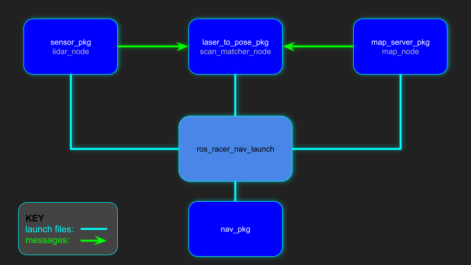
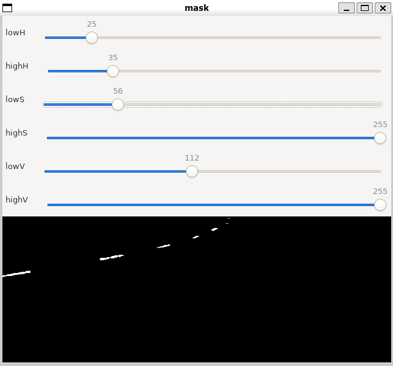
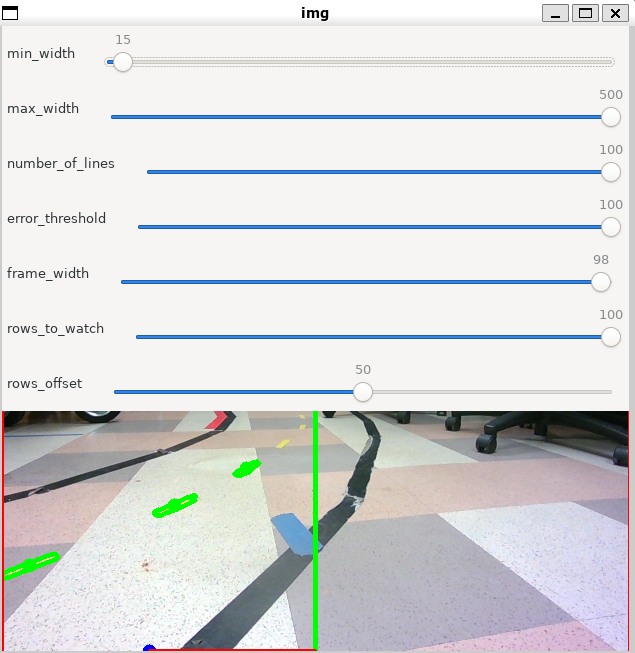

Version V1.3

Last updated: 08/26/2022

Prepared by

Dominic Nightingale

Department of Mechanical and Aerospace Engineering

University of California, San Diego

9500 Gilman Dr, La Jolla, CA 92093

{width="3.1313626421697287in"
height="0.7398272090988627in"}

{width="1.4010422134733158in"
height="1.4010422134733158in"}

{width="3.1548917322834646in"
height="0.6718755468066492in"}

#  

# [Table of Contents]{.mark}

**[Table of Contents](#table-of-contents) 2**

**[1. Introduction](#introduction) 5**

> [1.1 About](#about) 5
>
> [1.2 What\'s Being Used](#whats-being-used) 5
>
> [1.2.1 Embedded Computers](#embedded-computers) 5
>
> [1.2.2 Ubuntu](#ubuntu) 5
>
> [1.2.3 Gitlab](#gitlab) 6
>
> [1.2.4 Docker](#docker) 6
>
> [1.2.5 ROS](#ros) 6
>
> [1.3 Recommendations](#recommendations) 6
>
> [1.3.1 VS Code IDE](#vs-code-ide) 6
>
> [1.3.2 Virtual Machines](#virtual-machines) 6

**[2. UCSD Robocar Framework
Breakdown](#ucsd-robocar-framework-breakdown) 7**

> [2.1 Packages](#packages) 8
>
> [2.1.1 Nav](#nav) 8
>
> [2.1.2 Lane Detection](#lane-detection) 8
>
> [2.1.3 Sensor](#sensor) 8
>
> [2.1.4 Actuator](#actuator) 8
>
> [2.1.5 Control (coming soon)](#control-coming-soon) 9
>
> [2.1.6 Path (coming soon)](#path-coming-soon) 9
>
> [2.1.7 Basics](#basics) 9
>
> [2.2 Updating All Packages](#updating-all-packages) 9
>
> [2.2 Launch Files](#launch-files) 10

**[3. Developer Tools](#developer-tools) 14**

> [3.1 Guidebooks](#ros-guidebooks) 14
>
> [3.2 Gitlab](#gitlab-1) 14
>
> [3.2.1 Adding new submodules:](#adding-new-submodules) 14
>
> [3.2.2 Updating local submodules with remote
> submodules:](#updating-local-submodules-with-remote-submodules) 14
>
> [3.2.3 Updating remote submodules with local
> submodules:](#updating-remote-submodules-with-local-submodules) 14
>
> [3.2.4 Removing submodules:](#removing-submodules) 14
>
> [3.2.5 Adding an existing package to
> git](#adding-an-existing-package-to-git) 15
>
> [3.3 Docker](#docker-1) 16
>
> [3.3.1 Pulling/running](#pullingrunning) 16
>
> [3.3.2 Updating/creating/sharing](#updatingcreatingsharing) 16
>
> [3.3.3 Listing](#listing) 16
>
> [3.3.4 Deleting](#deleting) 16

**[4. Accessing Docker Images](#accessing-docker-images) 17**

> [4.1 UCSD Robocar Image](#ucsd-robocar-image) 17
>
> [4.2 Docker Setup](#docker-setup) 18
>
> [4.2.1 Enable X_11 Port Forwarding](#enable-x_11-port-forwarding) 18
>
> [4.2.2 Update Docker Daemon](#update-docker-daemon) 18
>
> [4.2.3 Running A Container](#running-a-container) 19
>
> [4.3 Workspaces in Docker Container](#workspaces-in-docker-container)
> 21
>
> [4.3.1 ros1_ws](#ros1_ws) 21
>
> [4.3.2 ros2_ws](#ros2_ws) 21
>
> [4.3.3 sensor2_ws](#sensor2_ws) 21
>
> [4.4 ROS BRIDGE](#ros-bridge) 21
>
> [4.5 Utility functions in \~/.bashrc](#utility-functions-in-.bashrc)
> 21

**[5. Source ROS Version](#_nhx6a8oc85lj) 22**

> [5.1 Source ROS1](#source-ros1) 22
>
> [5.2 Source ROS2](#source-ros2) 22
>
> [5.3 Source ROS Bridge](#source-ros-bridge) 22

**[6. Hardware Configuration](#_ga29zeehbnca) 23**

> [6.1 ROS1](#ros1) 23
>
> [6.2 ROS2](#ros2) 23

**[7. Node Configuration](#node-configuration) 24**

> [7.1 ROS1](#ros1-1) 24
>
> [7.2 ROS2](#ros2-1) 24

**[8. Sensor Visualization](#sensor-visualization) 25**

> [8.1 ROS1](#ros1-2) 25
>
> [8.2 ROS2](#ros2-2) 25

**[9. Manual Control of Robot with
Joystick](#manual-control-of-robot-with-joystick) 26**

> [9.1 ROS1](#ros1-3) 26
>
> [9.2 ROS2](#ros2-3) 26

**[10. Integrating New Packages/Code into the
Framework](#integrating-new-packagescode-into-the-framework) 27**

> [10.1 Integrating a ROS Package](#integrating-a-ros-package) 27
>
> [10.2 Integrating supporting files](#integrating-supporting-files) 28
>
> [10.3 Integrating new algorithms into the basics
> package](#integrating-new-algorithms-into-the-basics-package) 29

**[11. Navigation](#navigation) 30**

> [11.1 Lane Detection](#lane-detection-1) 30
>
> [11.1.1 Calibration Process](#calibration-process) 30
>
> [11.1.1.1 ROS1](#ros1-4) 30
>
> [11.1.1.2 ROS2](#ros2-4) 30
>
> [11.1.2 Color Calibration](#color-calibration) 31
>
> [11.1.3 Line/Lane Calibration](#linelane-calibration) 35
>
> [11.1.4 Actuator Calibration](#actuator-calibration) 39
>
> [11.1.4.1 Clarification on throttle
> modes](#clarification-on-throttle-modes) 40
>
> [11.1.5 Camera Navigation](#camera-navigation) 41
>
> [11.1.5.1 ROS1](#ros1-5) 41
>
> [11.1.5.2 ROS2](#ros2-5) 41
>
> **[11.2 Tube/Wall Following (coming
> soon)](#tubewall-following-coming-soon) 42**
>
> **[11.3 SLAM](#slam) 43**
>
> [11.3.1 Requirements](#requirements) 43
>
> [11.3.2 Starting SLAM](#starting-slam) 43
>
> [11.3.2.1 Saving the map](#saving-the-map) 44
>
> [11.3.2.1.1 map_server](#map_server) 44
>
> [11.3.2.1.2 hector_mapping](#hector_mapping) 44
>
> [11.3.3 Localization in a pre-made
> map](#localization-in-a-pre-made-map) 44

**[12. Data Collection](#data-collection) 45**

**[13. F1 Tenth Simulator](#f1-tenth-simulator) 46**

> [13.1 Creating a Map with Paint (coming
> soon)](#creating-a-map-with-paint-coming-soon) 46
>
> [13.2 Updating Vehicle Parameters (coming
> soon)](#updating-vehicle-parameters-coming-soon) 46
>
> [13.3 Adding Multiple Vehicles (coming
> soon)](#adding-multiple-vehicles-coming-soon) 46

**[14. Troubleshooting](#troubleshooting) 47**

**[15. Frequently Used Linux commands](#_rs1dmk9ftl93) 48**

> [15.1 WIFI](#wifi) 48
>
> [15.2 Hardware Tests](#hardware-tests) 48
>
> [15.3 File management](#file-management) 48
>
> [15.4 System Control](#system-control) 48

#  

# 1. Introduction 

The UCSD Robocar framework is primarily maintained and developed by
Dominic Nightingale right here at UC San Diego.

UCSD Robocar uses ROS and ROS2 for controlling our scaled robot cars
which can vary from traditional programming or machine learning to
achieve an objective. The framework works with a vast selection of
sensors and actuation methods in our inventory making it a robust
framework to use across various platforms. Has been tested on 1/16,
1/10, 1/5 scaled robot cars and soon our go-karts.

## 1.1 About

This framework was originally developed as one of Dominic's senior
capstone projects as an undergraduate and has been under constant
development throughout his graduate program. The framework provides the
ability to easily control a car-like robot as well as performing
autonomous tasks. It is currently being used to support his thesis in
learning-model predictive control (LMPC).

The framework is also being used to teach undergraduates the
fundamentals of using gitlab, docker, python, openCV and ROS. The
students are given the task to use the framework with their robots to
perform autonomous laps on a track by first going through a calibration
process that\'s embedded into the framework. The students then have to
come up with their own final projects for the class that can be
supported by the framework, which can vary from car following, SLAM
applications, path planning, city driving behaviors,
Human-machine-interfacing and so much more.

## 1.2 What\'s Being Used

### 1.2.1 Embedded Computers

There are 3 main computers that have been used to develop and test this
framework which belong to the NVIDIA Jetson family.

-   Jetson Nano

-   Jetson Xavier Nx

-   Jetson AGX Xavier

### 1.2.2 Ubuntu

The host OS on all the Jetson computers use Ubuntu18 which is flashed
through NVIDIA\'s Jetpack image. However, the docker image uses Ubuntu20
in order to use ROS2 without worrying about package installation issues

### 1.2.3 Gitlab

This is where all the code for the entire framework is managed and
developed. Gitlab provides a service similar to google drive but for
programs! It\'s especially convenient in terms of deploying code into
embedded computers.

### 1.2.4 Docker

This tool is being used to expedite the setup process on the computers.
To get the docker image working, the Jetson just needs to be flashed
with the Jetpack 4.6 image provided by NVIDIA and then simply pull the
UCSD Robocar docker image from docker hub onto the Jetson. This allows
for plug-n-play capabilities as long as all the hardware is connected to
the Jetson properly.

### 1.2.5 ROS

The framework allows for both ROS-Noetic and ROS2-Foxy to work together
through the ROS bridge or independently depending on the application.

## 1.3 Recommendations

### 1.3.1 VS Code IDE

Microsoft Visual Studio IDE is an excellent development tool for coding
especially because of all the free plug-ins that can be added.

Plug-ins recommended:

-   Python

-   Docker

-   Remote - SSH

### 1.3.2 Virtual Machines

If having software related issues, a virtual machine can possibly solve
the issues and also provide a linux based interface to use with the
jetson which is usually much smoother than with windows or mac.

Below are some links to install Virtual machine software and a virtual
machine image that runs Ubuntu20.04, has VS code (with all plug-ins
mentioned above), docker and the UCSDrobocar docker image installed
already.

[[VMware
Software]{.underline}](https://www.vmware.com/products/workstation-player.html)

[[UCSD Robocar VM image for
VMware]{.underline}](https://drive.google.com/file/d/1ltKrZBdA2ZTFRjKj5E08WWbZN5PNIPJL/view?usp=sharing)

Hostname: ucsdrobocar-vm

Username: robocar

Password: ucsdrobocar

# 2. UCSD Robocar Framework Breakdown

Below are the supporting packages to the framework. The Nav package
operates as the \"brain\" because it is the only package that
communicates to all the other packages which are all independent from
one another.

​

Why so many packages? In practice, developing stand-alone or independent
functionalities makes the package more robust in terms of deployability.
Also as the robot becomes more sophisticated, the number of packages it
will have access to would naturally increase allowing it to achieve many
different types of tasks depending on the application of interest.

So the idea is to develop a package that could in general be used on any
car-like robot as well as being able to choose what packages your robot
really needs without having to use the entire framework.

​

For example, lets say another company developed their own similar
sensor, actuator and nav packages but they have not researched into lane
detection. Instead of using the entire UCSD Robocar framework, they
could easily just deploy the lane detection package and have some
interpreter in their framework read the messages from the lane detection
package to suit their needs.

[Link to official git repo (**ROS1**):
[[ucsd_robocar_hub1]{.underline}](https://gitlab.com/ucsd_robocar/ucsd_robocar_hub1)]{.mark}

[Link to official git repo (**ROS2**):
[[ucsd_robocar_hub2]{.underline}](https://gitlab.com/ucsd_robocar2/ucsd_robocar_hub2)]{.mark}

[NOTE: Both hub1 and hub2 are *[metapackages]{.underline}*. For specific
details about any individual package, click on any of the packages in
either hub to be taken to that packages\' main repository.]{.mark}

## 2.1 Packages

**[Each UCSD ROS package has a README.md that explains in detail what
config, nodes, launch files it has as well as topic/message information.
So if you are confused about a particular thing, ask yourself,]{.mark}**

**["What is the problem I am having?" ,"What package is most likely the
root of the concern?" Then go see the readme for that package and check
anything relevant or even the troubleshooting section.]{.mark}**

[In the package sections below are the links to the official README.md
docs for each package for both ROS1 and ROS2. So any package with a 1 in
it is for ROS-NOETIC and any package with a 2 is for ROS2-FOXY.]{.mark}

### 2.1.1 Nav 

The navigation package (nav_pkg) is the \"brain\" of the UCSD Robocar
framework because it keeps all the launch files in its package to launch
any node/launch file from the other packages used in the framework. This
makes using the framework easier because you only really have to
remember the name of the nav_pkg and what launch file you want to use
rather than having to remember all the other package names and their own
unique launch files.

[[NAV2
README.md]{.underline}](https://gitlab.com/ucsd_robocar2/ucsd_robocar_nav2_pkg/-/blob/master/README.md)

[[NAV1
README.md]{.underline}](https://gitlab.com/ucsd_robocar/ucsd_robocar_nav1_pkg/-/blob/master/README.md)

### 2.1.2 Lane Detection

The lane detection package is one method of navigating by identifying
and tracking road markers. The basic principle behind this package is to
detect road markers using openCV and then compute whats called the
"cross-track-error" which is the difference between the center axis of
the car and the centroid (center of "mass") of the road mark which is
then fed into a PID controller for tracking.

[[Lane Detection2
README.md]{.underline}](https://gitlab.com/ucsd_robocar2/ucsd_robocar_lane_detection2_pkg/-/blob/master/README.md)

[[Lane Detection1
README.md]{.underline}](https://gitlab.com/ucsd_robocar/ucsd_robocar_lane_detection1_pkg/-/blob/master/README.md)

### 

### 2.1.3 Sensor

The sensor package contains all the required nodes/launch files needed
to use the sensors that are equipped to the car.

[[Sensor2
README.md]{.underline}](https://gitlab.com/ucsd_robocar2/ucsd_robocar_sensor2_pkg/-/blob/master/README.md)

[[Sensor1
README.md]{.underline}](https://gitlab.com/ucsd_robocar/ucsd_robocar_sensor1_pkg)

### 2.1.4 Actuator

The actuator package contains all the required nodes/launch files needed
to use the actuators that are equipped to the car.

[[Actuator2
README.md]{.underline}](https://gitlab.com/ucsd_robocar2/ucsd_robocar_actuator2_pkg/-/blob/master/README.md)

[[Actuator1
README.md]{.underline}](https://gitlab.com/ucsd_robocar/ucsd_robocar_actuator1_pkg/-/blob/master/README.md)

### 2.1.5 Control (coming soon)

The control package contains all the required nodes/launch files needed
to control the car in various methods such as PID, LQR, LQG and MPC

.

### 2.1.6 Path (coming soon)

The path package contains all the required nodes/launch files needed to
create trajectories for the car to follow in a pre-built map as well as
in simulations

### 2.1.7 Basics

The path package contains all the required nodes/launch files needed to
subscribe/publish to the sensor/actuator messages within the framework
for fast algorithm prototyping

[[Basics2
README.md]{.underline}](https://gitlab.com/ucsd_robocar2/ucsd_robocar_basics2_pkg/-/blob/master/README.md)

## 

## 2.2 Updating All Packages

A utility function was added to the \~/.bashrc script that will
automatically update all the packages in the framework and then rebuild
and source it so it will be ready to start using ROS2!

From the terminal

upd_ucsd_robocar

##  

## 2.2 Launch Files

The launch file diagrams below show the very general approach of how the
packages communicate with one another. With ROS, it just comes down to a
combination of starting launch files and sending messages (through
topics) to nodes. For specific details about messages types, topics,
services and launch files used, please go to the readme for the specific
package of interest!

The nav_pkg is at the base of each of the diagrams and rooting from it
are the launch files it calls that will launch other nodes/launch files
from all the other packages in the framework.

In ROS2, a *[dynamically]{.underline}* built launch file (at run-time)
is used to launch all the different nodes/launch files for various
purposes such as data collection, navigation algorithms and controllers.
This new way of creating launch files has now been simplified by just
adding an entry to a yaml file of where the launch file is and a
separate yaml file to indicate to use that launch file or not. There is
only one file to modify and all that needs to be changed is either
putting a "0" or a "1" next to the list of nodes/launch files. To select
the nodes that you want to use, put a "1" next to it otherwise put a "0"
which means it will not activate. In the figures below, instead of
including the entire ros2 launch command, you will only see the names of
the launch files that need to be turned on in the node config file
explained more in detail [[here]{.underline}](#node-configuration)

+-----------------------------------------------------------------------+
| {width="5.5in"                      |
| height="3.10200021872266in"}                                          |
+=======================================================================+
| ROS-NOETIC: roslaunch ucsd_robocar_nav1_pkg                           |
| sensor_visualization.launch                                           |
|                                                                       |
| ROS2-FOXY: all_components.launch.py, sensor_visualization.launch.py   |
+-----------------------------------------------------------------------+
| {width="5.5in"                       |
| height="3.1133923884514436in"}                                        |
+-----------------------------------------------------------------------+
| ROS-NOETIC: roslaunch ucsd_robocar_nav1_pkg teleop_joy_vesc.launch    |
|                                                                       |
| ROS2-FOXY:all_components.launch.py, teleop_joy_vesc_launch.launch.py  |
+-----------------------------------------------------------------------+
| {width="5.5in"                       |
| height="3.1013888888888888in"}                                        |
+-----------------------------------------------------------------------+
| ROS-NOETIC: roslaunch ucsd_robocar_nav1_pkg                           |
| camera_nav_calibration_launch.launch                                  |
|                                                                       |
| ROS2-FOXY: all_components.launch.py, camera_nav_calibration.launch.py |
+-----------------------------------------------------------------------+
| {width="5.5in"                      |
| height="3.1013888888888888in"}                                        |
+-----------------------------------------------------------------------+
| ROS-NOETIC: roslaunch ucsd_robocar_nav1_pkg camera_nav_launch.launch  |
|                                                                       |
| ROS2-FOXY: all_components.launch.py, camera_nav.launch.py             |
+-----------------------------------------------------------------------+
| {width="5.5in"                       |
| height="3.1013888888888888in"}                                        |
+-----------------------------------------------------------------------+
| ROS-NOETIC: roslaunch ucsd_robocar_nav1_pkg                           |
| ros_racer_mapping_launch.launch                                       |
+-----------------------------------------------------------------------+
| {width="5.5in"                      |
| height="3.1013888888888888in"}                                        |
+-----------------------------------------------------------------------+
| ROS-NOETIC: roslaunch ucsd_robocar_nav1_pkg                           |
| ros_racer_nav_launch.launch                                           |
+-----------------------------------------------------------------------+

#  

# 3. Developer Tools

## 3.1 ROS Guidebooks

Links provided below are guides for ROS and ROS2 which include many
examples, terminal commands and general concept explanations of the
various features in ROS and ROS2

-   [[UCSD ROS
    Guidebook]{.underline}](https://docs.google.com/document/d/1u7XS7B-Rl_emK3kVKEfc0MxHtwXGYHf5HfLlnX8Ydiw/edit)

-   [[UCSD ROS2
    Guidebook]{.underline}](https://docs.google.com/document/d/1DJgVLnu_vN-IXKD3QrQVF3W-JC6RiQPVugHeFAioB58/edit?usp=sharing)

## 3.2 Gitlab

Since the framework uses a meta package (a package that contains
multiple packages) we refer to *individual packages* as *submodules*.

### 3.2.1 Adding new submodules:

1.  git submodule add \<remote_url\>

2.  git commit -m \"message\"

3.  git push

### 3.2.2 Updating **local** submodules with **remote** submodules:

1.  If local changes have been made, the update command will fail unless
    you add, commit and push (shown in 3.2.3) or stash (git stash) them,
    which will temporarily discard any local changes

2.  git submodule update \--remote \--merge [Pay attention to the output
    of this command, to make sure it did not fail or
    Abort\...]{.underline}

### 3.2.3 Updating **remote** submodules with **local** submodules:

1.  git add .

2.  git commit -m \"message\"

3.  git push [Pay attention to the output of this command, to make sure
    it did not fail or Abort\...]{.underline}

### 3.2.4 Removing submodules:

1.  git submodule deinit \<submodule\>

2.  git rm \<submodule\>

###  

### 3.2.5 Adding an existing package to git

[From the web browser, [[create empty repo on
gitlab]{.underline}](https://docs.gitlab.com/ee/user/project/working_with_projects.html#create-a-blank-project)]{.mark}

Now from the Jetson, start by creating a new ROS2 package

ros2 pkg create \--build-type ament_python pkg_name \--dependencies
rclpy

build_ros2

[Now proceed with merging the new package with the framework]{.mark}

git init

git remote add origin \<remote url from step 1\>

git add .

git commit -m \"message\"

git push \--set-upstream origin master

## 

##  

## 3.3 Docker

Below is a go-to list of docker commands that can be used with the
framework.

Some new lingo:

Container name: **NAMES**

Image name: **REPOSITORY**

Image tag ID (comparable to branches in git): **TAG**

### 3.3.1 Pulling/running

-   pulling image from docker hub: docker pull REPOSITORY:TAG

-   starting a stopped container: docker start NAMES

-   stopping a container: docker stop NAMES

-   [Using Multiple Terminals for a Single Docker Container:]{.mark}
    docker exec -it NAMES bash

-   build docker image and give it a new name and tag docker build -t
    REPOSITORY:TAG .

### 3.3.2 Updating/creating/sharing

-   save changes made while in container to original image (change tag
    to create a new image):\
    docker commit name_of_container REPOSITORY:TAG

-   create a new image from a container: docker tag NAMES REPOSITORY:TAG

-   pushing image to dockerhub: docker push REPOSITORY:TAG

-   Share files between host and docker container:

    -   From **host** to docker container: docker cp foo.txt
        container_id:/foo.txt

    -   From **docker container** to host: docker cp
        container_id:/foo.txt foo.txt

### 3.3.3 Listing

-   list all images: docker images

-   list all running containers: docker ps

-   list all containers (including stopped): docker ps  -a

### 3.3.4 Deleting

-   delete specific container: docker rm NAMES

-   delete specific image: docker rmi REPOSITORY:TAG

-   delete ALL containers: docker rm -f \$(docker ps -a -q)

-   delete ALL images: docker rmi -f \$(docker images -q)

#  

# 4. Accessing Docker Images

Currently there are two **DIFFERENT** docker images that are being
supported by UCSD. One image was built for arm architecture computers
(Jetson family) and the other was built for X86 architecture computers
(most laptops and desktops). Apple M1 support will be coming soon.

**Question:** Why two images?

**Answer:** The X86 image was built to provide an environment for the
developer to test new algorithms, packages, sensors (Yes, you can plug
sensors into your computer just like the Jetson for testing) etc in a
simulated environment without having to use a physical robot. Using the
physical robot for first-time testing can lead to damaging the robot or
something/someone in the environment due to an unforeseen behavior from
the robot. We must practice safe autonomy if we ever hope to see our new
ideas become a part of the industry! This leads to the ARM image, which
was built to be used on the physical robot when ready to perform
physical testing.

**Question:** The display wont open when in the container, how to make
it work? (ie. images won\'t port through)

**Answer:** There could be several reasons why the display is not
working but below are the most common solutions that can be tried

-   [[Make sure that an X11 forwarding session was established when
    doing an ssh connection into the
    jetson]{.underline}](#enable-x_11-port-forwarding)

-   [If that still doesn\'t work, then the container could have a broken
    connection with the display so the only other thing to try is
    [[creating a new container using the provided function in the
    \~/.bashrc]{.underline}](#running-a-container)]{.mark}

**NOTE:** Docker is pre-installed on the Jetson computers so no need to
install it, but in order to use the X86 image, you must install docker
on your computer (for linux, windows or mac).

## 4.1 UCSD Robocar Image

[Link to image on Docker Hub: [[docker
image]{.underline}](https://hub.docker.com/r/djnighti/ucsd_robocar)]{.mark}

[Computer architecture: ARM (Jetson)]{.mark}

Pulling the image from the terminal:\
docker pull djnighti/ucsd_robocar:devel

## 

[Computer architecture: X86 (Most laptops and desktops)]{.mark}

Pulling the image from the terminal:

docker pull djnighti/ucsd_robocar:x86

##  

## 4.2 Docker Setup

The exact \"recipe\" to build this image can be found
[[here]{.underline}](https://gitlab.com/ucsd_robocar2/ucsd_robocar_hub2/-/blob/master/docker_setup/docker_files/Dockerfile)

**[Note: If using the [virtual machine](#virtual-machines), all this is
already completed for you!\
]{.underline}**Note: In order to connect with x-forwarding, you have to
set stuff up.

1.  One way is to ssh from a terminal inside the virtual machine to the
    jetson

2.  On windows, I recommend downloading moba xterm, which should have
    x11-forwarding set up by default
    [[https://mobaxterm.mobatek.net/]{.underline}](https://mobaxterm.mobatek.net/)

3.  On mac, you can download xquartz from xquartz.org. Here is a link
    describing how to set it up:
    [[https://drive.google.com/file/d/1ozFIgeIVAWg04S_bMru95JwThPDrq6Fk/view?usp=sharing]{.underline}](https://drive.google.com/file/d/1ozFIgeIVAWg04S_bMru95JwThPDrq6Fk/view?usp=sharing)

### 4.2.1 Enable X_11 Port Forwarding

1.  On your **HOST** machine **[(not the Jetson)]{.underline}** enter
    these commands (Will have to enter every time)

> ssh -X jetson@ip_address

2.  Now on the **Jetson**, run the following commands to obtain sudo
    access for docker commands (only needs to be ran once)

> sudo usermod -aG docker \${USER}
>
> su \${USER}

3.  Now check that if X_11 forwarding is working

> xeyes

If some googly eyes pop up, X_11 is ready to go. IF X_11 PORT FORWARDING
IS NOT SETUP, follow steps
[[here]{.underline}](https://gitlab.com/djnighti/ucsd_robo_car_simple_ros/-/blob/master/x11_forwarding_steps.txt)
to get it set up. Then come back here to continue the steps below.

Note: xhost + is essentially disabling access control for display
forwarding to your computer. This creates a security vulnerability since
malicious third parties could forward stuff to your display. While
you're on the ucsd_robocar dedicated wifi network there is pretty much
no risk from this, but make sure to run xhost - after you are done to
re-enable access control.\
Xforwarding from the jetson may even work without ever running xhost +.
Try it to see if it works for you.

### 

### Additional Troubleshooting: If you continue having issues with the X_11 forwarding, you can try reinstalling the xserver and regenerating the xauthority files to fix.

### sudo apt-get install \--reinstall xserver-xorg

### sudo chmod 777 .Xauthority

### 

### 4.2.2 Update Docker Daemon 

1.  Then modify daemon.json file (just delete previous version then
    create new one)

> sudo rm /etc/docker/daemon.json
>
> sudo nano /etc/docker/daemon.json

2.  copy and paste the following into that file:

+-----------------------------------------------------------------------+
| {                                                                     |
|                                                                       |
| \"runtimes\": {                                                       |
|                                                                       |
| \"nvidia\": {                                                         |
|                                                                       |
| \"path\": \"nvidia-container-runtime\",                               |
|                                                                       |
| \"runtimeArgs\": \[\]                                                 |
|                                                                       |
| }                                                                     |
|                                                                       |
| },                                                                    |
|                                                                       |
| \"default-runtime\": \"nvidia\"                                       |
|                                                                       |
| }                                                                     |
+=======================================================================+
+-----------------------------------------------------------------------+

3.  save and quit then reboot jetson

> sudo reboot now

### 4.2.3 Running A Container

1.  SSH back into the Jetson with the -X flag which enables X_11
    Forwarding

> ssh -X jetson@ip_address

2.  Create a new function in the \~/.bashrc file with command line
    arguments to easily run a container

> gedit \~/.bashrc

3.  Copy and paste the following into the very bottom of the file

+-----------------------------------------------------------------------+
| robocar_docker ()                                                     |
|                                                                       |
| {                                                                     |
|                                                                       |
| docker run \\                                                         |
|                                                                       |
| \--name \${1} \\                                                      |
|                                                                       |
| -it \\                                                                |
|                                                                       |
| \--privileged \\                                                      |
|                                                                       |
| \--net=host \\                                                        |
|                                                                       |
| -e DISPLAY=\$DISPLAY \\                                               |
|                                                                       |
| -v /dev/bus/usb:/dev/bus/usb \\                                       |
|                                                                       |
| \--device-cgroup-rule=\'c 189:\* rmw\' \\                             |
|                                                                       |
| \--device /dev/video0 \\                                              |
|                                                                       |
| \--volume=\"\$HOME/.Xauthority:/root/.Xauthority:rw\" \\              |
|                                                                       |
| djnighti/ucsd_robocar:\${2:-devel}                                    |
|                                                                       |
| }                                                                     |
+=======================================================================+
+-----------------------------------------------------------------------+

> Note: you may want to replace the last line with\
> djnighti/ucsd_robocar:\${2:-ucsd_robocar} if you want to use the
> latest part of the ucsd_robocar image instead of the devel image.
> However I recommend the devel image
>
> **Notice the two arguments we have made:**
>
> **\${1}:** This will be the name of the container, ex.
> Name_this_container
>
> **\${2:[devel]{.mark}}:** This is the tag id of the image you want to
> launch a container from. If nothing is specified when calling at the
> command line (example shown below), the "devel" tag will be run.
>
> **[Don\'t modify the function, the arguments are intentional and not
> meant to be hard coded.]{.underline}**

4.  Source the \~/.bashrc script so the current terminal can see the new
    function we just added

> source \~/.bashrc

5.  Run the following command to enter the docker container

> robocar_docker test_container

6.  To access the **[same]{.underline}** docker container from another
    terminal (do this for as many terminals you want)

> docker start test_container
>
> docker exec -it test_container bash

At this point the docker setup is complete but don\'t forget to refer to
the useful [[docker commands sections]{.underline}](#section-7) which
includes deleting, creating and updating images locally and remotely!

## 4.3 Workspaces in Docker Container

### 4.3.1 ros1_ws

ROS version: **ROS-NOETIC**

This workspace contains source compiled packages from
[**[ucsd_robocar_hub1]{.underline}**](https://gitlab.com/ucsd_robocar/ucsd_robocar_hub1)

### 4.3.2 ros2_ws

ROS version: **ROS2-FOXY**

This workspace contains source compiled packages from
[**[ucsd_robocar_hub2]{.underline}**](https://gitlab.com/ucsd_robocar2/ucsd_robocar_hub2)

### 4.3.3 sensor2_ws

ROS version: **ROS2-FOXY**

This workspace contains source compiled packages for various sensors in
our inventory.

## 4.4 ROS BRIDGE 

The ros1_bridge package is used to enable the communication between
nodes in ROS1 (ros1_ws) and ROS2 (ros2_ws). Reading material on how to
use it can be found
[[here]{.underline}](https://industrial-training-master.readthedocs.io/en/melodic/_source/session7/ROS1-ROS2-bridge.html#run-the-ros1-bridge)
and a video of it being used can be found
[[here]{.underline}](https://www.theconstructsim.com/how-to-communicate-between-ros1-ros2-with-ros1_bridge)

**REMEMBER:**

**[This image has both ROS1 and ROS2 which results in having to source
them individually and every new terminal. This also means that the
metapackages ucsd_robocar_hub1 and ucsd_robocar_hub2 must be
sourced!]{.underline}**

Jetpack info for Jetson

**REQUIREMENT**: JetPack 4.6 (L4T R32.6.1)

check to make sure: sudo apt-cache show nvidia-jetpack

## 4.5 Utility functions in \~/.bashrc 

-   [[Updating all packaging in the ucsd_robocar framework from
    gitlab:]{.underline}](#updating-all-packages) upd_ucsd_robocar

-   [[Source Noetic and]{.underline} **[ALL]{.underline}** [ROS
    packages]{.underline} **[and]{.underline}** [start
    roscore]{.underline}](#source-ros1): source_ros1_init

-   [[Source Noetic and]{.underline} **[ALL]{.underline}** [ROS
    packages]{.underline}](#source-ros1): source_ros1_pkg

-   [[Source Noetic and]{.underline} **[ALL]{.underline}** [ROS
    packages]{.underline} **[and]{.underline}** [put user in
    ros1_ws:]{.underline}](#source-ros1) source_ros1

-   [[Source foxy and]{.underline} **[ALL]{.underline}** [ROS2
    packages:]{.underline}](#source-ros2) source_ros2_pkg

-   [[Source foxy and]{.underline} **[ALL]{.underline}** [ROS2
    packages]{.underline} **[and]{.underline}** [put user in
    ros2_ws:]{.underline}](#source-ros2) source_ros2

-   [[Build all packages in ucsd_robocar:]{.underline}](#source-ros2)
    build_ros2

-   [[Source ROS bridge:]{.underline}](#source-ros-bridge)
    source_ros_bridge

# 5. Source ROS Version

## 5.1 Source ROS1 

We need to source ROS Noetic, ros1_ws and activate roscore, below is an
alias command that will do all of that automatically. *[This command
only needs to be run one time in any docker container]{.underline}*. As
you open new terminals in the same Docker container, another alias was
made to source ROS Noetic and the ros1_ws as well as placing you in the
ros1_ws. *[This command needs to be run in every new terminal you want
to use ROS1 in.]{.underline}*

From the terminal (this terminal will always need to be running so
don\'t close it!)

source_ros1_init

From another terminal

source_ros1

## 

## 5.2 Source ROS2

We need to source ROS Foxy and the ros2_ws, below is an alias command
that will do that automatically. The alias will also place you in the
ros2_ws. *[This command needs to be run in every new terminal you want
to use ROS2 in.]{.underline}* Another alias was made to rebuild the
package if any changes were made to the source code. It will put you in
the ros2_ws, then perform a colcon build and then source
install/setup.bash to reflect the changes made.

From the terminal

source_ros2

From the terminal (This is only needs to be ran in 1 terminal, the
changes will be reflected everywhere)

build_ros2

## 5.3 Source ROS Bridge

We need to source ROS Noetic, ROS Foxy and the ros2_ws, below is an
alias command that will do that and launch ros bridge automatically.
*[This command only needs to be run once and will occupy a terminal
throughout its existence.]{.underline}* This alias does a dynamic bridge
between ALL topics in Noetic and Foxy.

From the terminal

source_ros_bridge

#  6. Hardware Configuration

Not all robots have the same hardware especially when it comes to their
sensors and motors and motor controllers. This quick section shows how
to select the hardware that is on your robot. There are differences
between ROS1 and ROS2 on how this configuration works so please read
accordingly. This configuration is only necessary for the UCSD Robocar
Image and NOT UCSD Robocar Simple ROS Image.

## 6.1 ROS1 

In ROS1, the hardware configuration is done by either modifying the
launch files or at the command prompt as an argument to the launch
command. There are 3 pre-made car configurations that can be launched at
any time. If using a launch file from the nav_pkg, an example is given
below for how to modify the launch file. All the launch files for the
hardware can be found in the launch directory in the
ucsd_robocar_nav1_pkg.

1.  dsc_car_launch: sic lidar, intel camera (any model works), VESC

2.  mae_148_car_launch: ld06 lidar, webcam, adafruit

3.  custom_car_launch: ld06 lidar, webcam, VESC (pick any nodes needed
    to launch all sensors/actuators on the car, by modifying the
    "custom_car_launch.launch" file)

**NOTE**: The custom car option is meant to be modified as needed for
other types of configurations.

**Modify "load_car_launch.launch" launch file with the car config for
your robot. This is the line you need to modify, the 3 options are
listed above. \<arg name=\"car_type\" value=\"custom_car_launch \" /\>**

From the terminal

source_ros1

gedit
src/ucsd_robocar_hub1/ucsd_robocar_nav1_pkg/launch/load_car_launch.launch

### 

## 6.2 ROS2

In ROS2, the hardware configuration is as simple as flipping a switch.
Since the launch files in ROS2 are now in python, we can dynamically
build launch files! This means no more need to have several different
"car configs" that may have different hardware on them and instead have
a single launch file that is capable of launching any component you need
by changing a single number (that number is explained below)! There is
only one file to modify and all that needs to be changed is either
putting a "0" or a "1" next to the list of hardware in the file. To
select the hardware that your robot has and that you want to use, put a
"1" next to it otherwise put a "0" which means it will not activate.

**Modify and save the car config with the sensors and actuators on your
robot [and then recompile]{.underline}.**

From the terminal

source_ros2

gedit src/ucsd_robocar_hub2/ucsd_robocar_nav2_pkg/config/car_config.yaml

build_ros2

# 7. Node Configuration

This quick section shows how to select the nodes/launch files that are
on your robot. There are differences between ROS1 and ROS2 on how this
configuration works so please read accordingly. This configuration is
only necessary for the UCSD Robocar Image and NOT UCSD Robocar Simple
ROS Image.

## 7.1 ROS1 

In ROS1, the launch files for the various capabilities of the robot are
written and called individually and can be found in the launch directory
in the ucsd_robocar_nav1_pkg.

### 

## 7.2 ROS2

Similar to the hardware configuration in ROS2, a dynamically built
launch file is used to launch all the different nodes/launch files for
various purposes such as data collection, navigation algorithms and
controllers. This new way of creating launch files has now been
simplified by just adding an entry to a yaml file of where the launch
file is and a separate yaml file to indicate to use that launch file or
not. There is only one file to modify and all that needs to be changed
is either putting a "0" or a "1" next to the list of nodes/launch files.
To select the nodes that you want to use, put a "1" next to it otherwise
put a "0" which means it will not activate.

**Modify and save the node config to launch the algorithm(s) of your
choice [and then recompile]{.underline}.**

From the terminal

source_ros2

gedit
src/ucsd_robocar_hub2/ucsd_robocar_nav2_pkg/config/node_config.yaml

build_ros2

# 8. Sensor Visualization

**After selecting the hardware that\'s equipped on the robot, let\'s
visually verify that the sensors are working. The current config file
that is launched will display laser scan and image data. If you have
more sensors you want to visualize, feel free to add them through
rviz.**

## 

## 8.1 ROS1 

**Here is the list of available launch files for all the sensors in the
[[sensor1_pkg]{.underline}](https://gitlab.com/ucsd_robocar/ucsd_robocar_sensor1_pkg/-/tree/master/launch)**

**Place the robot on the class provided stand. The wheels of the robot
should be clear to spin.**

From terminal

source_ros1

roslaunch ucsd_robocar_nav1_pkg sensor_visualization.launch

## 8.2 ROS2

**Here is the list of available launch files for all the sensors in the
[[sensor2_pkg]{.underline}](https://gitlab.com/ucsd_robocar2/ucsd_robocar_sensor2_pkg/-/tree/master/launch)**

**Place the robot on the class provided stand. The wheels of the robot
should be clear to spin.**

From the terminal

source_ros2

Modify the hardware config file to turn on the **sensors** you have
plugged in and want to visualize.

gedit src/ucsd_robocar_hub2/ucsd_robocar_nav2_pkg/config/car_config.yaml

Then modify the node config file to activate **all_components** and
**sensor_visualization** launch files

gedit
src/ucsd_robocar_hub2/ucsd_robocar_nav2_pkg/config/node_config.yaml

Then rebuild and launch

build_ros2

ros2 launch ucsd_robocar_nav2_pkg all_nodes.launch.py

**NOTE: If image data does not show up automatically, un-check and check
its box in the display panel in rviz.**

[[Here is an example from intel showing the point cloud with any of
their cameras in
RVIZ!]{.underline}](https://github.com/IntelRealSense/realsense-ros/tree/ros2#point-cloud)

From the terminal

source_ros2

ros2 launch realsense2_camera demo_pointcloud_launch.py

# 9. Manual Control of Robot with Joystick

This feature is only supported in the UCSD Robocar Image and NOT UCSD
Robocar Simple ROS Image

If using Adafruit and not VESC, anywhere below that says vesc you can
replace with adafruit

A deadman switch is also enabled which means you *[must]{.underline}* be
pressing the button (LB on logitech) down in order for you to send
commands to your robots motors.

The joysticks on the controller are what control the robot to move
forwards/backwards and turn.

**Place the robot on the class provided stand. The wheels of the robot
should be clear to spin.**

## 

## 9.1 ROS1 

**Place the robot on the class provided stand. The wheels of the robot
should be clear to spin.**

From the terminal

source_ros1

roslaunch ucsd_robocar_nav1_pkg teleop_joy_vesc.launch

## 9.2 ROS2

**Place the robot on the class provided stand. The wheels of the robot
should be clear to spin.**

From the terminal

source_ros2

Modify the hardware config file to turn on the **vesc_with_odom**

gedit src/ucsd_robocar_hub2/ucsd_robocar_nav2_pkg/config/car_config.yaml

Then modify the node config file to activate **all_components** and
**f1tenth_vesc_joy_launch** launch files

gedit
src/ucsd_robocar_hub2/ucsd_robocar_nav2_pkg/config/node_config.yaml

Then rebuild and launch

build_ros2

ros2 launch ucsd_robocar_nav2_pkg all_nodes.launch.py

# 10. Integrating New Packages/Code into the Framework

Integrating a new package can be done many ways so do not take this
approach as the best or only method but simply a method for integration.
The example below will be in ROS2 but the general procedure is the same
in ROS1.

## 10.1 Integrating a ROS Package

1.  While in the docker container source ros2 and move in to the src
    directory of the ros2_ws

source_ros2

cd src/

2.  Now lets create a new node by [[using an example node from the ros2
    guidebook]{.underline}](https://docs.google.com/document/d/1DJgVLnu_vN-IXKD3QrQVF3W-JC6RiQPVugHeFAioB58/edit#heading=h.z8pzj9x72ptj)
    which gives all the code for the node, setup.py and launch files as
    well as step-by-step terminal commands to create everything
    including the package itself.

    a.  Package name: **counter_package**

    b.  Node name: **counter_publisher.py**

    c.  Launch file name: **counter_package_launch_file.launch.py**

3.  After completing step 2, notice the **"counter_package"** package in
    the same directory as **"ucsd_robocar_hub2"** package

ls src/

4.  Adding your package to the nav2 node configuration and node package
    location lists. To do this, all we need is the name of the package
    that we want to integrate and the name of the launch file we want to
    use from that package. In the example node above, the package name
    is **"counter_package"** and its launch file is called
    **"counter_package_launch_file.launch.py"**. Lets add them to
    "node_pkg_locations_ucsd.yaml" and to "node_config.yaml" which are
    both in the NAV2 package

source_ros2

gedit
src/ucsd_robocar_hub2/ucsd_robocar_nav2_pkg/config/node_pkg_locations_ucsd.yaml

gedit
src/ucsd_robocar_hub2/ucsd_robocar_nav2_pkg/config/node_config.yaml

5.  Once added, make sure that the
    **"counter_package_launch_file.launch.py"** file is set to "1" in
    the "node_config.yaml" to make sure it\'s activated as well as any
    other nodes that are desired to be run.

6.  Rebuild the workspace

build_ros2

7.  Now launch!

ros2 launch ucsd_robocar_nav2_pkg all_nodes.launch.py

8.  Verify the node is running (which is called **"counter_publisher")**
    and echo the topic (which is called **"/counter")**

ros2 node list

ros2 topic echo /counter

That\'s it! A new package has just been integrated into the framework
and now can be easily called with any of the framework\'s launch files.

## 10.2 Integrating supporting files

Supporting files can range from yaml files, data sets, machine learning
models and general source code that has nothing to do with ROS but may
be required for the node to run properly. Once these files are
integrated into the ROS framework, they are used the same exact way as
they would be when ROS was not being used, which basically means we need
to tell ROS where to locate these files so it can access them. Below is
a simple example of a ROS package structure.

ros2_ws

src

example_package_name

config

launch

example_package_name

example_node.py

setup.py

Now let\'s say our node **"example_node.py"** requires an external class
or method from a pure python file called **"python_only.py"**, Lets
create a new directory or submodule in **"example_package_name"** and
call it **"example_submodule_name"** and then put the pure python file
there

ros2_ws

src

example_package_name

config

launch

example_package_name

example_submodule_name

python_only.py

example_node.py

setup.py

This is the general idea however the submodule placement is arbitrary as
long as you are consistent in the code where things are located. For
example, maybe the node requires a pre-trained machine learning model
for it to run successfully and makes more sense to have a models folder
adjacent to the launch and config directories as shown below

ros2_ws

src

example_package_name

config

launch

models

example_model.pt

example_package_name

example_node.py

setup.py

Again, this placement is arbitrary but it\'s good to form a convention
so others can understand more easily. After the new external files have
been added to the package, both the **"setup.py"** and
**"example_node.py"** files need to be updated/modified so they can
access the supporting files. [[See this example of modifying these files
in the ROS2
guidebook.]{.underline}](https://docs.google.com/document/d/1DJgVLnu_vN-IXKD3QrQVF3W-JC6RiQPVugHeFAioB58/edit#heading=h.gt05lbgt1rp9)

## 10.3 Integrating new algorithms into the basics package

The [[basics package]{.underline}](#basics) was created to give a jump
start on accessing sensor data and controlling the actuators on the
robot without having to focus too much on the ROS implementation. The
pre-created nodes have all the ROS-functionality completed and only
require the algorithms to process the sensor data and/or control signals
for moving the robot. Each node in the package (nodes described in the
readme.md link above) has a callback function which provides the
starting point for the user to implement their algorithms with ease.

# 11. Navigation

This chapter is dedicated to the various methods for the robot to
navigate autonomously.

## 11.1 Lane Detection 

Goal: Be able to identify road lines with opencv and ROS to be able to
autonomously navigate around any given track.

To achieve this, the hardware on the robot must be calibrated for the
track environment which is explained in detail below. Once the
calibration is complete, launch the robot in an autonomous state and
tune the calibration parameters as needed.

## 

### 11.1.1 Calibration Process

This section is a guide for calibrating the camera to detect road lines
as well as for steering and speed control.

While inside docker container, run the calibration script per the
instructions found at

UCSD Robocar ROS Image:
[[ucsd_robocar_nav1_pkg]{.underline}](https://gitlab.com/ucsd_robocar/ucsd_robocar_nav1_pkg#work-flow-to-use-this-repository)
(ROS1) or
[[ucsd_robocar_nav2_pkg]{.underline}](https://gitlab.com/ucsd_robocar2/ucsd_robocar_nav2_pkg#work-flow-to-use-this-repository)
(ROS2)

### 

#### 11.1.1.1 ROS1 

**Place the robot on the class provided stand. The wheels of the robot
should be clear to spin.**

From the terminal

roslaunch ucsd_robocar_nav1_pkg camera_nav_calibration_launch.launch

#### 

#### 11.1.1.2 ROS2

**Place the robot on the class provided stand. The wheels of the robot
should be clear to spin.**

From the terminal

source_ros2

Modify the hardware config file to turn on the **vesc_without_odom** and
the **camera** you have equipped

gedit src/ucsd_robocar_hub2/ucsd_robocar_nav2_pkg/config/car_config.yaml

Then modify the node config file to activate only **all_components** and
**camera_nav_calibration** launch files

gedit
src/ucsd_robocar_hub2/ucsd_robocar_nav2_pkg/config/node_config.yaml

Then rebuild and launch

build_ros2

ros2 launch ucsd_robocar_nav2_pkg all_nodes.launch.py

### 11.1.2 Color Calibration

+---------------------------------+------------------------------------+
| The camera is seeing something  | {width="3.5in" |
|                                 | height="3.236111111111111in"}      |
| Anything that is **accepted     |                                    |
| (true)** will be passed through |                                    |
| as **white**, everything else   |                                    |
| will be **black (false)**. With |                                    |
| the default values, everything  |                                    |
| is white                        |                                    |
|                                 |                                    |
| #                               |                                    |
|                                 |                                    |
| We are going to calibrate the   |                                    |
| camera to only keep the color   |                                    |
| yellow (the dots in the middle  |                                    |
| of the road). To do that we     |                                    |
| need to understand how HSV      |                                    |
| colors work                     |                                    |
+=================================+====================================+
+---------------------------------+------------------------------------+

# 

# 

  -----------------------------------------------------------------------
  {width="5.182292213473316in"
  height="2.1011537620297465in"}
  -----------------------------------------------------------------------
  The Hue is often referred to as a degree and goes between 0 and 180

  -----------------------------------------------------------------------

# 

+----------------------------------------+-----------------------------+
| So if we chose an H value of 0 we      | { |
|                                        | width="2.682292213473316in" |
| #                                      | hei                         |
|                                        | ght="1.9184601924759406in"} |
| All of these values are represented by |                             |
| the H value of 0. We would expect      |                             |
| something similar to the above square  |                             |
| except yellow if we put in the value   |                             |
| of 30                                  |                             |
+========================================+=============================+
| Because we are trying to filter out    | {w |
| we will set the lowH and highH to 25   | idth="2.7505752405949258in" |
| and 35 Here is what we see with these  | hei                         |
| values                                 | ght="2.5364588801399823in"} |
|                                        |                             |
| #                                      |                             |
|                                        |                             |
| the camera is seeing something like    |                             |
| this before we filter                  |                             |
+----------------------------------------+-----------------------------+

# 

  ------------------------------------------------------------------------------------------------------
  We want to keep everything in the    {width="2.7552088801399823in"
  upper right corner of these(picture  height="1.9664621609798776in"}
  this red square is yellow). As you   
  can see, if the S value gets too     
  low(left to right), we only see      
  white, and if the V value gets too   
  low(up and down) we only see black   
  values. There is not a problem with  
  V or S being too high, as that gives 
  us a pure color(top right). With     
  this in mind, we will keep only what 
  is in the upper right corner by      
  leaving the highS and highV at the   
  max and setting the low values to    
  about half way                       
  ------------------------------------ -----------------------------------------------------------------
  Oops, looks like that filters out    {width="2.8177088801399823in"
  too much. We can adjust these values height="2.604245406824147in"}
  until we get what we want. (also     
  notice that in the original image    
  the yellow looked pretty white so we 
  will lower the lowS until we see     
  some good results with little noise) 

  And there you go (while playing with {width="2.8388976377952755in"
  these two bars (lowS and lowV) will  height="2.6406255468066493in"}
  almost always result in a good image 
  like this, note that paying          
  attention to the lighter and darker  
  parts of the color you are filtering 
  for will help you set your lowS and  
  lowV values with a higher accuracy   
  and speed)(if the bright spots are   
  disappearing, allow more S, if the   
  shadows aren\'t showing up, allow    
  more V)                              

  **Inverted_filter** Whatever color   {width="3.2263068678915134in"
  you selected to "track" this slider  height="1.8697922134733158in"}
  will invert it which is basically    
  rejecting what you were originally   
  tracking and now tracking the exact  
  opposite. This feature is nice when  
  the road color is very consistent    
  and you want to track all road       
  markers, yellow dashed lines, white  
  lanes etc.                           
  ------------------------------------------------------------------------------------------------------

+-----------------------------------+-----------------------------------+
| If for some reason you still have | {width="3.6041666666666665in" |
| to change these settings, the     | height="2.611111111111111in"}     |
| following settings can be         |                                   |
| adjusted                          |                                   |
+===================================+===================================+
| **gray_thresh** This will put a   | {width="3.6041666666666665in" |
| approximately gray such that only | height="2.2916666666666665in"}    |
| the white pixels can pass through |                                   |
| the filter and potentially        |                                   |
| resulting the small noise in the  |                                   |
| background to black pixels        |                                   |
|                                   |                                   |
| **Kernel_size** This value        |                                   |
| represents the size of the kernel |                                   |
| to be convolved with the image    |                                   |
| with the two transforms, Erosion  |                                   |
| & Dilation                        |                                   |
|                                   |                                   |
| **Erosion_itterations** The       |                                   |
| higher this value, the more times |                                   |
| the kernel is convolved with the  |                                   |
| image which results in shrinking  |                                   |
| pixel noise. This means if there  |                                   |
| is some small noise like in the   |                                   |
| photo above, the erosion          |                                   |
| transform will minimize that      |                                   |
| noise further by shrinking its    |                                   |
| distribution. The Erosion         |                                   |
| transform not only minimizes the  |                                   |
| noise but in general all          |                                   |
| distributions which means that    |                                   |
| even our detected road marker     |                                   |
| will shrink! This issue is fixed  |                                   |
| with the dilation transform.      |                                   |
|                                   |                                   |
| **Dilation_itterations** The      |                                   |
| higher this value, the more times |                                   |
| the kernel is convolved with the  |                                   |
| image which results in enlarging  |                                   |
| pixel values. We want to undo the |                                   |
| effects of the erosion transform  |                                   |
| on the road marker which is ok    |                                   |
| because our noise has already     |                                   |
| been filtered out so it won\'t    |                                   |
| come back!                        |                                   |
+-----------------------------------+-----------------------------------+

##  

### 11.1.3 Line/Lane Calibration 

This part of the calibration is now about manipulating the image
dimensions, the geometry of the road lines and parameters to adjust the
steering behavior of the robot.

  ------------------------------------------------------------------------------------------------------
  **min_width** and **max_width**      {width="3.2291666666666665in"
  filter based on the size of the      height="3.3115430883639547in"}
  dotted lines found                   
  ------------------------------------ -----------------------------------------------------------------
  For example we can see if we set the {width="3.2395833333333335in"
  min to be 15 it will eliminate some  height="3.3333333333333335in"}
  of the smaller lines in the distance 
  because they are too thin (below15)  

  ------------------------------------------------------------------------------------------------------

# 

+------------------------------------+---------------------------------+
| **Number_of_lines** correlates to  | !                               |
| the number of lines found in the   | {width="3.6041666666666665in" |
|                                    | height="2.0277777777777777in"}  |
| When it is set to 4, only up to 4  |                                 |
| lines will be used                 |                                 |
+====================================+=================================+
+------------------------------------+---------------------------------+

# 

+------------------------------------+---------------------------------+
| **Error_threshold** Specify the    | !                               |
| acceptable error the robot will    | {width="3.6168350831146108in" |
| error\". This means that           | height="2.0364588801399823in"}  |
| everything inside the **two        |                                 |
| vertical red bars (*[error         | Some intuition, if on a         |
| bounds)]{.underline}*** will be    | **curved path**,                |
| ignored and only the detected road |                                 |
| lines outside of the error bounds  | As the distance **decreases**   |
| are used when determining the      | between the error bounds, the   |
| steering angle. The simple error   | robot will steer towards the    |
| cost function implemented will     | roadlines that are **closest**  |
| determine the minimum error        | to it (basically looking down). |
| detected (closets road line) and   |                                 |
| steer towards it. Again, in this   | As the distance **increases**,  |
| cost function, the road lines      | the robot will start steering   |
| within the error bars are ignored. | towards detected road lines     |
|                                    | that are **further** away (will |
| This value also plays a role in    | start looking ahead rather than |
| determining throttle values which  | previously).                    |
| is discussed in the [[actuator     |                                 |
| calibration]{.                     |                                 |
| underline}](#actuator-calibration) |                                 |
| section.                           |                                 |
|                                    |                                 |
| Some intuition, if on a **straight |                                 |
| path**,                            |                                 |
|                                    |                                 |
| If all the detected lines fall     |                                 |
| within the error bounds, then the  |                                 |
| algorithm will assume an error of  |                                 |
| zero and not change its steering   |                                 |
| angle. So, if the error bars are   |                                 |
| too wide, this can cause some      |                                 |
| "drifting" (not like Tokyo         |                                 |
| drift..) behavior to occur which   |                                 |
| can make the car go unstable and   |                                 |
| lose the path.                     |                                 |
+====================================+=================================+
+------------------------------------+---------------------------------+

  -----------------------------------------------------------------------------------------------------
  **Camera_centerline** is used to    {width="3.6041666666666665in"
  calibrate the actual center         height="3.013888888888889in"}
  position of the camera frame.       
  Fastest way to calibrate this is to 
  grab a ruler and align it along the 
  center of the car and then toggle   
  the slider bar such that the        
  **green vertical bar (true car      
  center line)** is lined up directly 
  in the middle of the ruler. The     
  value of slider represents pixel %  
  ----------------------------------- -----------------------------------------------------------------
  **Frame_width** and                 {width="3.2403423009623795in"
  **rows_to_watch** are used to crop  height="5.026042213473316in"}
  the image vertically and            
  horizontally                        

  -----------------------------------------------------------------------------------------------------

  -----------------------------------------------------------------------------------------------------
  And **rows_offset** will give a     {width="3.3541666666666665in"
  vertical pan adjustment             height="4.625in"}
  ----------------------------------- -----------------------------------------------------------------
  The higher rows_ofset is, the       {width="3.3541666666666665in"
  further down it looks               height="3.3194444444444446in"}

  -----------------------------------------------------------------------------------------------------

### 11.1.4 Actuator Calibration

This part of the calibration is now about identifying the speeds the
robot should go in different situations and adjusting how much the car
steers left and right.

+-----------------------------------------+----------------------------+
| A PID controller is implemented on the  | {width="2.71875in" |
| in autonomous mode.                     | hei                        |
|                                         | ght="5.527777777777778in"} |
| **Kp_steering** is the value for the    |                            |
| proportional error term                 |                            |
|                                         |                            |
| **Ki_steering** is the value for the    |                            |
| integral error term                     |                            |
|                                         |                            |
| **Kd_steering** is the value for the    |                            |
| derivative error term                   |                            |
|                                         |                            |
| **Steering_mode**                       |                            |
|                                         |                            |
| -   **Mode_0** sets **max left** for    |                            |
|     fixing any offset                   |                            |
|                                         |                            |
| -   **Mode_1** sets **straight**        |                            |
|     steering limit                      |                            |
|                                         |                            |
| -   **Mode_2** sets **max right**       |                            |
|     steering limit                      |                            |
|                                         |                            |
| **Steering_value** is the value used to |                            |
| visualize the steering sensitivity and  |                            |
| setting steering constraints.           |                            |
|                                         |                            |
| **Throttle Calibration** In order to    |                            |
| calibrate the throttle you will want to |                            |
| set 3 separate values. See the systems  |                            |
| response plot at the end of this        |                            |
| section to get more intuition on how    |                            |
| throttle scheduling works               |                            |
|                                         |                            |
| **Throttle \_mode**                     |                            |
|                                         |                            |
| -   **Mode_0** sets **zero_throttle**   |                            |
|     (**desired throttle for neutral**)  |                            |
|                                         |                            |
| -   **Mode_1** sets **max_throttle**    |                            |
|     (**desired throttle when there are  |                            |
|     no errors for road line tracking**) |                            |
|                                         |                            |
| -   **Mode_2** sets **min_throttle**    |                            |
|     (**desired throttle with errors     |                            |
|     present for road line tracking,     |                            |
|     [NOT REVERSE]{.underline}**)        |                            |
|                                         |                            |
| **Max RPM** for those using a vesc,     |                            |
| this sets upper limit on RPM            |                            |
|                                         |                            |
| **Steering \_polarity** swaps the       |                            |
| steering direction                      |                            |
|                                         |                            |
| **Throttle \_polarity** swaps the       |                            |
| throttle direction                      |                            |
|                                         |                            |
| **Test_motor_control** tests out the    |                            |
| PID steering controller and the         |                            |
| throttle scheduling values as the car   |                            |
| will start tracking the road lines.     |                            |
| [This test should be done on the test   |                            |
| stand and not for actual autonomous     |                            |
| navigation, that\'s the next            |                            |
| section!]{.underline}                   |                            |
+=========================================+============================+
+-----------------------------------------+----------------------------+

#### 11.1.4.1 Clarification on throttle modes

Again we are going to be setting 3 separate values. The default mode to
calibrate first is throttle **mode_0**. When toggling the
**throttle_mode** slider to different modes, whatever value that is
currently set for the **throttle_value** slider will be the value that
is taken in for that mode as the values are being saved to the
calibration file in real time. **[As long as you are on any particular
mode, you are editing the values for that mode, whatever the last value
you had when you were on that mode will be the value that is saved to
that mode when you end the calibration script.]{.mark}** For example, if
the **throttle_value** slider is currently set to 1000 now when toggling
the **throttle_mode** slider from **mode_0** to **mode_1,** the value
for **mode_0** will remain at 1000 and then the process of editing
**mode_1** will begin.

{width="5.838205380577428in"
height="4.640625546806649in"}

In the system response plot, it shows the relationship between the max
throttle, min throttle and error threshold values. This is the idea of
throttle scheduling based on the tracking error (x-axis). For example,
let\'s say the tracking error is 0.4, based on the throttle plot, the
throttle command will be about 0.37 and if the error is less than the
error threshold (0.2 in the example throttle plot) then the throttle
response will be max throttle which is 0.4 in this example.

From here, exit the calibration script with **ctrl+c** and the chosen
throttle mode (mode_0, mode_1 and mode_2) values (and all other
calibration values) will be properly stored in the [**calibration file
found in the config directory of the lane_detection_pkg. *[Don\'t forget
that you need to recompile after calibration.]{.underline}***[\
\
]{.underline}]{.mark}

***[Make sure to always build_ros2 after closing the camera calibration
program. The reason is that on startup, the camera calibration
overwrites the values in the ros_racer_config.yaml with whatever values
it was compiled with. Even though the values you put in will get
autosaved in the ros_racer_config.yaml, if they don\'t get compiled they
will just get overwritten the next time the calibration starts
up.]{.mark}***

### 11.1.5 Camera Navigation

Only proceed with this section **AFTER** you have gone through the
calibration procedure above. At this point, your robot should be taken
off of the test stand and put on to the track so it can move freely.
Please be alert of the people around you and be ready to shutdown the
robot if it starts drifting off the path.

#### 11.1.5.1 ROS1 

From the terminal

roslaunch ucsd_robocar_nav1_pkg camera_nav_launch.launch

#### 

#### 11.1.5.2 ROS2

**Remember, if you make even a single change ANYWHERE in your code
(which also includes .yaml files) you must rebuild the package. Check
the [[Source ROS2]{.underline}](#source-ros2)** **section.**

From the terminal

source_ros2

Modify the hardware config file to turn on the **vesc_without_odom** and
the **camera** you have equipped

gedit src/ucsd_robocar_hub2/ucsd_robocar_nav2_pkg/config/car_config.yaml

Then modify the node config file to activate only **all_components** and
**camera_nav** launch files

gedit
src/ucsd_robocar_hub2/ucsd_robocar_nav2_pkg/config/node_config.yaml

Then rebuild and launch

build_ros2

ros2 launch ucsd_robocar_nav2_pkg all_nodes.launch.py

If the robot is not responding the way you were expecting, turn on the
debugger plots which will show you:

-   your black and white filter (will show how good your filtering is
    working)

-   the detected lines with bounding boxes and error bound etc. like
    from [**[calibration]{.underline}**](#linelane-calibration)

This is done easily by setting the ros parameter from the terminal.

-   1:debug on

-   0:debug off

By default, the debugger is set to 0 (off) for performance reasons and
is only recommended to turn on when trying to find out why the robot
starts deviating from the expected outcome of following the track. Which
is most likely due to changes in environment lighting.

From *[another]{.underline}* terminal (turn **on** debugger)

ros2 param set /lane_detection_node debug_cv 1

From *[another]{.underline}* terminal (turn **off** debugger)

ros2 param set /lane_detection_node debug_cv 0

## 11.2 Tube/Wall Following (coming soon) 

## 11.3 SLAM

Simultaneous Localization and Mapping (SLAM) has been completely
integrated with our Docker image but is only currently available in ROS1
and **NOT** ROS2. Below is a short tutorial of getting SLAM working on
the robot using ROS-Bridge.

### 11.3.1 Requirements 

Make sure that the following hardware is plugged in and operational
before launching the docker container

-   Lidar

-   Logitech controller (for manual control while mapping)

-   VESC or Adafruit PWM board

## 

### 11.3.2 Starting SLAM

We will need 3 terminals to get SLAM working, 1 for the [[Hector-SLAM
algorithm in ROS1]{.underline}](http://wiki.ros.org/hector_slam),
another for ROS-Bridge and the last one for sensors/hardware and
control/path planning algorithms.

From terminal 1

source_ros2

Modify the hardware config file to turn on the **vesc_with_odom** and
the **lidar** you have equipped

gedit src/ucsd_robocar_hub2/ucsd_robocar_nav2_pkg/config/car_config.yaml

Then modify the node config file to activate only **all_components,**
**sensor_visualization and f1tenth_vesc_joy_launch** launch files

gedit
src/ucsd_robocar_hub2/ucsd_robocar_nav2_pkg/config/node_config.yaml

Then rebuild

build_ros2

From terminal 1

source_ros1

roslaunch ucsd_robocar_nav1_pkg ros_racer_mapping_launch.launch

From terminal 2

source_ros_bridge

From terminal 3

ros2 launch ucsd_robocar_nav2_pkg all_nodes.launch.py

Notice RVIZ is launched automatically with a pre-configured setup file
to show a URDF of your robot doing SLAM!

Now depending on what the robot is trying to achieve with slam, modify
the all_nodes.yaml file to turn on which navigation/control algorithms
for the robot to use. If unsure, or specifically trying to create a map
it\'s suggested to turn on all_components ([[where a lidar and actuator
type has been selected]{.underline}](#ros2)), manual_joy_control_launch
to have manual control of the robot while creating the map.

#### 11.3.2.1 Saving the map

There are a few options to do this step. The first option is from the
map_server node and the other is from the hector_mapping node. Each
provides different output map formats so it could be useful knowing both
commands depending on what projects you'll be working on.

##### 11.3.2.1.1 map_server

For this method, the map files are created in your current working
directory so keep that in mind. There is a maps folder in the
ucsd_robocar_nav1_pkg that can be used to store all your maps.

From another terminal

source_ros1

rosrun map_server map_saver -f ms_map_test

##### 11.3.2.1.2 hector_mapping

For this method, the maps generated are saved automatically to the maps
directory in ucsd_robocar_nav1_pkg with a generic name with some time
stamp.

From another terminal

source_ros1

rostopic pub syscommand std_msgs/String \"savegeotiff\"

### 

### 11.3.3 Localization in a pre-made map 

This will only load maps that were created with the map_server node! You
will also need to modify the car_type in this launch file just as done
previously.

From terminal

source_ros1

roslaunch ucsd_robocar_nav1_pkg ros_racer_nav_launch.launch

Notice RVIZ is launched automatically with a pre-configured setup file
to show a URDF of your robot, your saved map and it localizing itself!

# 12. Data Collection

To collect data being broadcasted over the topics that are actively
being published, turn on whichever nodes needed to publish that topic
information but make sure that the **rosbag_launch** option in the
[[node_config]{.underline}](#ros2-1) is also turned on which is the
switch for data collection. This will record ALL topics to the "rosbag"
which is a unique file type to ROS. Then a package called
[[bagpy]{.underline}](https://jmscslgroup.github.io/bagpy/index.html) is
used to convert the data into csv format which is useful for
viewing/analysis.

Modify the hardware config file to turn on any sensors you have equipped
and need for data collection/moving

gedit src/ucsd_robocar_hub2/ucsd_robocar_nav2_pkg/config/car_config.yaml

Then modify the node config file to activate only **all_components,
rosbag_launch** launch files and any other launch file you need to move
the robot around **(i.e. manual control, camera_nav etc.)**

gedit
src/ucsd_robocar_hub2/ucsd_robocar_nav2_pkg/config/node_config.yaml

Then rebuild and launch

build_ros2

ros2 launch ucsd_robocar_nav2_pkg all_nodes.launch.py

#  

# 13. F1 Tenth Simulator

A light-weight ROS2 simulator using RVIZ can be used for various
scenarios such as model validation, experiment repeatability and general
experimentation. The simulator uses a 2D dynamic bicycle-car model to
simulate how the car would actually move in an environment. There are
several maps that are already made and can be used in the simulator or
you can create your own map with the SLAM techniques discussed above and
load that map into the simulator as well. Below are the steps to pick
the following plug-ins for the simulator: a map, path planning
technique, and a controller as an example. Feel free to change any of
the plug-ins.

**NOTE**: For the example below, we are going to use the joystick for
the controller so you will need a controller plugged into your computer.
Since we will be doing manual control, we do not need a path planner
activated.

**NOTE: Only use the simulator on the [X86 docker image]{.underline} and
not the Jetson.**

Modify the hardware config file to turn off any sensors you have

gedit src/ucsd_robocar_hub2/ucsd_robocar_nav2_pkg/config/car_config.yaml

Then modify the node config file to activate only the **simulator** and
**f1tenth_vesc_joy_launch,** launch files and any other launch file you
need to move the robot around **(i.e. manual control, camera_nav etc.)**

gedit
src/ucsd_robocar_hub2/ucsd_robocar_nav2_pkg/config/node_config.yaml

Modify the f1 tenth simulator config file to update the map (if needed)

gedit
src/ucsd_robocar_hub2/ucsd_robocar_nav2_pkg/config/f1_tenth_sim.yaml

Then rebuild and launch

build_ros2

ros2 launch ucsd_robocar_nav2_pkg all_nodes.launch.py

## 13.1 Creating a Map with Paint (coming soon)

## 13.2 Updating Vehicle Parameters (coming soon)

## 13.3 Adding Multiple Vehicles (coming soon)

#  

# 14. Troubleshooting

Below are the links to the troubleshooting sections when using either
ROS1 or ROS2. There are troubleshooting guides for every single package
to potentially help solve any common problems.

-   [**[ucsd_robocar_hub1 troubleshooting
    links]{.underline}**](https://gitlab.com/ucsd_robocar/ucsd_robocar_nav1_pkg#troubleshooting)

-   [**[ucsd_robocar_hub2 troubleshooting
    links]{.underline}**](https://gitlab.com/ucsd_robocar2/ucsd_robocar_hub2#troubleshooting)

#  15. Frequently Used Linux commands

## 15.1 WIFI

[Rescan wifi list:]{.mark} sudo nmcli device wifi rescan

[Show wifi list:]{.mark} sudo nmcli device wifi list

[Connect to wifi network:]{.mark} sudo nmcli device wifi connect
\<NETWORK_NAME\> password \<NETWORK_PASSWORD\>

Restart networking: sudo service NetworkManager restart

Check network interfaces: nmcli device status

Check if connected internet: ping google.com

Disable power save mode for wifi: sudo iw dev wlan0 set power_save off

Networking info: ifconfig

## 15.2 Hardware Tests

List connected USB devices: lsusb

Check if joystick is working: jstest /dev/input/js0

Check if x_11 forwarding is working: xeyes

## 15.3 File management

Listing files in a directory: ls

Copy file: cp old_file_name new_file_name

Copy directory: cp -r old_directory_name new_directory_name

Move file: mv file_name /path/to/new/file/location/file_name

Move directory: mv -r directory_name
/path/to/new/directory/location/directory_name

Delete file: rm -f file_name

Delete directory: rm -rf directory_name

[To copy a file from B to A while logged into B:]{.mark}

scp /path/to/file username@A_ip_address:/path/to/destination

[To copy a file from B to A while logged into A:]{.mark}

scp username@B_ip_address:/path/to/file /path/to/destination

## 15.4 System Control

Terminate process by PID: sudo kill -9 PID_number
