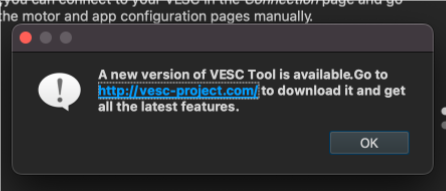
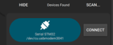

# UCSD VESC Setup Instructions
Version 2.0 30 Dec 2022

These instructions are for different versions of the VESC &mdash; pay attention to what version you have. Choosing incorrect firmware may harm the VESC.

We will be using the VESC Tool software ([linked here](https://drive.google.com/drive/folders/1m_gqcIWwaCzV3y3raU1FFiEpCyf3rYPi?usp=sharing)) to upgrade the firmware in the VESC and measure parameters from the brushless DC motor (BLDC).

**PLACE THE CAR ON THE PROVIDED STAND WHEN WORKING WITH THE VESC AND ENSURE THAT THE WHEELS ARE CLEAR AND CAN SPIN FREELY**

You will need the battery to power the VESC and a long micro USB cable to connect the VESC to your computer. See the instructor if you need a longer cable.

If the VESC is connected to the SBC, disconnect them before connecting to the VESC.

**AGAIN, THE WHEELS OF THE ROBOT WILL SPIN, PLEASE MAKE SURE THE WHEELS ARE CLEAR TO ROTATE.**

## VESC Tools

You can ignore prompts to update VESC Tools to the latest version if you are using the class-provided install.

To start, connect the battery voltage checker to the LiPo battery BMS pins. Then connect the main battery terminals to the input for the VESC and a micro USB cable between the VESC and your computer.

Select the VESC Tools connect icon:

or 

**Note:** When you connect the VESC to VESC Tools, it may warn you that 