# UCSD VESC Setup Instructions
Version 2.0 30 Dec 2022

These instructions are for different versions of the VESC &mdash; pay attention to what version you have. Choosing incorrect firmware may harm the VESC.

We will be using the VESC Tool software ([linked here](https://drive.google.com/drive/folders/1m_gqcIWwaCzV3y3raU1FFiEpCyf3rYPi?usp=sharing)) to upgrade the firmware in the VESC and measure parameters from the brushless DC motor (BLDC).

**PLACE THE CAR ON THE PROVIDED STAND WHEN WORKING WITH THE VESC AND ENSURE THAT THE WHEELS ARE CLEAR AND CAN SPIN FREELY**

You will need the battery to power the VESC and a long micro USB cable to connect the VESC to your computer. See the instructor if you need a longer cable.

If the VESC is connected to the SBC, disconnect them before connecting to the VESC.

**AGAIN, THE WHEELS OF THE ROBOT WILL SPIN, PLEASE MAKE SURE THE WHEELS ARE CLEAR TO ROTATE.**

## VESC Tools

You can ignore prompts to update VESC Tools to the latest version if you are using the class-provided install.

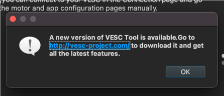

To start, connect the battery voltage checker to the LiPo battery BMS pins. Then connect the main battery terminals to the input for the VESC and a micro USB cable between the VESC and your computer.

Select the VESC Tools connect icon:


or 

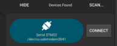

**Note:** When you connect the VESC to VESC Tools, it may warn you that there is a newer firmware version for the VESC.

Feel free to update it on VESC 6.x versions. Do not upgrade VESC 4.x versions.


### Updating the firmware

As of 30 Dec, 2022, the VESC 6.x firmware to be used is version 6.00. **You do not need to update it if the version is the same**.

Navigate to the **Firmware** tab on the left side in the VESC Tool.


Select the arrow without the text "All" next to it. Hovering over it should display the text "Update firmware on the connected VESC"

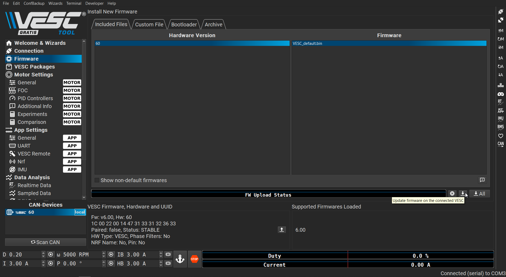

**Do not unplug the VESC while the firmware is updating, you may damage the VESC**.


### Motor Detection

Go to the **Welcome and Wizards** tab.

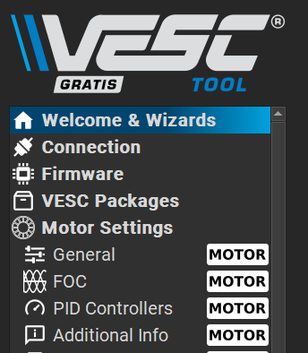

In the menu at the bottom, select ```Autoconnect```. Once the VESC is connected, select ```Setup Motors FOC```. 

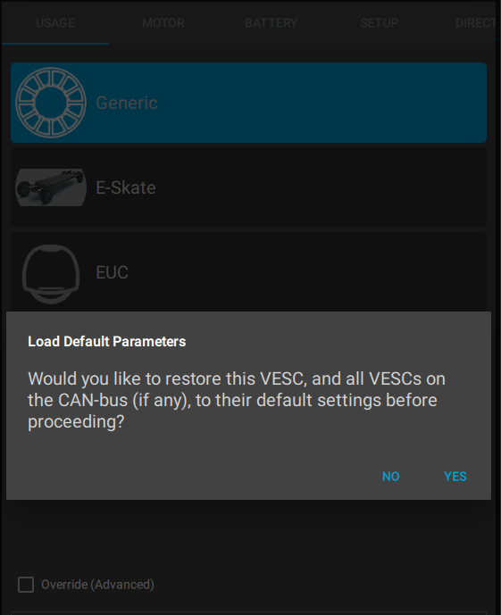

You will be prompted to load the default parameters. Select ```Yes```. Then select ```Generic``` and  ```Medium Outrunner``` after that.

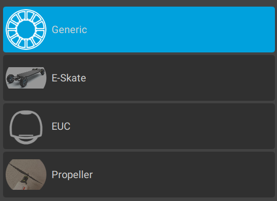

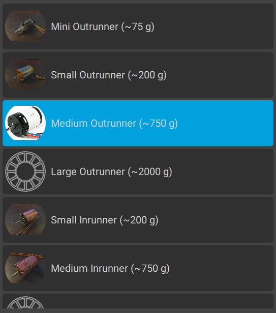

Select ```BATTERY_TYPE_LIION_3_0__4_2``` as the battery type (3.0-4.2 is the voltage range of the cells).

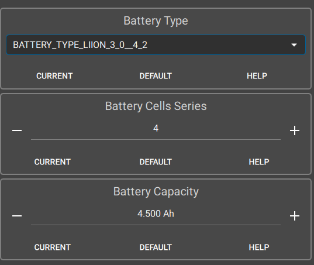

The batteries we are using currently have 4 cells in series; input that below with a capacity of 4500 mAh. When prompted to set current limits by going to the next section, just proceed without setting them.

Now check the ```Direct Drive``` setting. The wheel diameter is 100.00mm and the motor is a 4 pole - 8 magnet setup.

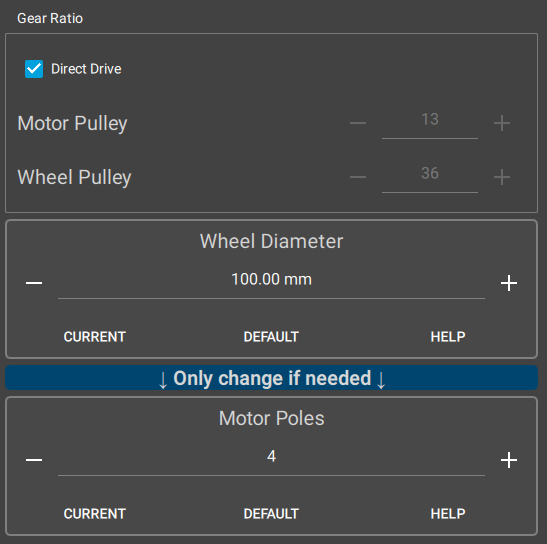

Then run the detection procedure.

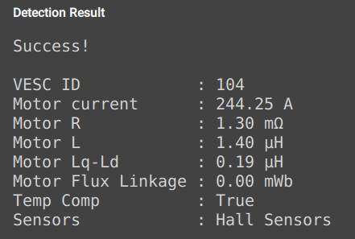

Now determine if your motor direction needs to be reversed.

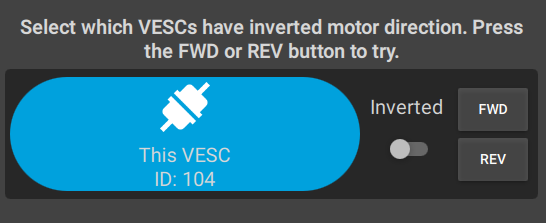

Once you are done, press finish at the bottom.

**Now, write the motor configuration to the VESC using the button along the right side of the screen.**

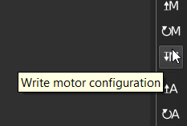

**Then write the app configuration.**

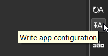

### Sensor Detection

We are now going to measure characteristic parameters of the motor.

**Resistance and Inductance**

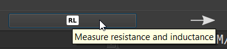

**Motor Flux Linkage**


Then press ```Apply``` at the right side of the window.


Now check the Hall Sensor table under the ```Hall Sensors``` tab at the top. Your table should look something like this:

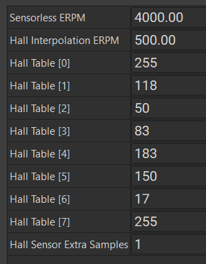

Write the motor configuration and the app configuration:

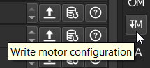

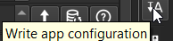

### Enable Servo Control for Steering

We need to enable the VESC PWM output in order to control the servo for steering.

In ```General``` under ```App Settings```, set ```Enable Servo Output``` to ```True``` and write the app configuration.

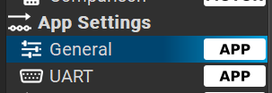

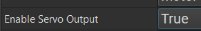

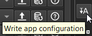