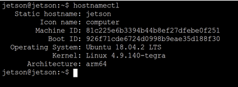
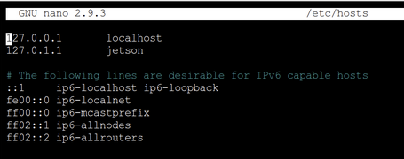

# Jetson Nano Configuration

This document will take you through the process of setting up your Jetson Nano. This document is a re-written version of this document, which may have some useful information if you are ever stuck: https://docs.google.com/document/d/1TF1uGAFeDARNwbPkgg9xg4NvWPJvrsHW2I_IN9dWQH0/edit

### Flashing Image

A Jetson Nano runs off of a externally mounted microSD card, which will first need an image flashed onto it. A custom UCSD Jetson Nano Developer Kit image with some pre-configured settings and files can be downloaded here: [UCSD Image](https://drive.google.com/file/d/1Ikdat_BaP3IqEYoYfjfMQJGgmAC-UGNK/view?usp=sharing). You will need to install a program to flash this download onto your microSD card, we recommend Etcher: [Etcher Download](https://www.balena.io/etcher/). 

#### Using Etcher to Write UCSD Image

1) Using an adapter, plug your mircoSD card into a computer with the zipped image file downloaded  
2) Open Etcher, select the zipped file under "Flash from file" and the microSD card under "Select target", and click "Flash!" to write the image to the microSD card  
3) After flashing is complete, eject the microSD card from your computer and plug it into the back of the Jetson Nano. NOTE: this is a push-in-to-lock and push-in-to-unlock the uSD card. Please do not pull the uSD card out of the slot before unlocking it, otherwise you may damage your JTN and or the uSD card  

## MobaXterm Installation

A good tool for Windows machines when doing embedded programming is MobaXterm, which offers more robust SSH communication with single board computers. [Here](https://mobaxterm.mobatek.net/download-home-edition.html) you can find the download link.

1. Click on the green "MobaXterm Home Edition v24.2 (Installer Edition)" to download a zip file.  
2. Extract the zip file and launch the installer from the file explorer (not the .dat file).  
3. Follow the instructions in the installer.  
4. When installation is complete, launch MobaXterm and select "Start new terminal" to be placed on the command line.  

### Powering Jetson Nano

To power the Jetson Nano you can use the provided 5V 4A power supply. This plugs into the barrel jack port to the left of the USB ports. The Jetson is recieving power and on if there is a green LED near the microUSB port. However, you may need to give it a minute or two to boot and load software. The fan will NOT turn on until you follow the documentation below to install the proper software. If you wish to power the Jetson through a microUSB connection, remove the jumper on the J48 pins near the barrel jack port. Please keep track of the jumper by leaving in connected to only one of the J48 pins.  


### Jetson Nano SSH Configuration

Since we do not have any monitors or keyboard connected to our Jetson Nano, we will need to remotely login to the Jetson using Secure Shell (SSH) Protocol. Initially, we will need to remotely login to the Jetson Nano using a wire. While connected over the wire we will do some initial configuration and connect to the UCSDRoboCar wifi network. Once the network is configured, we will then be able to wirelessly SSH into the Jetson over the UCSDRoboCar network.  

#### Wire SSH Communication

1) Power your Jetson Nano using the details above. Plug a microUSB cable from your computer into the microUSB port on the Jetson Nano. Give the Jetson a minute or two to boot up. NOTE: Not all microUSB cables contain the proper wiring to transmit data. If you are sruggling to establish a connection with the Jetson Nano in the following steps, try switching to another microUSB cable.  
2) Open a terminal on your computer and type in: ``` ssh jetson@192.168.55.1 ```. This command is calling ssh and asking to login to the user "jetson" on the device "192.168.55.1". This IP address is unique to the wired connection, and the network IP address will be something different.  
3) You will be prompted to input a password for the user you are logging in as. The default username is ``` jetson ```, which you specified in the ssh command in step 1. The default password is ``` jetsonucsd ```, which you will type in after the ssh command when prompted.   
4) If login is successful, you will be placed into the home directory of the Jetson Nano. If you want to return to your local device, you can enter ```exit``` and you will logoff the Jetson.   


#### Wifi Configuration

1) Follow the above steps to log into the Jetson over a USB cable.   
2) Ensure the USB wifi adapter supplied with the kit is plugged into the Jetson Nano.  
3) Once logged in and in the home directory, lets make sure the network service is running properly: ```sudo systemctl start networking.service```  
4) List the available wifi networks: ```sudo nmcli device wifi list```. If your desired wifi network is not being listed you can use ```sudo nmcli device wifi rescan``` to refresh the list. If needed, you can try to reboot the entire Jetson Nano with ```sudo reboot now``` and try scanning again. NOTE: Rebooting will take a couple minutes and will require you to re-ssh into the Jetson Nano.  
5) To connect the Jetson Nano to a listed wifi network: ```sudo nmcli device wifi connect <ssid_name> password <password>```. In the case of UCSDRobocar, the command would be ```sudo nmcli device wifi connect UCSDRoboCar password UCSDrobocars2018 ```. After a few seconds the terminal should print out a success message similar to: ```Device 'wlan0' successfully activated with 'bab49f3e-b40c-4201-84f9-972ac83ddcb7'``` 
6) To further ensure the Jetson Nano is connected to Wifi, try pinging google using ```ping google.com```. A message should be printing every second with latency information.  
7) The Jetson Nano will now have a unique IP address that identifies the machine on the wifi network. You can check what this IP address is by entering ```ifconfig```, which will return the Jetson Nano's network interface configuration. Under the ```wlan0``` section, the Jetson Nano's network IP address should be displayed. In the case below, the network IP address is ```192.168.113.165```. If an IP address is not showing up, ensure that the Wifi connection is properly configured and operating using the steps above.  

#### Wifi Power Saving Settings

If Wifi Power Saving is on, it can cause the Jetson Nano to lag and slow down. Here we show how to turn off power saving mode.

1) To temporarily turn off power saving, you can use the command ```sudo iw dev wlan0 set power_save off```  
2) If you wish to make the change persistent, you will need to edit a config file using a text editor. Ensure Nano is installed by updating pre-existing packages with ```sudo apt-get update``` and installing nano with ```sudo apt-get install nano```. We can edit the file by entering ```sudo nano /etc/NetworkManager/conf.d/default-wifi-powersave-on.conf``` and changing ```wifi.powersave = 3``` to ```wifi.powersave = 2```.   

#### Testing Wifi SSH Communication

We will quickly test that we can communicate and login to the Jetson Nano over the UCSDRoboCar wifi network. While testing the wifi, we can stay logged in on the wire and simply login in a different terminal on our local computer.

1) Ensure your laptop is connected to the UCSDRoboCar wifi.   
2) Open a new terminal on your local computer and try ```ssh jetson@<wlan0-IP-address>```, where 'wlan0-IP-address' is the IP address you found in the previous section. The password will be the same as the wire SSH.  


#### Configuring Hostname and Password

To make the SSH process easier and more secure, we should set a unique static hostname for our Jetson Nano and change the password. This new static hostname can then replace the long IP address in the SSH command.  

1) Check the current hostname by entering ```hostnamectl```.  

2) Change your hostname to something unique using ```sudo hostnamectl set-hostname <new-hostname>```. We recommend including your team name in your Jetson Nano's hostname. Confirm your changes by entering ```hostnamectl``` again. You must also change the hostname in /etc/hosts using a text editor: ```sudo nano /etc/hosts```. Change "jetson" to the hostname you choose.  



3) You can change the password by simply entering ```passwd``` and following the prompts.  
4) Make sure to remember your newly selected hostname and password, you will need them to log into your Jetson Nano.   
5) Now when logging into your Jetson Nano using SSH, you can replace the IP address with your static hostname. This is useful, as sometimes the network will change the IP address of the Jetson Nano, while the hostname will stay static. ```ssh jetson@<new-hostname>```. Remember, we are just changing the devices identifier, we are still logging into the device as the "jetson" user with the password we set, which is why "jetson" remains unchanged in the SSH command. NOTE: If you are having trouble connecting, try adding a .lan or .local to the end of your hostname in the ssh command. If you are wired to the jetson, then you might end up connecting over the wire.   


### Fan Configuration

Our Jetson Nano's are outfitted with a heat sink and fan for cooling. The image should come pre-loaded with the fan drivers, but if the fan is not spinning here are the steps to download the drivers.

1) Enter the projects directory from the home directory ```cd ~/projects```. If a projects folder doesn't exist, make one in the home directory: ```cd``` to go to the home directory, then ```mkdir projects``` to create a directory named "projects", then enter the new directory ```cd projects```.   
2) In ~/projects, enter ```git clone https://github.com/Pyrestone/jetson-fan-ctl.git```. This clones the github repository "jetson-fan-ctl" into your projects directory.  
3) Make sure your packages are updated using ```sudo apt-get update``` and install python3-dev using ```sudo apt install python3-dev```. 
4) Enter "jetson-fan-ctl" using ```cd jetson-fan-ctl``` and enter ```./install.sh``` to install the fan firmware.   
5) You can customize fan settings in ```/etc/automagic-fan/config.json``` using a text editor of your choice. The command to edit in nano is ```sudo nano /etc/automagic-fan/config.json```. You can check the status of the fan by entering ```sudo service automagic-fan status```.   


