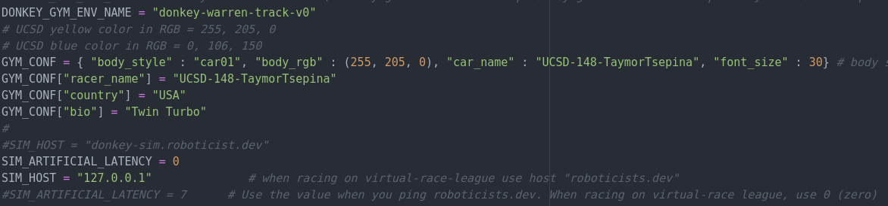
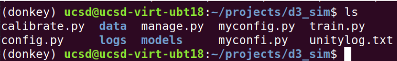
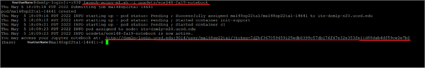
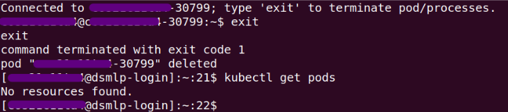

# Setting up DonkeySim on a Mac M1 or newer (ARM Based)
The class virtual machine will not run on ARM based macs, but you can install the software natively instead.

If you are on a linux or windows machine but are having issues with the virtual machine, following these instructions with a few changes for your platform could work for you too. Installing donkeysim/donkeycar natively is more work, but it will run faster and use less space than the virtual machine.   

We also have lab computers with donkeysim set up available to use, if you run into difficulties with setting up donkeysim on your computer don't hesitate to use the lab computers. We also have joysticks in the lab which make driving much more convenient.  

These instructions are new for Fall 2024, and the donkey_sim app was just compiled for ARM macs by me (Alexander). Please let me know about any issues/improvements!  

For this process to run, you'll need the xcode developer tools installed. I recommend installing them through homebrew, which is a super convenient package manager for mac.
Copy paste this command in the terminal to get homebrew and the developer tools
```/bin/bash -c "$(curl -fsSL https://raw.githubusercontent.com/Homebrew/install/HEAD/install.sh)"```
However, you can also use ```xcode-select --install``` to get the developer tools.

Download the donkeysim video game from here:  
[https://drive.google.com/file/d/1FRDT7DiuKDhAuoKyqt8KyMnRAYsALx5Y/view?usp=sharing](https://drive.google.com/file/d/1FRDT7DiuKDhAuoKyqt8KyMnRAYsALx5Y/view?usp=sharing)  
To run the app, you may need to go to your settings->security&privacy->general and click "run anyway," although it is not from an identified developer.    
Note that the arm64 compiled simulator does have a known bug where there are a few invisible cones outside the track that your car can collide with. I am working on fixing it!  
Note: If you're using this guide to install on linux, windows, or an intel mac download the simulator from here:
[https://github.com/tawnkramer/gym-donkeycar/releases](https://github.com/tawnkramer/gym-donkeycar/releases)

[https://docs.donkeycar.com/guide/deep_learning/simulator/](https://docs.donkeycar.com/guide/deep_learning/simulator/) is what I referenced when writing this document. For your convenience I will write out the steps here:

1. Download miniconda from [https://conda-forge.org/download/](https://conda-forge.org/download/), and run the bash script to install it. You can open your terminal app, and ```cd Downloads``` and then ```bash Miniforge3-MACOSX-arm64.sh```
Note: If you get prompted asking to change your shell to zsh by the terminal, please change the shell to zsh with the suggested command.
3. Follow all the prompts the script provides
4. Once the script is installed, it will ask if you want to automatically start conda by default. I suggest putting no, but then note you will have to run the command ```eval "$(/Users/YOUR_USER/miniforge3/bin/conda shell.zsh hook)"``` to start conda every time you start the terminal. The terminal should tell you the proper path.
5. Restart your terminal to get the install to complete. Then start conda with ```eval "$(/Users/YOUR_USER/miniforge3/bin/conda shell.zsh hook)"```  You should see ```(base)``` appear before your terminal prompt.
6. ```conda create -n donkey python=3.11```  
7. ```conda activate donkey```  
8. ```pip install donkeycar\[macos\]```
9. ```pip install git+https://github.com/tawnkramer/gym-donkeycar```
10. ```donkey createcar --path ./d4_sim```
11. ```cd d4_sim```


### Customizing Virtual Car

From a terminal, run ```open myconfig.py``` from the ```~/d4_sim/``` directory.

Within the ```myconfig.py``` file, change the:

* car_name - note, you can only choose between 'donkey', 'cybertruck', 'sports_car', 'jeep', 'f1_car', or 'monster_truck' by default the sports car is used
* racer_name
* your country location (under "country")
* a fun fact (under "bio")
* car color (in the dictionary entry for "body_rgb")



#### Example Config File - make sure to uncomment the lines you want applied. You only should uncomment those lines,
#### Note that you can just copy-paste this file into the top of the myconfig.py and it will work

```
# 04Jan22
# UCSD mods to make easier for the UCSD students to use the Donkey-Sim
# the following uncommented lines where copied here from the body of myconfig.py below
DONKEY_GYM = True
DONKEY_SIM_PATH = "remote"

DONKEY_GYM_ENV_NAME = "donkey-warren-track-v0"

# UCSD yellow color in RGB = 255, 205, 0
# UCSD blue color in RGB = 0, 106, 150
GYM_CONF = { "body_style" : "car01", "body_rgb" : (255, 205, 0), "car_name" : "UCSD-148-YourName", "font_size" : 30} # body style(donkey|bare|car01) body rgb 0-255
GYM_CONF["racer_name"] = "UCSD-148-YourName"
GYM_CONF["country"] = "USA"
GYM_CONF["bio"] = "Something_about_you, ex: Made in Brazil"
#
# SIM_HOST = "donkey-sim.roboticist.dev"
 SIM_ARTIFICIAL_LATENCY = 0
SIM_HOST = "127.0.0.1"              # when racing on virtual-race-league use host "roboticists.dev"
# SIM_ARTIFICIAL_LATENCY = 30          # Use the value when you ping roboticists.dev. When racing on virtual-race league, use 0 (zero)

# When racing, to give the ai a boost, configure these values.
AI_LAUNCH_DURATION = 3            # the ai will output throttle for this many seconds
AI_LAUNCH_THROTTLE = 1            # the ai will output this throttle value
AI_LAUNCH_KEEP_ENABLED = True      # when False ( default) you will need to hit the AI_LAUNCH_ENABLE_BUTTON for each use. This is safest. When this True, is active on each trip into "local" ai mode.
#
# When using a joystick modify these specially USE_JOYSTICK_AS_DEFAULT = True
# JOYSTICK
# USE_JOYSTICK_AS_DEFAULT = True     #when starting the manage.py, when True, will not require a --js option to use the joystick
JOYSTICK_MAX_THROTTLE = 1.0         #this scalar is multiplied with the -1 to 1 throttle value to limit the maximum throttle. This can help if you drop the controller or just don't need the full speed available.
JOYSTICK_STEERING_SCALE = 0.8       #some people want a steering that is less sensitve. This scalar is multiplied with the steering -1 to 1. It can be negative to reverse dir.
AUTO_RECORD_ON_THROTTLE = True      #if true, we will record whenever throttle is not zero. if false, you must manually toggle recording with some other trigger. Usually circle button on joystick.
JOYSTICK_DEADZONE = 0.2             # when non zero, this is the smallest throttle before recording triggered.
# #Scale the output of the throttle of the ai pilot for all model types.
AI_THROTTLE_MULT = 1.0              # this multiplier will scale every throttle value for all output from NN models
#
```
### Get Latency from Remote Server

To get the latency between your computer and the server, ping it using the command 
```
  ping donkey-sim.roboticist.dev
```


Since this computer is on the same network as the server, the delay is much lower than 0.5 ms. When pinging the server within the US, you should expect about 20-60 ms.

Replace the value of ```SIM_ARTIFICIAL_LATENCY``` with the average ping delay (e.g. ```SIM_ARTIFICIAL_LATENCY=30```)


#### Driving using Mouse and Keyboard

Start the donkey_sim_m1.app app in the gui by clicking the icon, and then run ```python3 manage.py drive``` in the terminal
You should be able to go to [http://localhost:8887](http://localhost:8887) to control the car. 


#### Driving using a Gamepad

To use a physical joystick without using the web browser, edit this section in ```myconfig.py```.

```
# #JOYSTICK
# USE_JOYSTICK_AS_DEFAULT = False      #when starting the manage.py, when True, will not require a --js option to use the joystick
# JOYSTICK_MAX_THROTTLE = 1         #this scalar is multiplied with the -1 to 1 throttle value to limit the maximum throttle. This can help if you drop the controller or just don't need the full speed available.
# JOYSTICK_STEERING_SCALE = 1       #some people want a steering that is less sensitve. This scalar is multiplied with the steering -1 to 1. It can be negative to reverse dir.
#AUTO_RECORD_ON_THROTTLE = True      #if true, we will record whenever throttle is not zero. if false, you must manually toggle recording with some other trigger. Usually circle button on joystick.
# CONTROLLER_TYPE = 'ps4'            #(ps3|ps4|xbox|pigpio_rc|nimbus|wiiu|F710|rc3|MM1|custom) custom will run the my_joystick.py controller written by the `donkey createjs` command
# USE_NETWORKED_JS = False            #should we listen for remote joystick control over the network?
# NETWORK_JS_SERVER_IP = None         #when listening for network joystick control, which ip is serving this information
# JOYSTICK_DEADZONE = 0.01            # when non zero, this is the smallest throttle before recording triggered.
```
Set ```USE_JOYSTICK_AS_DEFAULT``` to ```True``` and set the controller type ```CONTROLLER_TYPE``` to one from the adjacent list (ps3|ps4|...).

You may have to uncomment lines in order for them to take effect.

When using a controller, the face buttons can have useful functions:

* Deleting 100 data points (@20Hz == 5s)
* Emergency stop
* Change operations mode (User control, AI model)

Otherwise you may have to determine the function of each button from the terminal outputs when they are pressed.

**~14000 images is recommended for an initial dataset. This should take about 10 minutes to record**


**To stop the DonkeyCar framework, use CTRL + C in the terminal**

#### Deleting Data not to be used in Training

Data for training is stored in the ```~/projects/d4_sim/data``` directory.



We can delete data by removing the ```data``` folder and creating a new one.

Run this command in the ```d4_sim``` directory. **Be careful &mdash; there is no undoing this if the command runs successfully.**

```
rm -rf data
```
Then create a new ```data``` directory with:
```
mkdir data
```
### Training and Testing

Using the data in the ```data``` folder, we can train a model and give it a name (e.g. 8july24_sim_160x120_20_1.h5)

**20 laps is recommended for an initial dataset.**

To do so, run this command from the ```d4_sim``` folder.
```
python3 train.py --model=models/YOUR_MODEL_NAME.h5 --type=linear --tubs=data/
```
To test the model, run:
```
python3 manage.py drive --model=models/YOUR_MODEL_NAME.h5 --type=linear
```
Enabling the model is done by pressing the change operation mode button twice. The terminal should state that the car is in AI mode.

If the car does not perform well around corners, it could be that throtte and steering data is not being recorded when navigating them.

By default, the program records steering only when a throttle input is detected &mdash; when slowing down to corner, this means steering data may not be recorded. To fix this, you can edit in ```myconfig.py```:
```
AUTO_RECORD_ON_THROTTLE = True
```
Set this to false. Now, in order to record data, you must press the record button to begin input recording. The terminal will print out when recording is enabled and the amount of samples.

If you increase the number of samples recorded after training a model, you can train a new model that uses all of the data in the ```data``` folder (old and new &mdash; be sure to give it a different name).

To train data from a specific tub and transfer to a previous model:
```
python3 train.py --tub ~/projects/d4_sim/data/TUB_NAME  --transfer=models/PREVIOUS_MODEL.h5  --model=models/NEW_MODEL.h5
```
Tubs are subsections of the data folder that you may create to separate training data. To use all the data in the ```data``` folder, do not include a tub name after ```~/projects/d4_sim/data/``` in the tub argument.


### UCSD GPU Cluster Instructions

**Do not use the cluster until you are told the GPU cluster is ready to use.**

**Do not train on the cluster until you have demonstrated model training on your local machine.**

To train our models faster, we can use more powerful GPUs with higher throughputs.

On the virtual machine you will be using 2 terminals:

1. Local Session: Used to interact with the virtual machine

2. Remote Session: From this terminal you will ssh (secure shell) onto the GPU cluster using the proper account. 

In the remote session terminal, ssh into the GPU cluster:
```
ssh <username>@dsmlp-login.ucsd.edu
```
You will be prompted for a password (case sensitive). No characters will be shown for security purposes.


Your shell prompt is replaced with your user login for the GPU cluster.

You will have access to two containers &mdash; one with only a CPU, and another with the GPU. The GPU clusters are limited, so only use them for training.

Available hardware options:

Container for transfering data: (2 CPU 4 GB RAM)

```
launch-scipy-ml.sh -i ucsdets/donkeycar-notebook:latest
```

Container for training models: (8 CPU, 1 GPU, 16 GB RAM)
```
launch-scipy-ml.sh -g 1 -i ucsdets/donkeycar-notebook:latest
```
When creating the GPU container, the terminal should look like:



You should only have one container open at a time.

When launching a container it creates a "pod"; in order to exit the pod, run in the terminal:
```
exit
```
To confirm that you have exited the container and the instance has successfully been deleted do
```
kubectl get pods
```
This should return "no resources found".



If there is a pod, delete it with:
```
kubectl delete pod <POD_NAME>
```
#### Transfering Data

In the **Remote Session**, prepare DonkeyCar.

The donkey virtual environment should automatically be invoked for you; otherwise try 
```
conda activate donkey
```
If donkey is not found, try 
```
conda init
```
Relogin to the remote session and try the activate command again.

Once you are in the virtual environment,
```
mkdir ~/projects
cd ~/projects
donkey createcar --path d4_sim
cd d4_sim
```
In the **Local Session**

To copy over your ```myconfig.py``` file:
```
rsync -avr -e ssh myconfig.py <user_name>@dsmlp-login.ucsd.edu:projects/d4_sim/
```
To transfer data collected in the local session to the remote session:

```
rsync -avr -e ssh data/<tub_name> <user_name>@dsmlp-login.ucsd.edu:projects/d4_sim/data/
```
This sends specific tubs (e.g. tub_#_21-07-13 in this example) to the remote session.


The tubs should now appear in the remote session.


The ```rsync``` command syncs directories remotely from one system to another. That means it will only copy the differences between the two directories to save time and reduce load. Since the data does not exist initially on the remote system, the first use of ```rsync``` will copy the whole folder over to the remote system.

Once the data is transferred, close the CPU pod (and verify that it is closed) and open a GPU pod to train on the data.

#### Training on Data

Once the data is transferred to the remote session, training a model on it is the same as on a local session.

In the **Remote Session**

If you didn't use any tubs and just have your data in the data folder, this command should do the trick:
```
python train.py --model=models/yourmodelname.h5 --type=linear --tubs=data/
```   
You can train multiple tubs at the same time with (the paths to the tubs must be separated by commas, **no spaces**). 
```
python train.py --tub=data/tub1,data/tub2 --model=models/MODEL_NAME.h5 --type=linear
```
To alter a previous model with new data:
```
python train.py --tub=data/tub1 --model=models/NEW_MODEL_NAME.h5 --transfer=models/OLD_MODEL_NAME.h5
```

**Note** : If "imgaug" is not availible and Donkeysim generates an error, run 
```
pip install imgaug
```
Once your model training has completed, close the GPU pod (verifying that it has closed) and open a CPU pod to transfer the data back to your local machine.


#### Transferring Data back to Local Session

This is done similarly using the ```rsync``` command, but the source and destination are flipped since the data is going from the remote session to the local session.

In the **Local Session**

```
rsync -avr -e ssh <user_name>@dsmlp-login.ucsd.edu:projects/d4_sim/models/<model_file> models/
```

Now you can test the car in the local session as before.

### Using a Remote Server for the Simulator

The simulator for DonkeyCar (that you found in  ```~/projects/DonkeySimLinux/``` and executed with the file ```donkey_sim.x86_64```) can be run from a remote server instead of locally on your machine.

The server's name is ```donkey-sim.roboticist.dev```

You can connect to the remote server by changing the simulator host in the ```myconfig.py``` file.


Set the ```SIM_HOST``` from the local IP to ```donkey-sim.roboticist.dev``` and set the ```SIM_ARTIFICIAL_LATENCY``` to ```0```.

Don't forget to change the artificial latency, otherwise your car will experience both *real and virtual* latency and perform poorly.

Since the simulator is running on a remote server, how can I view the car on the track?

You can see the car on the livestream on

https://www.twitch.tv/roboticists or https://www.twitch.tv/roboticists2

The car should appear momentarily after you run the same command to start the car if you have configured the host properly.

And then save and exit

12. Start the donkey_sim app, and then run ```python3 manage.py drive```
13. You should be able to go to http://localhost:8887 to control the car. Note, it will be easier to control the car if you hook up a joystick. Instructions to do that are in the other virtual machine document.
14. Follow the other document for the rest of the instructions. For here on everything should work the same.
