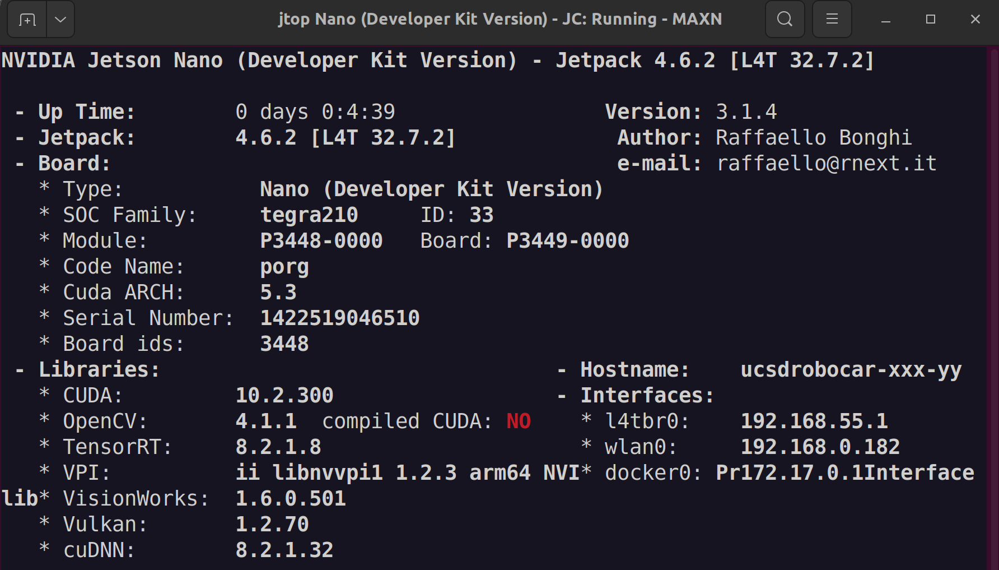
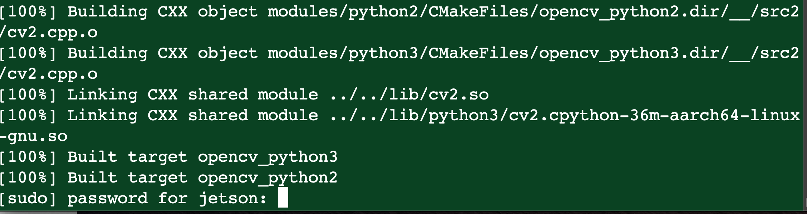
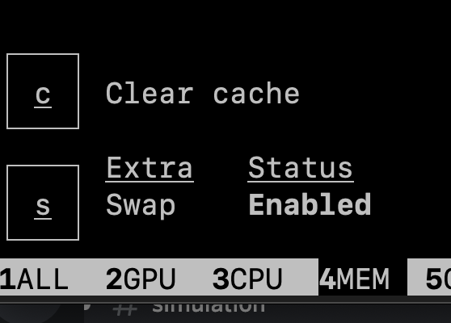
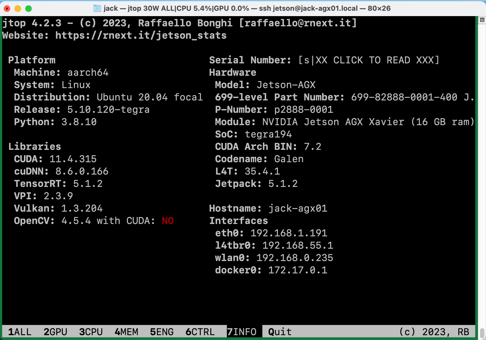
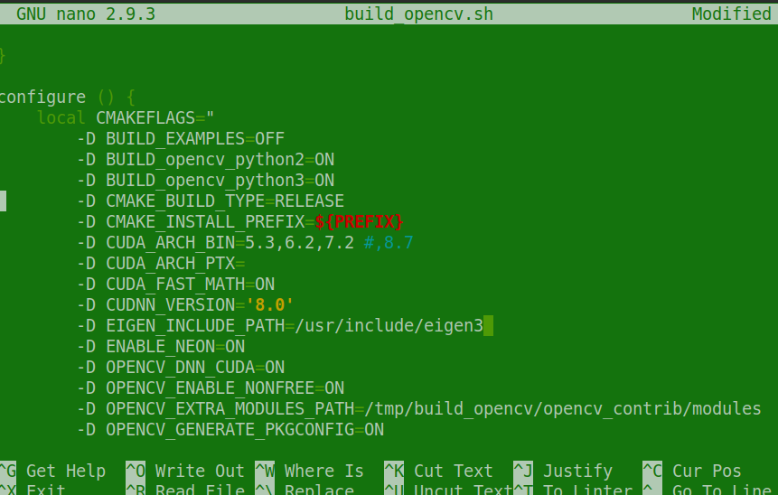
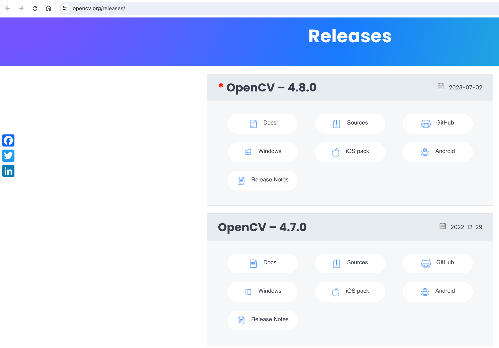
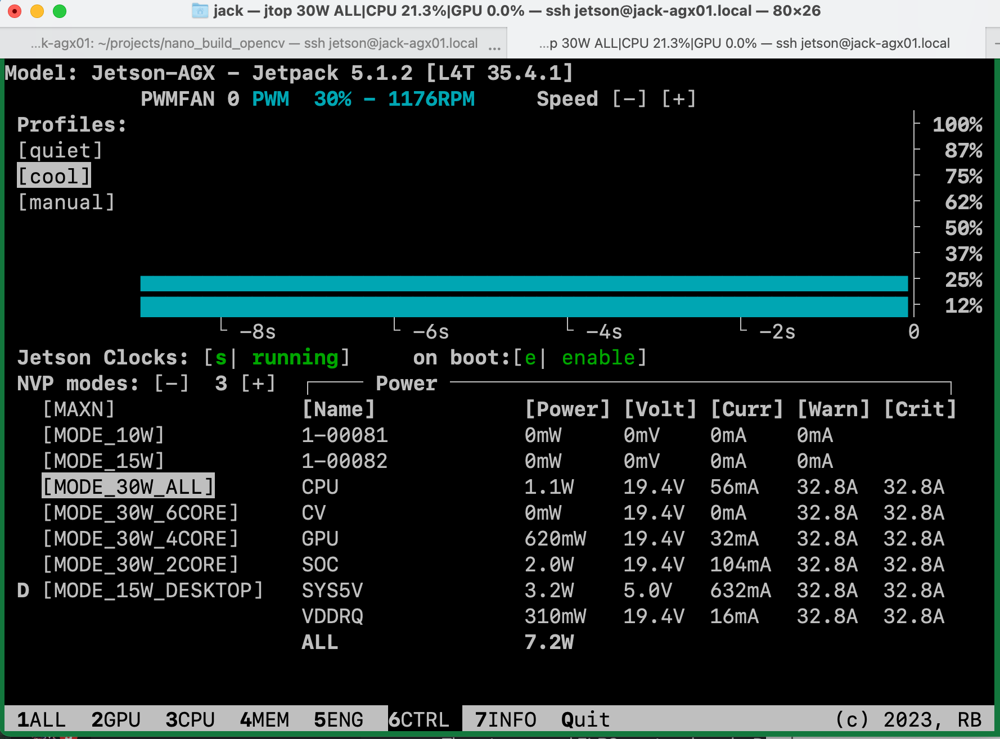
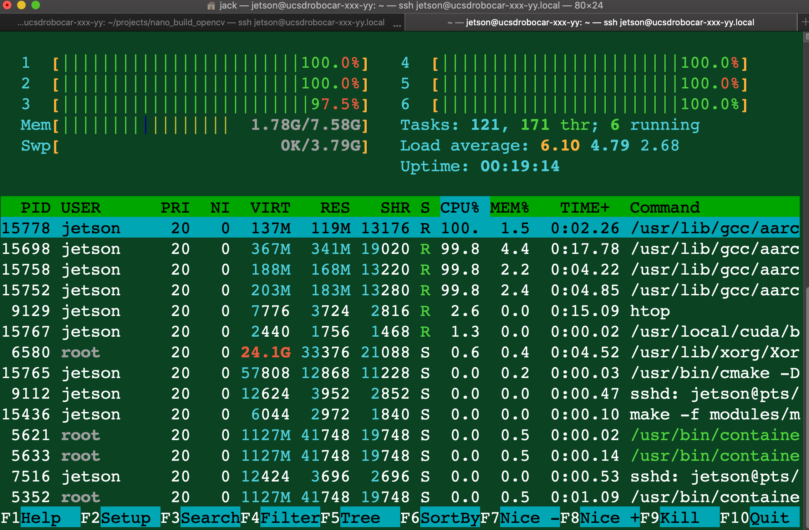
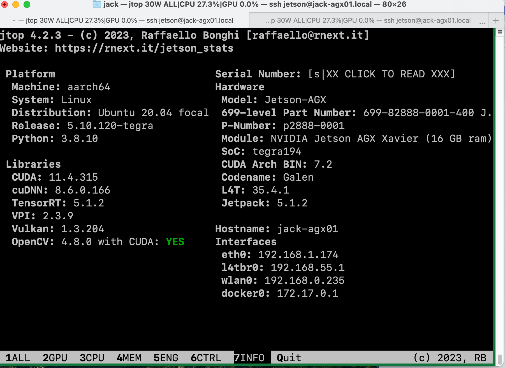

# Installing an Open Source Computer Vision (OpenCV) package with CUDA
Support

\# As of Jan 2020, NVIDIA is not providing OpenCV optimized to use CUDA
(GPU acceleration).

\# Search the web if you are curious why.

\#
[[https://forums.developer.nvidia.com/t/opencv-cuda-python-with-jetson-nano/72902]{.underline}](https://forums.developer.nvidia.com/t/opencv-cuda-python-with-jetson-nano/72902)

Youtube Video about the process:
[https://www.youtube.com/watch?v=art0-99fFa8](https://www.youtube.com/watch?v=art0-99fFa8)

# Checking openCV build information

 ssh to the Single Board Computer (SBC)

 Check to see if OpenCV for CUDA is available, search on the terminal
output for CUDA),

if not, we build OpenCV from source to use CUDA Acceleration

From a terminal:
```
python

\>\>import cv2

\>\>print cv2.getBuildInformation()

\>\>exit ()
```
ex:

NVIDIA CUDA: YES (ver 10.2, CUFFT CUBLAS FAST_MATH)

NVIDIA GPU arch: 53 62 72

NVIDIA PTX archs:

cuDNN: YES (ver 8.0)

OpenCL: YES (no extra features)

Include path: /tmp/build_opencv/opencv/3rdparty/include/opencl/1.2

Link libraries: Dynamic load

You can also use jtop to check if OpenCV was compiled with CUDA.

jtop

6


\# If OpenCV is not using CUDA acceleration, let\'s build and install
the latest OpenCV optimized

\# for CUDA

\# As of 03Apr2022, I have not seen NVIDIA supplying OpenCV GPU
accelerated on their

\# JetPack. We need to compile it from source. If you ask me, nice
experience for you.

\# Let's do this

#  

# Installing openCV with CUDA

**\# This step may take several hours** **to compile and build OpenCV in
a SBC such as the**

**\# Jetson Nano (JTN) or Jetson Xavier NX (JNX). It took my JTN four
hours to complete.**

**\# For the JTN, please make sure the fan is installed including
software to enable high CPU power mode**

\# Better do it overnight. Be patient, please keep in mind that you are
using a low power single board computer (SBC)

\# Make sure you are using the external power supply to power the
jetson, not a USB cable.

\#
[[https://devtalk.nvidia.com/default/topic/1054949/process-to-install-opencv-4-1-on-nano/]{.underline}](https://devtalk.nvidia.com/default/topic/1054949/process-to-install-opencv-4-1-on-nano/)

\#
[[https://github.com/mdegans/nano_build_opencv]{.underline}](https://github.com/mdegans/nano_build_opencv)

\# Please make sure your computer will not sleep so you maintain an
active ssh connection

\# while you are building OpenCV because you will need to type the user
jetson password

\# again to complete the install.

\# Reconnecting on the same ssh session is not trivial



## \# Using a Linux Host? Use Screen

\# You should consider using
[screen](https://ma.ttias.be/screen-a-must-for-ssh/) to
enable you to reconnect to a previous ssh session.

\# Do you need to install screen?

sudo apt-get install screen

\# From a terminal on Linux host or on your VM:

screen

\# ssh jetson@ name of IP address of your machine

ssh jetson@ucsdrobocar-xxx-yy.local

\# If you get disconnected, open a terminal again on your computer then
type

screen -r

\# screen -r should reconnect to the previous ssh session that was open

\# Here is some more detailed information on using screen

[[https://www.howtogeek.com/howto/ubuntu/keep-your-ssh-session-running-when-you-disconnect]{.underline}](https://www.howtogeek.com/howto/ubuntu/keep-your-ssh-session-running-when-you-disconnect)

*\# if not installed in your host*

*sudo apt-get install screen*

*Now you can start a new screen session by just typing screen at the
command line. You'll be shown some information about screen. Hit enter,
and you'll be at a normal prompt.*

*To disconnect (but leave the session running)*

*Hit Ctrl + A and then Ctrl + D in immediate succession. You will see
the message \[detached\]*

*To reconnect to an already running session*

*screen -r*

*To reconnect to an existing session, or create a new one if none
exists*

*screen -D -r*

\# More info on using screen

[[https://ma.ttias.be/screen-a-must-for-ssh/]{.underline}](https://ma.ttias.be/screen-a-must-for-ssh/)

*screen -ls*

*There are screens on:*

*27111.screen_untarring (Detached)*

*27097.screen_disking (Detached)*

*2 Sockets in /var/run/screen/S-root.*

*This will show a list of all running screen-sessions at any given time.
You can pick up a previous screen-session, by typing*

*screen -r \<name_of_session\>*

*screen -r*

##  

\# Since your SBC will be busy, how can you see it is working for you?

\#

\# Besides htop or top, there is another cool utility called
[jetson_stats](https://github.com/rbonghi/jetson_stats)

sudo apt-get install python3-pip

sudo -H pip3 install -U jetson-stats

\# reboot

sudo reboot now

\# Then you can run

jtop

4

You can use jtop to add more swap space using the left and right keys
and clicking the plus button


Add 4G of swap and press \<S\> to enable it.



## Removing old version of OpenCV 

\# First lets remove the current OpenCV version and reboot the JTN

sudo sudo apt-get purge \*libopencv\*

sudo reboot now

## Compiling OpenCV from source

\# screen then ssh back to the SBC

\# If needed, create the \~/projects directory

cd\~

mkdir projects

cd projects

\# For Jetson Nano

git clone
[https://github.com/mdegans/nano_build_opencv.git](https://github.com/mdegans/nano_build_opencv.git)

cd nano_build_opencv

\# For the Jetson Nano, lets modify the script to use 2 CPU cores vs. 1.

\# Note: for the TX2 and Xaviers the script automatically uses more CPU
cores.

\# Need to modify the configuration for the CUDNN we are using

\# First see what you have installed using jtop use option INFO press 7




#Remove the 8.7 from the CUDA_ARCH_BIN version, it causes a
compatibility issue

#Also, make sure the CUDNN_VERSION='8.0', it will fail otherwise

nano build_opencv.sh

\# modify this line to have JOBS=2

else

JOBS=1 \# you can set this to 4 if you have a swap file

JOBS=2

\# save the file / exit nano

\#
[https://opencv.org/releases/](https://opencv.org/releases/)

\# look for the latest version



\# As of 24Nov23, **4.8.0** is the latest version

\# You can use jtop to have Jetson Clocks enabled to improve the
performance of the Jetson

\# 6 CTRL and then press s

\# To make it enabled at boot too, press e



\# From a terminal
```
./build_opencv.sh 4.8.0
```
\# Again, this will take a good while. You may consider doing this at
night before you go to bed. It is really boring

\# after a while (hours) looking that the SBC compile and build OpenCV
from source

\# Please make sure the computer you are using to SSH, disable sleep,
and if using a notebook computer

\# have in connected to the charger

\# Preferable you use screen before ssh to be able to reconnect in

\# case your computer lose the SSH connection.

\# If you wish, you can see that the SBC cores of the CPU are

\# busy by opening another terminal or a new tab on the same terminal
window then

\# ssh to the SBC and run the command top

\# I like better jtop (if needed, install htop or jtop).

\#

\# ex:



\# After a few hours you see that you need to enter a little information
to finish the build. That is when we have

\# problems if you get disconnected from your SSH

\# You can leave the temporary builds in place

Do you wish to remove temporary build files in /tmp/build_opencv ?

(Doing so may make running tests on the build later impossible)

Y/N **y**

**\# Enter y**

\# save some space on disc

# Checking the Install

\# When the installation is complete, let\'s check the version of OpenCV
that was installed

\# First reboot SBC

sudo reboot now

\# ssh back to the SBC

#Using jtop to confirm the OpenCV GPU (CUDA) compiled

jtop

7 INFO

\# look for the OpenCV version and that it was compiled with CUDA



{

## \# Let's make sure Python3 finds OpenCV (CV2)

\# Need to adapt this for the python and OpenCV versions that you are
using

> python3 -c \'import cv2 as cv; print(cv.\_\_version\_\_)\'
>
> #Traceback (most recent call last):
>
> #File \"\<string\>\", line 1, in \<module\>
>
> #ModuleNotFoundError: No module named \'cv2\'

\# If you don't see the version of the OpenCV that you built listed, it
might be because you forgot to delete the previous OpenCV version that was installed, go back to this document "Removing
old version of OpenCV" and then build and install OpenCV again. If OpenCV shows up in jtop then disregard this, there is some other issue preventing it from showing up.

\# What version of python3 do you have?

python3

#Python 3.8.10 (default, May 26 2023, 14:05:08)

#\[GCC 9.4.0\] on linux

#Type \"help\", \"copyright\", \"credits\" or \"license\" for more
information.

\>\>\> exit()

ex:
```
cd /usr/local/lib/python3.6/site-packages/cv2/python-3.6
```
\# or
```
cd /usr/local/lib/python3.8/site-packages/cv2/python-3.8
```
\# remove the previous cv2.so in case it is still there.
```
sudo rm -rf cv2.so
```
```
mv cv2.cpython-36m-[xxx]-linux-gnu.so cv2.so
```
```
ls cv2.\*
```
```
cv2.cpython-38-aarch64-linux-gnu.so
```
```
ln -s
/usr/local/lib/python3.8/site-packages/cv2/python-3.8cv2.cpython-38-aarch64-linux-gnu.so
cv2.so cv2.so
```
```
sudo cp cv2.cpython-36m-aarch64-linux-gnu.so cv2.so
```
\# or
```
sudo cp cv2.cpython-38-aarch64-linux-gnu.so cv2.so
```
\# Alternatively you could just rename the file
```
sudo mv cv2.cpython-36m-aarch64-linux-gnu.so cv2.so
```
```
sudo cp cv2.cpython-38-aarch64-linux-gnu.so cv2.so
```
\# Lets create a link at the home directory for cv2
```
cd \~
```
```
sudo rm -rf cv2.so
```
```
ln -s /usr/local/lib/python3.6/site-packages/cv2/python-3.6/cv2.so
cv2.so
```
\# or
```
ln -s /usr/local/lib/python3.8/site-packages/cv2/python-3.8/cv2.so
cv2.so
```
Checking install for python3
```
python3

import cv2

cv2.\_\_version\_\_

exit ()
```
\# Resulting on something similar to this

**jetson@ucsdrobocar-xxx-yy**:**\~**\$ python3

Python 3.6.9 (default, Jun 29 2022, 11:45:57)

\[GCC 8.4.0\] on linux

Type \"help\", \"copyright\", \"credits\" or \"license\" for more
information.

\>\>\> import cv2

\>\>\> cv2.\_\_version\_\_

\'4.6.0\'

\>\>\> exit()

**jetson@ucsdrobocar-xxx-yy**:**\~**\$

> Python 3.8.10 (default, May 26 2023, 14:05:08)
>
> \[GCC 9.4.0\] on linux
>
> Type \"help\", \"copyright\", \"credits\" or \"license\" for more
> information.
>
> \>\>\> import cv2
>
> \>\>\> cv2.\_\_version\_\_
>
> \'4.8.0\'
>
> \>\>\> exit ()

\# Here is quicker way to test cv2 on Python 3
```
python3 -c \'import cv2 as cv; print(cv.\_\_version\_\_)\'
```
> 4.6.0
>
> \# or
>
> 4.8.0

**end of Installing an Open Source Computer Vision (OpenCV) package with
CUDA Support**
